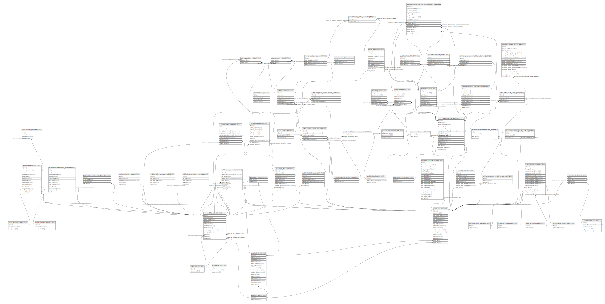

# geosegbar_dev

## Tables

| Name | Columns | Comment | Type |
| ---- | ------- | ------- | ---- |
| [public.anomalies](public.anomalies.md) | 13 |  | BASE TABLE |
| [public.anomaly_photos](public.anomaly_photos.md) | 4 |  | BASE TABLE |
| [public.anomaly_status](public.anomaly_status.md) | 3 |  | BASE TABLE |
| [public.answer_options](public.answer_options.md) | 2 |  | BASE TABLE |
| [public.answer_photos](public.answer_photos.md) | 3 |  | BASE TABLE |
| [public.answers](public.answers.md) | 6 |  | BASE TABLE |
| [public.attributions_permissions](public.attributions_permissions.md) | 5 |  | BASE TABLE |
| [public.checklist_dam](public.checklist_dam.md) | 2 |  | BASE TABLE |
| [public.checklist_responses](public.checklist_responses.md) | 6 |  | BASE TABLE |
| [public.checklist_template_questionnaire](public.checklist_template_questionnaire.md) | 2 |  | BASE TABLE |
| [public.checklists](public.checklists.md) | 3 |  | BASE TABLE |
| [public.classification_dams](public.classification_dams.md) | 2 |  | BASE TABLE |
| [public.client](public.client.md) | 15 |  | BASE TABLE |
| [public.constant](public.constant.md) | 7 |  | BASE TABLE |
| [public.dam](public.dam.md) | 16 |  | BASE TABLE |
| [public.dam_permissions](public.dam_permissions.md) | 9 |  | BASE TABLE |
| [public.danger_levels](public.danger_levels.md) | 3 |  | BASE TABLE |
| [public.deterministic_limit](public.deterministic_limit.md) | 5 |  | BASE TABLE |
| [public.documentation_dam](public.documentation_dam.md) | 18 |  | BASE TABLE |
| [public.documentation_permissions](public.documentation_permissions.md) | 5 |  | BASE TABLE |
| [public.input](public.input.md) | 6 |  | BASE TABLE |
| [public.instrument](public.instrument.md) | 15 |  | BASE TABLE |
| [public.instrument_graph_axes](public.instrument_graph_axes.md) | 15 |  | BASE TABLE |
| [public.instrument_graph_customization_properties](public.instrument_graph_customization_properties.md) | 14 |  | BASE TABLE |
| [public.instrument_graph_pattern](public.instrument_graph_pattern.md) | 4 |  | BASE TABLE |
| [public.instrument_graph_pattern_folder](public.instrument_graph_pattern_folder.md) | 3 |  | BASE TABLE |
| [public.instrument_tabulate_association](public.instrument_tabulate_association.md) | 10 |  | BASE TABLE |
| [public.instrument_tabulate_output_association](public.instrument_tabulate_output_association.md) | 4 |  | BASE TABLE |
| [public.instrument_tabulate_pattern](public.instrument_tabulate_pattern.md) | 4 |  | BASE TABLE |
| [public.instrument_tabulate_pattern_folder](public.instrument_tabulate_pattern_folder.md) | 3 |  | BASE TABLE |
| [public.instrument_type](public.instrument_type.md) | 2 |  | BASE TABLE |
| [public.instrumentation_permissions](public.instrumentation_permissions.md) | 11 |  | BASE TABLE |
| [public.levels](public.levels.md) | 5 |  | BASE TABLE |
| [public.measurement_unit](public.measurement_unit.md) | 3 |  | BASE TABLE |
| [public.options](public.options.md) | 4 |  | BASE TABLE |
| [public.output](public.output.md) | 8 |  | BASE TABLE |
| [public.potential_damages](public.potential_damages.md) | 2 |  | BASE TABLE |
| [public.psb_files](public.psb_files.md) | 10 |  | BASE TABLE |
| [public.psb_folders](public.psb_folders.md) | 10 |  | BASE TABLE |
| [public.question_option](public.question_option.md) | 2 |  | BASE TABLE |
| [public.questionnaire_responses](public.questionnaire_responses.md) | 5 |  | BASE TABLE |
| [public.questions](public.questions.md) | 3 |  | BASE TABLE |
| [public.reading](public.reading.md) | 10 |  | BASE TABLE |
| [public.reading_input_value](public.reading_input_value.md) | 4 |  | BASE TABLE |
| [public.reading_input_value_mapping](public.reading_input_value_mapping.md) | 2 |  | BASE TABLE |
| [public.regulatory_dam](public.regulatory_dam.md) | 14 |  | BASE TABLE |
| [public.reservoirs](public.reservoirs.md) | 4 |  | BASE TABLE |
| [public.risk_categories](public.risk_categories.md) | 2 |  | BASE TABLE |
| [public.roles](public.roles.md) | 3 |  | BASE TABLE |
| [public.routine_inspection_permissions](public.routine_inspection_permissions.md) | 4 |  | BASE TABLE |
| [public.section](public.section.md) | 8 |  | BASE TABLE |
| [public.security_levels](public.security_levels.md) | 2 |  | BASE TABLE |
| [public.sex](public.sex.md) | 2 |  | BASE TABLE |
| [public.share_folders](public.share_folders.md) | 9 |  | BASE TABLE |
| [public.statistical_limit](public.statistical_limit.md) | 4 |  | BASE TABLE |
| [public.status](public.status.md) | 2 |  | BASE TABLE |
| [public.template_questionnaire_questions](public.template_questionnaire_questions.md) | 4 |  | BASE TABLE |
| [public.template_questionnaires](public.template_questionnaires.md) | 2 |  | BASE TABLE |
| [public.user_client](public.user_client.md) | 2 |  | BASE TABLE |
| [public.users](public.users.md) | 12 |  | BASE TABLE |
| [public.verification_codes](public.verification_codes.md) | 5 |  | BASE TABLE |

## Relations

---

> Generated by [tbls](https://github.com/k1LoW/tbls)
