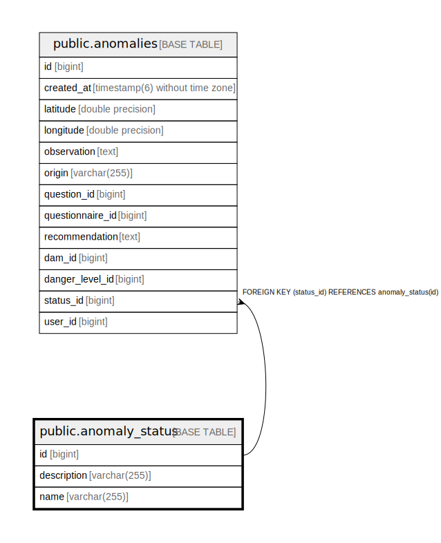
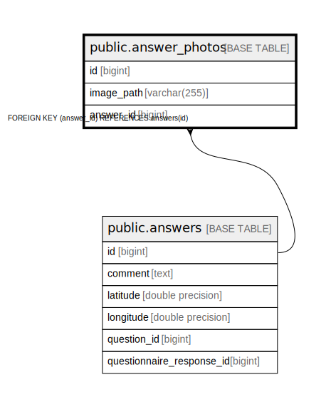
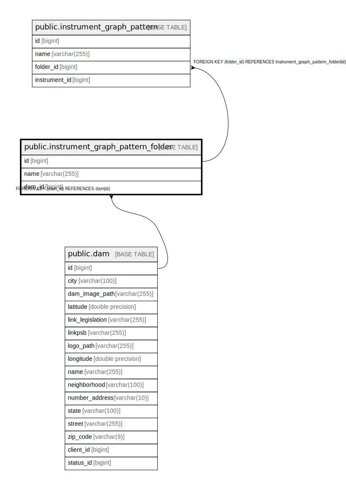
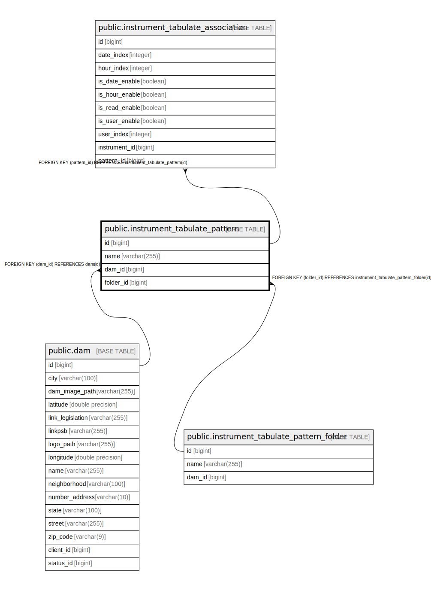
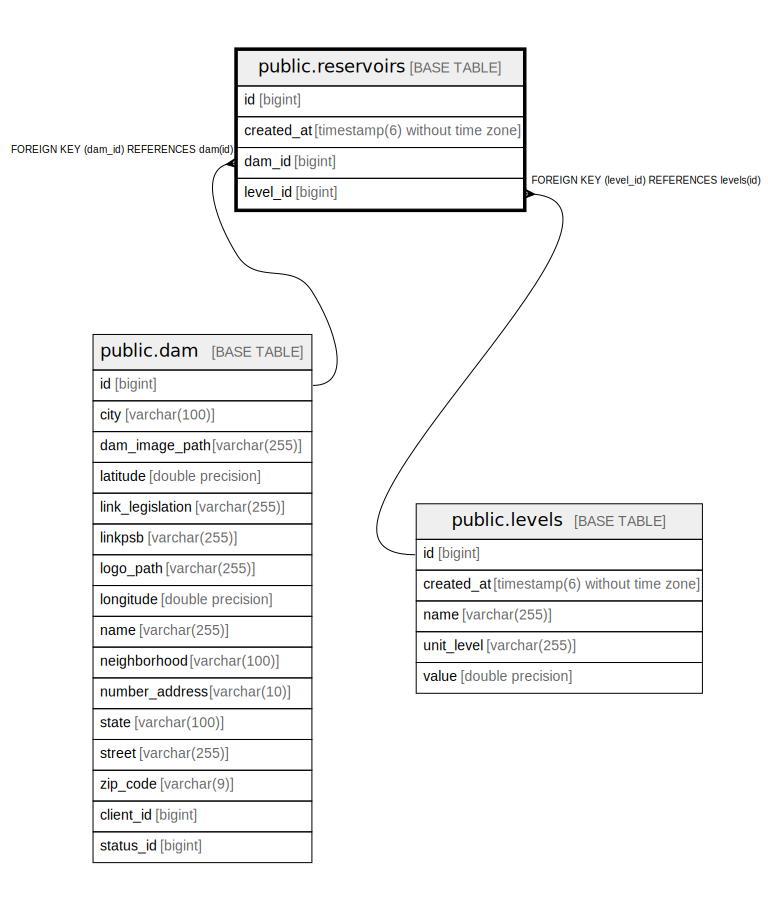

# geosegbar_dev

## Tables

| Name | Columns | Comment | Type |
| ---- | ------- | ------- | ---- |
| [public.anomalies](public.anomalies.md) | 13 |  | BASE TABLE |
| [public.anomaly_photos](public.anomaly_photos.md) | 4 |  | BASE TABLE |
| [public.anomaly_status](public.anomaly_status.md) | 3 |  | BASE TABLE |
| [public.answer_options](public.answer_options.md) | 2 |  | BASE TABLE |
| [public.answer_photos](public.answer_photos.md) | 3 |  | BASE TABLE |
| [public.answers](public.answers.md) | 6 |  | BASE TABLE |
| [public.attributions_permissions](public.attributions_permissions.md) | 5 |  | BASE TABLE |
| [public.checklist_dam](public.checklist_dam.md) | 2 |  | BASE TABLE |
| [public.checklist_responses](public.checklist_responses.md) | 6 |  | BASE TABLE |
| [public.checklist_template_questionnaire](public.checklist_template_questionnaire.md) | 2 |  | BASE TABLE |
| [public.checklists](public.checklists.md) | 3 |  | BASE TABLE |
| [public.classification_dams](public.classification_dams.md) | 2 |  | BASE TABLE |
| [public.client](public.client.md) | 15 |  | BASE TABLE |
| [public.constant](public.constant.md) | 7 |  | BASE TABLE |
| [public.dam](public.dam.md) | 16 |  | BASE TABLE |
| [public.dam_permissions](public.dam_permissions.md) | 9 |  | BASE TABLE |
| [public.danger_levels](public.danger_levels.md) | 3 |  | BASE TABLE |
| [public.deterministic_limit](public.deterministic_limit.md) | 5 |  | BASE TABLE |
| [public.documentation_dam](public.documentation_dam.md) | 18 |  | BASE TABLE |
| [public.documentation_permissions](public.documentation_permissions.md) | 5 |  | BASE TABLE |
| [public.input](public.input.md) | 6 |  | BASE TABLE |
| [public.instrument](public.instrument.md) | 15 |  | BASE TABLE |
| [public.instrument_graph_axes](public.instrument_graph_axes.md) | 15 |  | BASE TABLE |
| [public.instrument_graph_customization_properties](public.instrument_graph_customization_properties.md) | 14 |  | BASE TABLE |
| [public.instrument_graph_pattern](public.instrument_graph_pattern.md) | 4 |  | BASE TABLE |
| [public.instrument_graph_pattern_folder](public.instrument_graph_pattern_folder.md) | 3 |  | BASE TABLE |
| [public.instrument_tabulate_association](public.instrument_tabulate_association.md) | 10 |  | BASE TABLE |
| [public.instrument_tabulate_output_association](public.instrument_tabulate_output_association.md) | 4 |  | BASE TABLE |
| [public.instrument_tabulate_pattern](public.instrument_tabulate_pattern.md) | 4 |  | BASE TABLE |
| [public.instrument_tabulate_pattern_folder](public.instrument_tabulate_pattern_folder.md) | 3 |  | BASE TABLE |
| [public.instrument_type](public.instrument_type.md) | 2 |  | BASE TABLE |
| [public.instrumentation_permissions](public.instrumentation_permissions.md) | 11 |  | BASE TABLE |
| [public.levels](public.levels.md) | 5 |  | BASE TABLE |
| [public.measurement_unit](public.measurement_unit.md) | 3 |  | BASE TABLE |
| [public.options](public.options.md) | 4 |  | BASE TABLE |
| [public.output](public.output.md) | 8 |  | BASE TABLE |
| [public.potential_damages](public.potential_damages.md) | 2 |  | BASE TABLE |
| [public.psb_files](public.psb_files.md) | 10 |  | BASE TABLE |
| [public.psb_folders](public.psb_folders.md) | 10 |  | BASE TABLE |
| [public.question_option](public.question_option.md) | 2 |  | BASE TABLE |
| [public.questionnaire_responses](public.questionnaire_responses.md) | 5 |  | BASE TABLE |
| [public.questions](public.questions.md) | 3 |  | BASE TABLE |
| [public.reading](public.reading.md) | 10 |  | BASE TABLE |
| [public.reading_input_value](public.reading_input_value.md) | 4 |  | BASE TABLE |
| [public.reading_input_value_mapping](public.reading_input_value_mapping.md) | 2 |  | BASE TABLE |
| [public.regulatory_dam](public.regulatory_dam.md) | 14 |  | BASE TABLE |
| [public.reservoirs](public.reservoirs.md) | 4 |  | BASE TABLE |
| [public.risk_categories](public.risk_categories.md) | 2 |  | BASE TABLE |
| [public.roles](public.roles.md) | 3 |  | BASE TABLE |
| [public.routine_inspection_permissions](public.routine_inspection_permissions.md) | 4 |  | BASE TABLE |
| [public.section](public.section.md) | 8 |  | BASE TABLE |
| [public.security_levels](public.security_levels.md) | 2 |  | BASE TABLE |
| [public.sex](public.sex.md) | 2 |  | BASE TABLE |
| [public.share_folders](public.share_folders.md) | 9 |  | BASE TABLE |
| [public.statistical_limit](public.statistical_limit.md) | 4 |  | BASE TABLE |
| [public.status](public.status.md) | 2 |  | BASE TABLE |
| [public.template_questionnaire_questions](public.template_questionnaire_questions.md) | 4 |  | BASE TABLE |
| [public.template_questionnaires](public.template_questionnaires.md) | 2 |  | BASE TABLE |
| [public.user_client](public.user_client.md) | 2 |  | BASE TABLE |
| [public.users](public.users.md) | 12 |  | BASE TABLE |
| [public.verification_codes](public.verification_codes.md) | 5 |  | BASE TABLE |

## Relations

---

> Generated by [tbls](https://github.com/k1LoW/tbls)
# public.anomalies

## Description

## Columns

| Name | Type | Default | Nullable | Children | Parents | Comment |
| ---- | ---- | ------- | -------- | -------- | ------- | ------- |
| id | bigint |  | false | [public.anomaly_photos](public.anomaly_photos.md) |  |  |
| created_at | timestamp(6) without time zone |  | false |  |  |  |
| latitude | double precision |  | false |  |  |  |
| longitude | double precision |  | false |  |  |  |
| observation | text |  | true |  |  |  |
| origin | varchar(255) |  | false |  |  |  |
| question_id | bigint |  | true |  |  |  |
| questionnaire_id | bigint |  | true |  |  |  |
| recommendation | text |  | true |  |  |  |
| dam_id | bigint |  | false |  | [public.dam](public.dam.md) |  |
| danger_level_id | bigint |  | false |  | [public.danger_levels](public.danger_levels.md) |  |
| status_id | bigint |  | false |  | [public.anomaly_status](public.anomaly_status.md) |  |
| user_id | bigint |  | false |  | [public.users](public.users.md) |  |

## Constraints

| Name | Type | Definition |
| ---- | ---- | ---------- |
| anomalies_origin_check | CHECK | CHECK (((origin)::text = ANY ((ARRAY['CHECKLIST'::character varying, 'WEB'::character varying, 'OTHER'::character varying])::text[]))) |
| anomalies_pkey | PRIMARY KEY | PRIMARY KEY (id) |
| fke554m1il2p7t2whhsqj6nelsv | FOREIGN KEY | FOREIGN KEY (status_id) REFERENCES anomaly_status(id) |
| fkieyax3pfwm94tfy8sh47dok4x | FOREIGN KEY | FOREIGN KEY (dam_id) REFERENCES dam(id) |
| fkgcpc164oygiguoa08967r55ow | FOREIGN KEY | FOREIGN KEY (danger_level_id) REFERENCES danger_levels(id) |
| fkhig0kyy20prba25f7akn0hrly | FOREIGN KEY | FOREIGN KEY (user_id) REFERENCES users(id) |

## Indexes

| Name | Definition |
| ---- | ---------- |
| anomalies_pkey | CREATE UNIQUE INDEX anomalies_pkey ON public.anomalies USING btree (id) |
| idx_anomaly_dam_id | CREATE INDEX idx_anomaly_dam_id ON public.anomalies USING btree (dam_id) |
| idx_anomaly_user_id | CREATE INDEX idx_anomaly_user_id ON public.anomalies USING btree (user_id) |
| idx_anomaly_status_id | CREATE INDEX idx_anomaly_status_id ON public.anomalies USING btree (status_id) |
| idx_anomaly_danger_level_id | CREATE INDEX idx_anomaly_danger_level_id ON public.anomalies USING btree (danger_level_id) |
| idx_anomaly_created_at | CREATE INDEX idx_anomaly_created_at ON public.anomalies USING btree (created_at) |
| idx_anomaly_created_desc | CREATE INDEX idx_anomaly_created_desc ON public.anomalies USING btree (created_at DESC) |
| idx_anomaly_coordinates | CREATE INDEX idx_anomaly_coordinates ON public.anomalies USING btree (latitude, longitude) |
| idx_anomaly_dam_coordinates | CREATE INDEX idx_anomaly_dam_coordinates ON public.anomalies USING btree (dam_id, latitude, longitude) |
| idx_anomaly_dam_status | CREATE INDEX idx_anomaly_dam_status ON public.anomalies USING btree (dam_id, status_id) |
| idx_anomaly_dam_created | CREATE INDEX idx_anomaly_dam_created ON public.anomalies USING btree (dam_id, created_at DESC) |
| idx_anomaly_user_created | CREATE INDEX idx_anomaly_user_created ON public.anomalies USING btree (user_id, created_at DESC) |
| idx_anomaly_status_created | CREATE INDEX idx_anomaly_status_created ON public.anomalies USING btree (status_id, created_at DESC) |
| idx_anomaly_danger_created | CREATE INDEX idx_anomaly_danger_created ON public.anomalies USING btree (danger_level_id, created_at DESC) |
| idx_anomaly_origin | CREATE INDEX idx_anomaly_origin ON public.anomalies USING btree (origin) |
| idx_anomaly_questionnaire_id | CREATE INDEX idx_anomaly_questionnaire_id ON public.anomalies USING btree (questionnaire_id) |
| idx_anomaly_question_id | CREATE INDEX idx_anomaly_question_id ON public.anomalies USING btree (question_id) |
| idx_anomaly_origin_dam | CREATE INDEX idx_anomaly_origin_dam ON public.anomalies USING btree (origin, dam_id) |
| idx_anomaly_dam_danger_status | CREATE INDEX idx_anomaly_dam_danger_status ON public.anomalies USING btree (dam_id, danger_level_id, status_id) |
| idx_anomaly_complete_filter | CREATE INDEX idx_anomaly_complete_filter ON public.anomalies USING btree (dam_id, status_id, danger_level_id, created_at DESC) |

## Relations

---

> Generated by [tbls](https://github.com/k1LoW/tbls)
# public.anomaly_photos

## Description

## Columns

| Name | Type | Default | Nullable | Children | Parents | Comment |
| ---- | ---- | ------- | -------- | -------- | ------- | ------- |
| id | bigint |  | false |  |  |  |
| dam_id | bigint |  | true |  |  |  |
| image_path | varchar(255) |  | false |  |  |  |
| anomaly_id | bigint |  | false |  | [public.anomalies](public.anomalies.md) |  |

## Constraints

| Name | Type | Definition |
| ---- | ---- | ---------- |
| fk1t30oqndwrg68os1teh3yyalx | FOREIGN KEY | FOREIGN KEY (anomaly_id) REFERENCES anomalies(id) |
| anomaly_photos_pkey | PRIMARY KEY | PRIMARY KEY (id) |

## Indexes

| Name | Definition |
| ---- | ---------- |
| anomaly_photos_pkey | CREATE UNIQUE INDEX anomaly_photos_pkey ON public.anomaly_photos USING btree (id) |
| idx_anomaly_photo_anomaly_id | CREATE INDEX idx_anomaly_photo_anomaly_id ON public.anomaly_photos USING btree (anomaly_id) |
| idx_anomaly_photo_dam_id | CREATE INDEX idx_anomaly_photo_dam_id ON public.anomaly_photos USING btree (dam_id) |
| idx_anomaly_photo_anomaly_dam | CREATE INDEX idx_anomaly_photo_anomaly_dam ON public.anomaly_photos USING btree (anomaly_id, dam_id) |

## Relations

---

> Generated by [tbls](https://github.com/k1LoW/tbls)
# public.anomaly_status

## Description

## Columns

| Name | Type | Default | Nullable | Children | Parents | Comment |
| ---- | ---- | ------- | -------- | -------- | ------- | ------- |
| id | bigint |  | false | [public.anomalies](public.anomalies.md) |  |  |
| description | varchar(255) |  | true |  |  |  |
| name | varchar(255) |  | false |  |  |  |

## Constraints

| Name | Type | Definition |
| ---- | ---- | ---------- |
| anomaly_status_pkey | PRIMARY KEY | PRIMARY KEY (id) |
| ukdg1d22ieciexjyclaxeol0sf | UNIQUE | UNIQUE (name) |

## Indexes

| Name | Definition |
| ---- | ---------- |
| anomaly_status_pkey | CREATE UNIQUE INDEX anomaly_status_pkey ON public.anomaly_status USING btree (id) |
| ukdg1d22ieciexjyclaxeol0sf | CREATE UNIQUE INDEX ukdg1d22ieciexjyclaxeol0sf ON public.anomaly_status USING btree (name) |

## Relations

---

> Generated by [tbls](https://github.com/k1LoW/tbls)
# public.answer_options

## Description

## Columns

| Name | Type | Default | Nullable | Children | Parents | Comment |
| ---- | ---- | ------- | -------- | -------- | ------- | ------- |
| answer_id | bigint |  | false |  | [public.answers](public.answers.md) |  |
| option_id | bigint |  | false |  | [public.options](public.options.md) |  |

## Constraints

| Name | Type | Definition |
| ---- | ---- | ---------- |
| answer_options_pkey | PRIMARY KEY | PRIMARY KEY (answer_id, option_id) |
| fk9hu9eir3fpbcbq83yxmqo0roh | FOREIGN KEY | FOREIGN KEY (answer_id) REFERENCES answers(id) |
| fkpaub45j3djvy5md5yph6qhv0o | FOREIGN KEY | FOREIGN KEY (option_id) REFERENCES options(id) |

## Indexes

| Name | Definition |
| ---- | ---------- |
| answer_options_pkey | CREATE UNIQUE INDEX answer_options_pkey ON public.answer_options USING btree (answer_id, option_id) |

## Relations

---

> Generated by [tbls](https://github.com/k1LoW/tbls)
# public.answer_photos

## Description

## Columns

| Name | Type | Default | Nullable | Children | Parents | Comment |
| ---- | ---- | ------- | -------- | -------- | ------- | ------- |
| id | bigint |  | false |  |  |  |
| image_path | varchar(255) |  | false |  |  |  |
| answer_id | bigint |  | false |  | [public.answers](public.answers.md) |  |

## Constraints

| Name | Type | Definition |
| ---- | ---- | ---------- |
| answer_photos_pkey | PRIMARY KEY | PRIMARY KEY (id) |
| fkkgnj01ehuqlcv02pneatbb2he | FOREIGN KEY | FOREIGN KEY (answer_id) REFERENCES answers(id) |

## Indexes

| Name | Definition |
| ---- | ---------- |
| answer_photos_pkey | CREATE UNIQUE INDEX answer_photos_pkey ON public.answer_photos USING btree (id) |
| idx_answer_photo_answer_id | CREATE INDEX idx_answer_photo_answer_id ON public.answer_photos USING btree (answer_id) |

## Relations

---

> Generated by [tbls](https://github.com/k1LoW/tbls)
# public.answers

## Description

## Columns

| Name | Type | Default | Nullable | Children | Parents | Comment |
| ---- | ---- | ------- | -------- | -------- | ------- | ------- |
| id | bigint |  | false | [public.answer_options](public.answer_options.md) [public.answer_photos](public.answer_photos.md) |  |  |
| comment | text |  | true |  |  |  |
| latitude | double precision |  | true |  |  |  |
| longitude | double precision |  | true |  |  |  |
| question_id | bigint |  | false |  | [public.questions](public.questions.md) |  |
| questionnaire_response_id | bigint |  | false |  | [public.questionnaire_responses](public.questionnaire_responses.md) |  |

## Constraints

| Name | Type | Definition |
| ---- | ---- | ---------- |
| answers_pkey | PRIMARY KEY | PRIMARY KEY (id) |
| fk9efww7kc8ubw3bq257gkkdu2s | FOREIGN KEY | FOREIGN KEY (questionnaire_response_id) REFERENCES questionnaire_responses(id) |
| fk3erw1a3t0r78st8ty27x6v3g1 | FOREIGN KEY | FOREIGN KEY (question_id) REFERENCES questions(id) |

## Indexes

| Name | Definition |
| ---- | ---------- |
| answers_pkey | CREATE UNIQUE INDEX answers_pkey ON public.answers USING btree (id) |
| idx_answer_question | CREATE INDEX idx_answer_question ON public.answers USING btree (question_id) |
| idx_answer_questionnaire | CREATE INDEX idx_answer_questionnaire ON public.answers USING btree (questionnaire_response_id) |
| idx_answer_coords | CREATE INDEX idx_answer_coords ON public.answers USING btree (latitude, longitude) |

## Relations

---

> Generated by [tbls](https://github.com/k1LoW/tbls)
# public.attributions_permissions

## Description

## Columns

| Name | Type | Default | Nullable | Children | Parents | Comment |
| ---- | ---- | ------- | -------- | -------- | ------- | ------- |
| id | bigint |  | false |  |  |  |
| edit_dam | boolean |  | false |  |  |  |
| edit_geral_data | boolean |  | false |  |  |  |
| edit_user | boolean |  | false |  |  |  |
| user_id | bigint |  | false |  | [public.users](public.users.md) |  |

## Constraints

| Name | Type | Definition |
| ---- | ---- | ---------- |
| attributions_permissions_pkey | PRIMARY KEY | PRIMARY KEY (id) |
| fka1q3jt8gie13q8g6x5vl8v6i1 | FOREIGN KEY | FOREIGN KEY (user_id) REFERENCES users(id) |
| uk9mnnppoxlxm4fdutrst7m7dqi | UNIQUE | UNIQUE (user_id) |

## Indexes

| Name | Definition |
| ---- | ---------- |
| attributions_permissions_pkey | CREATE UNIQUE INDEX attributions_permissions_pkey ON public.attributions_permissions USING btree (id) |
| uk9mnnppoxlxm4fdutrst7m7dqi | CREATE UNIQUE INDEX uk9mnnppoxlxm4fdutrst7m7dqi ON public.attributions_permissions USING btree (user_id) |

## Relations

---

> Generated by [tbls](https://github.com/k1LoW/tbls)
# public.checklist_dam

## Description

## Columns

| Name | Type | Default | Nullable | Children | Parents | Comment |
| ---- | ---- | ------- | -------- | -------- | ------- | ------- |
| checklist_id | bigint |  | false |  | [public.checklists](public.checklists.md) |  |
| dam_id | bigint |  | false |  | [public.dam](public.dam.md) |  |

## Constraints

| Name | Type | Definition |
| ---- | ---- | ---------- |
| checklist_dam_pkey | PRIMARY KEY | PRIMARY KEY (checklist_id, dam_id) |
| fkfytsig8waln14352kfj5k5c07 | FOREIGN KEY | FOREIGN KEY (checklist_id) REFERENCES checklists(id) |
| fk43rom8q80db2jn3ck2g1m4e8d | FOREIGN KEY | FOREIGN KEY (dam_id) REFERENCES dam(id) |

## Indexes

| Name | Definition |
| ---- | ---------- |
| checklist_dam_pkey | CREATE UNIQUE INDEX checklist_dam_pkey ON public.checklist_dam USING btree (checklist_id, dam_id) |

## Relations

---

> Generated by [tbls](https://github.com/k1LoW/tbls)
# public.checklist_responses

## Description

## Columns

| Name | Type | Default | Nullable | Children | Parents | Comment |
| ---- | ---- | ------- | -------- | -------- | ------- | ------- |
| id | bigint |  | false | [public.questionnaire_responses](public.questionnaire_responses.md) |  |  |
| checklist_id | bigint |  | false |  |  |  |
| checklist_name | varchar(255) |  | false |  |  |  |
| created_at | timestamp(6) without time zone |  | true |  |  |  |
| dam_id | bigint |  | false |  | [public.dam](public.dam.md) |  |
| user_id | bigint |  | false |  | [public.users](public.users.md) |  |

## Constraints

| Name | Type | Definition |
| ---- | ---- | ---------- |
| checklist_responses_pkey | PRIMARY KEY | PRIMARY KEY (id) |
| fkoef60bxqq0drq2774f3830l1y | FOREIGN KEY | FOREIGN KEY (dam_id) REFERENCES dam(id) |
| fkrljl7a4kngcrwf0hb3bctmhe8 | FOREIGN KEY | FOREIGN KEY (user_id) REFERENCES users(id) |

## Indexes

| Name | Definition |
| ---- | ---------- |
| checklist_responses_pkey | CREATE UNIQUE INDEX checklist_responses_pkey ON public.checklist_responses USING btree (id) |
| idx_checklist_response_dam_id | CREATE INDEX idx_checklist_response_dam_id ON public.checklist_responses USING btree (dam_id) |
| idx_checklist_response_user_id | CREATE INDEX idx_checklist_response_user_id ON public.checklist_responses USING btree (user_id) |
| idx_checklist_response_checklist_id | CREATE INDEX idx_checklist_response_checklist_id ON public.checklist_responses USING btree (checklist_id) |
| idx_checklist_response_created_at | CREATE INDEX idx_checklist_response_created_at ON public.checklist_responses USING btree (created_at) |
| idx_checklist_response_dam_created_desc | CREATE INDEX idx_checklist_response_dam_created_desc ON public.checklist_responses USING btree (dam_id, created_at) |
| idx_checklist_response_dam_checklist_created | CREATE INDEX idx_checklist_response_dam_checklist_created ON public.checklist_responses USING btree (dam_id, checklist_id, created_at) |
| idx_checklist_response_dam_period | CREATE INDEX idx_checklist_response_dam_period ON public.checklist_responses USING btree (dam_id, created_at) |
| idx_checklist_response_user_created | CREATE INDEX idx_checklist_response_user_created ON public.checklist_responses USING btree (user_id, created_at) |

## Relations

---

> Generated by [tbls](https://github.com/k1LoW/tbls)
# public.checklist_template_questionnaire

## Description

## Columns

| Name | Type | Default | Nullable | Children | Parents | Comment |
| ---- | ---- | ------- | -------- | -------- | ------- | ------- |
| checklist_id | bigint |  | false |  | [public.checklists](public.checklists.md) |  |
| template_questionnaire_id | bigint |  | false |  | [public.template_questionnaires](public.template_questionnaires.md) |  |

## Constraints

| Name | Type | Definition |
| ---- | ---- | ---------- |
| checklist_template_questionnaire_pkey | PRIMARY KEY | PRIMARY KEY (checklist_id, template_questionnaire_id) |
| fkh834fdiv212fsnxdgkbpsoqo1 | FOREIGN KEY | FOREIGN KEY (checklist_id) REFERENCES checklists(id) |
| fk3ea1ejhkfasyc2fu5rnl3dylx | FOREIGN KEY | FOREIGN KEY (template_questionnaire_id) REFERENCES template_questionnaires(id) |

## Indexes

| Name | Definition |
| ---- | ---------- |
| checklist_template_questionnaire_pkey | CREATE UNIQUE INDEX checklist_template_questionnaire_pkey ON public.checklist_template_questionnaire USING btree (checklist_id, template_questionnaire_id) |

## Relations

---

> Generated by [tbls](https://github.com/k1LoW/tbls)
# public.checklists

## Description

## Columns

| Name | Type | Default | Nullable | Children | Parents | Comment |
| ---- | ---- | ------- | -------- | -------- | ------- | ------- |
| id | bigint |  | false | [public.checklist_dam](public.checklist_dam.md) [public.checklist_template_questionnaire](public.checklist_template_questionnaire.md) |  |  |
| created_at | timestamp(6) without time zone |  | true |  |  |  |
| name | varchar(255) |  | false |  |  |  |

## Constraints

| Name | Type | Definition |
| ---- | ---- | ---------- |
| checklists_pkey | PRIMARY KEY | PRIMARY KEY (id) |

## Indexes

| Name | Definition |
| ---- | ---------- |
| checklists_pkey | CREATE UNIQUE INDEX checklists_pkey ON public.checklists USING btree (id) |
| idx_checklist_name | CREATE INDEX idx_checklist_name ON public.checklists USING btree (name) |
| idx_checklist_created_at | CREATE INDEX idx_checklist_created_at ON public.checklists USING btree (created_at) |

## Relations

---

> Generated by [tbls](https://github.com/k1LoW/tbls)
# public.classification_dams

## Description

## Columns

| Name | Type | Default | Nullable | Children | Parents | Comment |
| ---- | ---- | ------- | -------- | -------- | ------- | ------- |
| id | bigint |  | false | [public.regulatory_dam](public.regulatory_dam.md) |  |  |
| classification | varchar(255) |  | false |  |  |  |

## Constraints

| Name | Type | Definition |
| ---- | ---- | ---------- |
| classification_dams_pkey | PRIMARY KEY | PRIMARY KEY (id) |
| idx_classification_value | UNIQUE | UNIQUE (classification) |

## Indexes

| Name | Definition |
| ---- | ---------- |
| classification_dams_pkey | CREATE UNIQUE INDEX classification_dams_pkey ON public.classification_dams USING btree (id) |
| idx_classification_value | CREATE UNIQUE INDEX idx_classification_value ON public.classification_dams USING btree (classification) |

## Relations

---

> Generated by [tbls](https://github.com/k1LoW/tbls)
# public.client

## Description

## Columns

| Name | Type | Default | Nullable | Children | Parents | Comment |
| ---- | ---- | ------- | -------- | -------- | ------- | ------- |
| id | bigint |  | false | [public.dam](public.dam.md) [public.dam_permissions](public.dam_permissions.md) [public.user_client](public.user_client.md) |  |  |
| city | varchar(100) |  | false |  |  |  |
| complement | varchar(100) |  | true |  |  |  |
| email | varchar(255) |  | false |  |  |  |
| email_contact | varchar(150) |  | true |  |  |  |
| logo_path | varchar(255) |  | true |  |  |  |
| name | varchar(255) |  | false |  |  |  |
| neighborhood | varchar(100) |  | false |  |  |  |
| number_address | varchar(10) |  | true |  |  |  |
| phone | varchar(11) |  | false |  |  |  |
| state | varchar(100) |  | false |  |  |  |
| street | varchar(255) |  | false |  |  |  |
| whatsapp_phone | varchar(11) |  | true |  |  |  |
| zip_code | varchar(9) |  | false |  |  |  |
| status_id | bigint |  | true |  | [public.status](public.status.md) |  |

## Constraints

| Name | Type | Definition |
| ---- | ---- | ---------- |
| client_pkey | PRIMARY KEY | PRIMARY KEY (id) |
| fkpc4nxaf4m9semynspoxq8cmu6 | FOREIGN KEY | FOREIGN KEY (status_id) REFERENCES status(id) |
| idx_client_name | UNIQUE | UNIQUE (name) |
| idx_client_email | UNIQUE | UNIQUE (email) |

## Indexes

| Name | Definition |
| ---- | ---------- |
| client_pkey | CREATE UNIQUE INDEX client_pkey ON public.client USING btree (id) |
| idx_client_status | CREATE INDEX idx_client_status ON public.client USING btree (status_id) |
| idx_client_phone | CREATE INDEX idx_client_phone ON public.client USING btree (phone) |
| idx_client_whatsapp | CREATE INDEX idx_client_whatsapp ON public.client USING btree (whatsapp_phone) |
| idx_client_email_contact | CREATE INDEX idx_client_email_contact ON public.client USING btree (email_contact) |
| idx_client_city | CREATE INDEX idx_client_city ON public.client USING btree (city) |
| idx_client_state | CREATE INDEX idx_client_state ON public.client USING btree (state) |
| idx_client_city_state | CREATE INDEX idx_client_city_state ON public.client USING btree (city, state) |
| idx_client_zip_code | CREATE INDEX idx_client_zip_code ON public.client USING btree (zip_code) |
| idx_client_status_name | CREATE INDEX idx_client_status_name ON public.client USING btree (status_id, name) |
| idx_client_status_city | CREATE INDEX idx_client_status_city ON public.client USING btree (status_id, city) |
| idx_client_state_status | CREATE INDEX idx_client_state_status ON public.client USING btree (state, status_id) |
| idx_client_name | CREATE UNIQUE INDEX idx_client_name ON public.client USING btree (name) |
| idx_client_email | CREATE UNIQUE INDEX idx_client_email ON public.client USING btree (email) |

## Relations

---

> Generated by [tbls](https://github.com/k1LoW/tbls)
# public.constant

## Description

## Columns

| Name | Type | Default | Nullable | Children | Parents | Comment |
| ---- | ---- | ------- | -------- | -------- | ------- | ------- |
| id | bigint |  | false | [public.instrument_graph_customization_properties](public.instrument_graph_customization_properties.md) |  |  |
| acronym | varchar(255) |  | false |  |  |  |
| name | varchar(255) |  | false |  |  |  |
| precision | integer |  | false |  |  |  |
| value | double precision |  | false |  |  |  |
| instrument_id | bigint |  | false |  | [public.instrument](public.instrument.md) |  |
| measurement_unit_id | bigint |  | false |  | [public.measurement_unit](public.measurement_unit.md) |  |

## Constraints

| Name | Type | Definition |
| ---- | ---- | ---------- |
| constant_pkey | PRIMARY KEY | PRIMARY KEY (id) |
| fk99yik34r84cmesqdvu2q9qetk | FOREIGN KEY | FOREIGN KEY (instrument_id) REFERENCES instrument(id) |
| fktqq0e890ncxphsabkucty5n5p | FOREIGN KEY | FOREIGN KEY (measurement_unit_id) REFERENCES measurement_unit(id) |

## Indexes

| Name | Definition |
| ---- | ---------- |
| constant_pkey | CREATE UNIQUE INDEX constant_pkey ON public.constant USING btree (id) |
| idx_constant_instrument_id | CREATE INDEX idx_constant_instrument_id ON public.constant USING btree (instrument_id) |
| idx_constant_acronym | CREATE INDEX idx_constant_acronym ON public.constant USING btree (acronym) |
| idx_constant_instrument_acronym | CREATE INDEX idx_constant_instrument_acronym ON public.constant USING btree (instrument_id, acronym) |

## Relations

---

> Generated by [tbls](https://github.com/k1LoW/tbls)
# public.dam

## Description

## Columns

| Name | Type | Default | Nullable | Children | Parents | Comment |
| ---- | ---- | ------- | -------- | -------- | ------- | ------- |
| id | bigint |  | false | [public.anomalies](public.anomalies.md) [public.checklist_dam](public.checklist_dam.md) [public.checklist_responses](public.checklist_responses.md) [public.dam_permissions](public.dam_permissions.md) [public.documentation_dam](public.documentation_dam.md) [public.instrument](public.instrument.md) [public.instrument_graph_pattern_folder](public.instrument_graph_pattern_folder.md) [public.instrument_tabulate_pattern](public.instrument_tabulate_pattern.md) [public.instrument_tabulate_pattern_folder](public.instrument_tabulate_pattern_folder.md) [public.psb_folders](public.psb_folders.md) [public.questionnaire_responses](public.questionnaire_responses.md) [public.regulatory_dam](public.regulatory_dam.md) [public.reservoirs](public.reservoirs.md) [public.section](public.section.md) |  |  |
| city | varchar(100) |  | false |  |  |  |
| dam_image_path | varchar(255) |  | true |  |  |  |
| latitude | double precision |  | false |  |  |  |
| link_legislation | varchar(255) |  | true |  |  |  |
| linkpsb | varchar(255) |  | true |  |  |  |
| logo_path | varchar(255) |  | true |  |  |  |
| longitude | double precision |  | false |  |  |  |
| name | varchar(255) |  | false |  |  |  |
| neighborhood | varchar(100) |  | true |  |  |  |
| number_address | varchar(10) |  | true |  |  |  |
| state | varchar(100) |  | false |  |  |  |
| street | varchar(255) |  | false |  |  |  |
| zip_code | varchar(9) |  | false |  |  |  |
| client_id | bigint |  | true |  | [public.client](public.client.md) |  |
| status_id | bigint |  | true |  | [public.status](public.status.md) |  |

## Constraints

| Name | Type | Definition |
| ---- | ---- | ---------- |
| fkidd4mv5rt7qs9draouxva9hvy | FOREIGN KEY | FOREIGN KEY (client_id) REFERENCES client(id) |
| dam_pkey | PRIMARY KEY | PRIMARY KEY (id) |
| fk1msr5e0iyphyifdwrp39ff34o | FOREIGN KEY | FOREIGN KEY (status_id) REFERENCES status(id) |

## Indexes

| Name | Definition |
| ---- | ---------- |
| dam_pkey | CREATE UNIQUE INDEX dam_pkey ON public.dam USING btree (id) |
| idx_dam_client_id | CREATE INDEX idx_dam_client_id ON public.dam USING btree (client_id) |
| idx_dam_status_id | CREATE INDEX idx_dam_status_id ON public.dam USING btree (status_id) |
| idx_dam_name | CREATE INDEX idx_dam_name ON public.dam USING btree (name) |
| idx_dam_coords | CREATE INDEX idx_dam_coords ON public.dam USING btree (latitude, longitude) |
| idx_dam_city_state | CREATE INDEX idx_dam_city_state ON public.dam USING btree (city, state) |
| idx_dam_zip | CREATE INDEX idx_dam_zip ON public.dam USING btree (zip_code) |
| idx_dam_latitude | CREATE INDEX idx_dam_latitude ON public.dam USING btree (latitude) |
| idx_dam_longitude | CREATE INDEX idx_dam_longitude ON public.dam USING btree (longitude) |
| idx_dam_city | CREATE INDEX idx_dam_city ON public.dam USING btree (city) |
| idx_dam_state | CREATE INDEX idx_dam_state ON public.dam USING btree (state) |
| idx_dam_client_status | CREATE INDEX idx_dam_client_status ON public.dam USING btree (client_id, status_id) |
| idx_dam_client_name | CREATE INDEX idx_dam_client_name ON public.dam USING btree (client_id, name) |
| idx_dam_status_city | CREATE INDEX idx_dam_status_city ON public.dam USING btree (status_id, city) |
| idx_dam_client_coords | CREATE INDEX idx_dam_client_coords ON public.dam USING btree (client_id, latitude, longitude) |
| idx_dam_client_geo_status | CREATE INDEX idx_dam_client_geo_status ON public.dam USING btree (client_id, status_id, latitude, longitude) |

## Relations

---

> Generated by [tbls](https://github.com/k1LoW/tbls)
# public.dam_permissions

## Description

## Columns

| Name | Type | Default | Nullable | Children | Parents | Comment |
| ---- | ---- | ------- | -------- | -------- | ------- | ------- |
| id | bigint |  | false |  |  |  |
| created_at | timestamp(6) without time zone |  | true |  |  |  |
| has_access | boolean |  | false |  |  |  |
| updated_at | timestamp(6) without time zone |  | true |  |  |  |
| client_id | bigint |  | false |  | [public.client](public.client.md) |  |
| created_by | bigint |  | true |  | [public.users](public.users.md) |  |
| dam_id | bigint |  | false |  | [public.dam](public.dam.md) |  |
| updated_by | bigint |  | true |  | [public.users](public.users.md) |  |
| user_id | bigint |  | false |  | [public.users](public.users.md) |  |

## Constraints

| Name | Type | Definition |
| ---- | ---- | ---------- |
| fkhyg3mf5ugawo240w1872q8g4w | FOREIGN KEY | FOREIGN KEY (client_id) REFERENCES client(id) |
| fkksjft6poa1th6qtkhwielk8d | FOREIGN KEY | FOREIGN KEY (dam_id) REFERENCES dam(id) |
| dam_permissions_pkey | PRIMARY KEY | PRIMARY KEY (id) |
| fk6hhpo5kbs452dyo5scmjitu5c | FOREIGN KEY | FOREIGN KEY (created_by) REFERENCES users(id) |
| fkdss7rlsfpu1nygiwqu5gr0our | FOREIGN KEY | FOREIGN KEY (updated_by) REFERENCES users(id) |
| fkmonsrspiqcprcfm64r19p4tvh | FOREIGN KEY | FOREIGN KEY (user_id) REFERENCES users(id) |
| uk9k4u6c1rgg3fwiuvmgp3g46wx | UNIQUE | UNIQUE (user_id, dam_id, client_id) |

## Indexes

| Name | Definition |
| ---- | ---------- |
| dam_permissions_pkey | CREATE UNIQUE INDEX dam_permissions_pkey ON public.dam_permissions USING btree (id) |
| idx_dam_perm_user_id | CREATE INDEX idx_dam_perm_user_id ON public.dam_permissions USING btree (user_id) |
| idx_dam_perm_dam_id | CREATE INDEX idx_dam_perm_dam_id ON public.dam_permissions USING btree (dam_id) |
| idx_dam_perm_client_id | CREATE INDEX idx_dam_perm_client_id ON public.dam_permissions USING btree (client_id) |
| idx_dam_perm_access | CREATE INDEX idx_dam_perm_access ON public.dam_permissions USING btree (has_access) |
| idx_dam_perm_created_at | CREATE INDEX idx_dam_perm_created_at ON public.dam_permissions USING btree (created_at) |
| idx_dam_perm_created_by | CREATE INDEX idx_dam_perm_created_by ON public.dam_permissions USING btree (created_by) |
| idx_dam_perm_updated_by | CREATE INDEX idx_dam_perm_updated_by ON public.dam_permissions USING btree (updated_by) |
| idx_dam_perm_user_access | CREATE INDEX idx_dam_perm_user_access ON public.dam_permissions USING btree (user_id, has_access) |
| idx_dam_perm_client_access | CREATE INDEX idx_dam_perm_client_access ON public.dam_permissions USING btree (client_id, has_access) |
| idx_dam_perm_dam_access | CREATE INDEX idx_dam_perm_dam_access ON public.dam_permissions USING btree (dam_id, has_access) |
| idx_dam_perm_user_client | CREATE INDEX idx_dam_perm_user_client ON public.dam_permissions USING btree (user_id, client_id) |
| idx_dam_perm_user_dam | CREATE INDEX idx_dam_perm_user_dam ON public.dam_permissions USING btree (user_id, dam_id) |
| uk9k4u6c1rgg3fwiuvmgp3g46wx | CREATE UNIQUE INDEX uk9k4u6c1rgg3fwiuvmgp3g46wx ON public.dam_permissions USING btree (user_id, dam_id, client_id) |

## Relations

---

> Generated by [tbls](https://github.com/k1LoW/tbls)
# public.danger_levels

## Description

## Columns

| Name | Type | Default | Nullable | Children | Parents | Comment |
| ---- | ---- | ------- | -------- | -------- | ------- | ------- |
| id | bigint |  | false | [public.anomalies](public.anomalies.md) |  |  |
| description | varchar(255) |  | true |  |  |  |
| name | varchar(255) |  | false |  |  |  |

## Constraints

| Name | Type | Definition |
| ---- | ---- | ---------- |
| danger_levels_pkey | PRIMARY KEY | PRIMARY KEY (id) |
| ukb7cvdwhtv2v8hiejssydwjytu | UNIQUE | UNIQUE (name) |

## Indexes

| Name | Definition |
| ---- | ---------- |
| danger_levels_pkey | CREATE UNIQUE INDEX danger_levels_pkey ON public.danger_levels USING btree (id) |
| ukb7cvdwhtv2v8hiejssydwjytu | CREATE UNIQUE INDEX ukb7cvdwhtv2v8hiejssydwjytu ON public.danger_levels USING btree (name) |

## Relations

---

> Generated by [tbls](https://github.com/k1LoW/tbls)
# public.deterministic_limit

## Description

## Columns

| Name | Type | Default | Nullable | Children | Parents | Comment |
| ---- | ---- | ------- | -------- | -------- | ------- | ------- |
| id | bigint |  | false | [public.instrument_graph_customization_properties](public.instrument_graph_customization_properties.md) |  |  |
| alert_value | double precision |  | true |  |  |  |
| attention_value | double precision |  | true |  |  |  |
| emergency_value | double precision |  | true |  |  |  |
| output_id | bigint |  | false |  | [public.output](public.output.md) |  |

## Constraints

| Name | Type | Definition |
| ---- | ---- | ---------- |
| deterministic_limit_pkey | PRIMARY KEY | PRIMARY KEY (id) |
| fk219qt88q8hbcffvk14k6l7elm | FOREIGN KEY | FOREIGN KEY (output_id) REFERENCES output(id) |
| uk4fotk9wwwy8t9cund516ym0n8 | UNIQUE | UNIQUE (output_id) |

## Indexes

| Name | Definition |
| ---- | ---------- |
| deterministic_limit_pkey | CREATE UNIQUE INDEX deterministic_limit_pkey ON public.deterministic_limit USING btree (id) |
| uk4fotk9wwwy8t9cund516ym0n8 | CREATE UNIQUE INDEX uk4fotk9wwwy8t9cund516ym0n8 ON public.deterministic_limit USING btree (output_id) |

## Relations

---

> Generated by [tbls](https://github.com/k1LoW/tbls)
# public.documentation_dam

## Description

## Columns

| Name | Type | Default | Nullable | Children | Parents | Comment |
| ---- | ---- | ------- | -------- | -------- | ------- | ------- |
| id | bigint |  | false |  |  |  |
| last_achievement_checklist | date |  | true |  |  |  |
| last_achievement_isr | date |  | true |  |  |  |
| last_external_simulation | date |  | true |  |  |  |
| last_filling_fsb | date |  | true |  |  |  |
| last_internal_simulation | date |  | true |  |  |  |
| last_update_pae | date |  | true |  |  |  |
| last_update_psb | date |  | true |  |  |  |
| last_update_rpsb | date |  | true |  |  |  |
| next_achievement_checklist | date |  | true |  |  |  |
| next_achievement_isr | date |  | true |  |  |  |
| next_external_simulation | date |  | true |  |  |  |
| next_filling_fsb | date |  | true |  |  |  |
| next_internal_simulation | date |  | true |  |  |  |
| next_update_pae | date |  | true |  |  |  |
| next_update_psb | date |  | true |  |  |  |
| next_update_rpsb | date |  | true |  |  |  |
| dam_id | bigint |  | false |  | [public.dam](public.dam.md) |  |

## Constraints

| Name | Type | Definition |
| ---- | ---- | ---------- |
| fkgpcxiem741mcp2qygg37cld86 | FOREIGN KEY | FOREIGN KEY (dam_id) REFERENCES dam(id) |
| documentation_dam_pkey | PRIMARY KEY | PRIMARY KEY (id) |
| idx_doc_dam_dam_id | UNIQUE | UNIQUE (dam_id) |

## Indexes

| Name | Definition |
| ---- | ---------- |
| documentation_dam_pkey | CREATE UNIQUE INDEX documentation_dam_pkey ON public.documentation_dam USING btree (id) |
| idx_doc_dam_next_pae | CREATE INDEX idx_doc_dam_next_pae ON public.documentation_dam USING btree (next_update_pae) |
| idx_doc_dam_next_psb | CREATE INDEX idx_doc_dam_next_psb ON public.documentation_dam USING btree (next_update_psb) |
| idx_doc_dam_next_checklist | CREATE INDEX idx_doc_dam_next_checklist ON public.documentation_dam USING btree (next_achievement_checklist) |
| idx_doc_dam_dam_id | CREATE UNIQUE INDEX idx_doc_dam_dam_id ON public.documentation_dam USING btree (dam_id) |

## Relations

---

> Generated by [tbls](https://github.com/k1LoW/tbls)
# public.documentation_permissions

## Description

## Columns

| Name | Type | Default | Nullable | Children | Parents | Comment |
| ---- | ---- | ------- | -------- | -------- | ------- | ------- |
| id | bigint |  | false |  |  |  |
| edit_psb | boolean |  | false |  |  |  |
| share_psb | boolean |  | false |  |  |  |
| view_psb | boolean |  | false |  |  |  |
| user_id | bigint |  | false |  | [public.users](public.users.md) |  |

## Constraints

| Name | Type | Definition |
| ---- | ---- | ---------- |
| documentation_permissions_pkey | PRIMARY KEY | PRIMARY KEY (id) |
| fkgwi3t8vcf4c2l8rcfbcebyy8e | FOREIGN KEY | FOREIGN KEY (user_id) REFERENCES users(id) |
| uk5etsi0t66bcbcogt56a7f4kyd | UNIQUE | UNIQUE (user_id) |

## Indexes

| Name | Definition |
| ---- | ---------- |
| documentation_permissions_pkey | CREATE UNIQUE INDEX documentation_permissions_pkey ON public.documentation_permissions USING btree (id) |
| uk5etsi0t66bcbcogt56a7f4kyd | CREATE UNIQUE INDEX uk5etsi0t66bcbcogt56a7f4kyd ON public.documentation_permissions USING btree (user_id) |

## Relations

---

> Generated by [tbls](https://github.com/k1LoW/tbls)
# public.input

## Description

## Columns

| Name | Type | Default | Nullable | Children | Parents | Comment |
| ---- | ---- | ------- | -------- | -------- | ------- | ------- |
| id | bigint |  | false |  |  |  |
| acronym | varchar(255) |  | false |  |  |  |
| name | varchar(255) |  | false |  |  |  |
| precision | integer |  | false |  |  |  |
| instrument_id | bigint |  | false |  | [public.instrument](public.instrument.md) |  |
| measurement_unit_id | bigint |  | false |  | [public.measurement_unit](public.measurement_unit.md) |  |

## Constraints

| Name | Type | Definition |
| ---- | ---- | ---------- |
| input_pkey | PRIMARY KEY | PRIMARY KEY (id) |
| fki1tcwk1kufv61nmmdobvmg32a | FOREIGN KEY | FOREIGN KEY (instrument_id) REFERENCES instrument(id) |
| fko3d2nchjf132m4l1inu43qn66 | FOREIGN KEY | FOREIGN KEY (measurement_unit_id) REFERENCES measurement_unit(id) |

## Indexes

| Name | Definition |
| ---- | ---------- |
| input_pkey | CREATE UNIQUE INDEX input_pkey ON public.input USING btree (id) |
| idx_input_instrument_id | CREATE INDEX idx_input_instrument_id ON public.input USING btree (instrument_id) |
| idx_input_acronym | CREATE INDEX idx_input_acronym ON public.input USING btree (acronym) |
| idx_input_instrument_acronym | CREATE INDEX idx_input_instrument_acronym ON public.input USING btree (instrument_id, acronym) |

## Relations

---

> Generated by [tbls](https://github.com/k1LoW/tbls)
# public.instrument

## Description

## Columns

| Name | Type | Default | Nullable | Children | Parents | Comment |
| ---- | ---- | ------- | -------- | -------- | ------- | ------- |
| id | bigint |  | false | [public.constant](public.constant.md) [public.input](public.input.md) [public.instrument_graph_customization_properties](public.instrument_graph_customization_properties.md) [public.instrument_graph_pattern](public.instrument_graph_pattern.md) [public.instrument_tabulate_association](public.instrument_tabulate_association.md) [public.output](public.output.md) [public.reading](public.reading.md) |  |  |
| active | boolean |  | false |  |  |  |
| active_for_section | boolean |  | false |  |  |  |
| distance_offset | double precision |  | true |  |  |  |
| is_linimetric_ruler | boolean |  | false |  |  |  |
| last_update_variables_date | timestamp(6) without time zone |  | false |  |  |  |
| latitude | double precision |  | false |  |  |  |
| linimetric_ruler_code | bigint |  | true |  |  |  |
| location | varchar(255) |  | true |  |  |  |
| longitude | double precision |  | false |  |  |  |
| name | varchar(255) |  | false |  |  |  |
| no_limit | boolean |  | false |  |  |  |
| dam_id | bigint |  | false |  | [public.dam](public.dam.md) |  |
| instrument_type_id | bigint |  | false |  | [public.instrument_type](public.instrument_type.md) |  |
| section_id | bigint |  | true |  | [public.section](public.section.md) |  |

## Constraints

| Name | Type | Definition |
| ---- | ---- | ---------- |
| fk4b2cj4h5oiu5tklh8g2dueukg | FOREIGN KEY | FOREIGN KEY (dam_id) REFERENCES dam(id) |
| instrument_pkey | PRIMARY KEY | PRIMARY KEY (id) |
| fk4fmhfxqelvk6ahs32cbxcr7l8 | FOREIGN KEY | FOREIGN KEY (instrument_type_id) REFERENCES instrument_type(id) |
| fk935d40dshf9s321kpngawhnx9 | FOREIGN KEY | FOREIGN KEY (section_id) REFERENCES section(id) |

## Indexes

| Name | Definition |
| ---- | ---------- |
| instrument_pkey | CREATE UNIQUE INDEX instrument_pkey ON public.instrument USING btree (id) |
| idx_instrument_dam_active | CREATE INDEX idx_instrument_dam_active ON public.instrument USING btree (dam_id, active) |
| idx_instrument_section_active | CREATE INDEX idx_instrument_section_active ON public.instrument USING btree (section_id, active) |
| idx_instrument_name | CREATE INDEX idx_instrument_name ON public.instrument USING btree (name) |
| idx_instrument_active_section | CREATE INDEX idx_instrument_active_section ON public.instrument USING btree (active, active_for_section) |
| idx_instrument_type_active | CREATE INDEX idx_instrument_type_active ON public.instrument USING btree (instrument_type_id, active) |
| idx_instrument_dam_type | CREATE INDEX idx_instrument_dam_type ON public.instrument USING btree (dam_id, instrument_type_id) |
| idx_instrument_coordinates | CREATE INDEX idx_instrument_coordinates ON public.instrument USING btree (latitude, longitude) |
| idx_instrument_dam_coordinates | CREATE INDEX idx_instrument_dam_coordinates ON public.instrument USING btree (dam_id, latitude, longitude) |
| idx_instrument_dam_section | CREATE INDEX idx_instrument_dam_section ON public.instrument USING btree (dam_id, section_id) |
| idx_instrument_linimetric | CREATE INDEX idx_instrument_linimetric ON public.instrument USING btree (is_linimetric_ruler) |

## Relations

---

> Generated by [tbls](https://github.com/k1LoW/tbls)
# public.instrument_graph_axes

## Description

## Columns

| Name | Type | Default | Nullable | Children | Parents | Comment |
| ---- | ---- | ------- | -------- | -------- | ------- | ------- |
| id | bigint |  | false |  |  |  |
| abscissa_grid_lines_enable | boolean |  | false |  |  |  |
| abscissa_px | integer |  | false |  |  |  |
| primary_ordinate_grid_lines_enable | boolean |  | false |  |  |  |
| primary_ordinate_initial_value | double precision |  | true |  |  |  |
| primary_ordinate_maximum_value | double precision |  | true |  |  |  |
| primary_ordinate_px | integer |  | false |  |  |  |
| primary_ordinate_spacing | double precision |  | true |  |  |  |
| primary_ordinate_title | varchar(255) |  | true |  |  |  |
| secondary_ordinate_initial_value | double precision |  | true |  |  |  |
| secondary_ordinate_maximum_value | double precision |  | true |  |  |  |
| secondary_ordinate_px | integer |  | false |  |  |  |
| secondary_ordinate_spacing | double precision |  | true |  |  |  |
| secondary_ordinate_title | varchar(255) |  | true |  |  |  |
| pattern_id | bigint |  | false |  | [public.instrument_graph_pattern](public.instrument_graph_pattern.md) |  |

## Constraints

| Name | Type | Definition |
| ---- | ---- | ---------- |
| instrument_graph_axes_pkey | PRIMARY KEY | PRIMARY KEY (id) |
| fkd93iv145rlitv9si9blo8ld0u | FOREIGN KEY | FOREIGN KEY (pattern_id) REFERENCES instrument_graph_pattern(id) |
| ukajv1d6p5oa7j1xewf0t0t9e3a | UNIQUE | UNIQUE (pattern_id) |

## Indexes

| Name | Definition |
| ---- | ---------- |
| instrument_graph_axes_pkey | CREATE UNIQUE INDEX instrument_graph_axes_pkey ON public.instrument_graph_axes USING btree (id) |
| idx_graph_axes_pattern | CREATE INDEX idx_graph_axes_pattern ON public.instrument_graph_axes USING btree (pattern_id) |
| ukajv1d6p5oa7j1xewf0t0t9e3a | CREATE UNIQUE INDEX ukajv1d6p5oa7j1xewf0t0t9e3a ON public.instrument_graph_axes USING btree (pattern_id) |

## Relations

---

> Generated by [tbls](https://github.com/k1LoW/tbls)
# public.instrument_graph_customization_properties

## Description

## Columns

| Name | Type | Default | Nullable | Children | Parents | Comment |
| ---- | ---- | ------- | -------- | -------- | ------- | ------- |
| id | bigint |  | false |  |  |  |
| customization_type | varchar(255) |  | false |  |  |  |
| fill_color | varchar(255) |  | true |  |  |  |
| is_primary_ordinate | boolean |  | false |  |  |  |
| label_enable | boolean |  | false |  |  |  |
| limit_value_type | varchar(255) |  | true |  |  |  |
| line_type | varchar(255) |  | true |  |  |  |
| name | varchar(255) |  | true |  |  |  |
| constant_id | bigint |  | true |  | [public.constant](public.constant.md) |  |
| deterministic_limit_id | bigint |  | true |  | [public.deterministic_limit](public.deterministic_limit.md) |  |
| instrument_id | bigint |  | true |  | [public.instrument](public.instrument.md) |  |
| output_id | bigint |  | true |  | [public.output](public.output.md) |  |
| pattern_id | bigint |  | false |  | [public.instrument_graph_pattern](public.instrument_graph_pattern.md) |  |
| statistical_limit_id | bigint |  | true |  | [public.statistical_limit](public.statistical_limit.md) |  |

## Constraints

| Name | Type | Definition |
| ---- | ---- | ---------- |
| instrument_graph_customization_propert_customization_type_check | CHECK | CHECK (((customization_type)::text = ANY ((ARRAY['INSTRUMENT'::character varying, 'OUTPUT'::character varying, 'STATISTICAL_LIMIT'::character varying, 'DETERMINISTIC_LIMIT'::character varying, 'LINIMETRIC_RULER'::character varying, 'CONSTANT'::character varying])::text[]))) |
| instrument_graph_customization_propertie_limit_value_type_check | CHECK | CHECK (((limit_value_type)::text = ANY ((ARRAY['STATISTICAL_LOWER'::character varying, 'STATISTICAL_UPPER'::character varying, 'DETERMINISTIC_ATTENTION'::character varying, 'DETERMINISTIC_ALERT'::character varying, 'DETERMINISTIC_EMERGENCY'::character varying])::text[]))) |
| instrument_graph_customization_properties_line_type_check | CHECK | CHECK (((line_type)::text = ANY ((ARRAY['SOLID'::character varying, 'DASHED'::character varying, 'DOTTED'::character varying, 'DASH_DOT'::character varying, 'DASH_DOT_DOT'::character varying])::text[]))) |
| fk6luowbaps30yigflr6qmdmfs5 | FOREIGN KEY | FOREIGN KEY (constant_id) REFERENCES constant(id) |
| fk8p8i6qdeq6d81g4b0pv6srgqr | FOREIGN KEY | FOREIGN KEY (deterministic_limit_id) REFERENCES deterministic_limit(id) |
| fkq5xp8l0jc14pqesmq10p9s3rc | FOREIGN KEY | FOREIGN KEY (instrument_id) REFERENCES instrument(id) |
| instrument_graph_customization_properties_pkey | PRIMARY KEY | PRIMARY KEY (id) |
| fknysastmuw36781ea4e9ct5mis | FOREIGN KEY | FOREIGN KEY (pattern_id) REFERENCES instrument_graph_pattern(id) |
| fkloth1r4e67815sd1m1j51a2ex | FOREIGN KEY | FOREIGN KEY (output_id) REFERENCES output(id) |
| fkp3w2m7adajlpl3pms96fqhrph | FOREIGN KEY | FOREIGN KEY (statistical_limit_id) REFERENCES statistical_limit(id) |

## Indexes

| Name | Definition |
| ---- | ---------- |
| instrument_graph_customization_properties_pkey | CREATE UNIQUE INDEX instrument_graph_customization_properties_pkey ON public.instrument_graph_customization_properties USING btree (id) |
| idx_graph_custom_props_type | CREATE INDEX idx_graph_custom_props_type ON public.instrument_graph_customization_properties USING btree (customization_type) |
| idx_graph_custom_props_output | CREATE INDEX idx_graph_custom_props_output ON public.instrument_graph_customization_properties USING btree (output_id) |
| idx_graph_custom_props_stat_limit | CREATE INDEX idx_graph_custom_props_stat_limit ON public.instrument_graph_customization_properties USING btree (statistical_limit_id) |
| idx_graph_custom_props_det_limit | CREATE INDEX idx_graph_custom_props_det_limit ON public.instrument_graph_customization_properties USING btree (deterministic_limit_id) |
| idx_graph_custom_props_name | CREATE INDEX idx_graph_custom_props_name ON public.instrument_graph_customization_properties USING btree (name) |
| idx_graph_custom_props_limit_value_type | CREATE INDEX idx_graph_custom_props_limit_value_type ON public.instrument_graph_customization_properties USING btree (limit_value_type) |
| idx_graph_custom_props_constant | CREATE INDEX idx_graph_custom_props_constant ON public.instrument_graph_customization_properties USING btree (constant_id) |

## Relations

---

> Generated by [tbls](https://github.com/k1LoW/tbls)
# public.instrument_graph_pattern

## Description

## Columns

| Name | Type | Default | Nullable | Children | Parents | Comment |
| ---- | ---- | ------- | -------- | -------- | ------- | ------- |
| id | bigint |  | false | [public.instrument_graph_axes](public.instrument_graph_axes.md) [public.instrument_graph_customization_properties](public.instrument_graph_customization_properties.md) |  |  |
| name | varchar(255) |  | false |  |  |  |
| folder_id | bigint |  | true |  | [public.instrument_graph_pattern_folder](public.instrument_graph_pattern_folder.md) |  |
| instrument_id | bigint |  | false |  | [public.instrument](public.instrument.md) |  |

## Constraints

| Name | Type | Definition |
| ---- | ---- | ---------- |
| fkeswjn3m57don33y5otqflpg19 | FOREIGN KEY | FOREIGN KEY (instrument_id) REFERENCES instrument(id) |
| instrument_graph_pattern_pkey | PRIMARY KEY | PRIMARY KEY (id) |
| fk3dxbyv4kc911wh483o063c4wy | FOREIGN KEY | FOREIGN KEY (folder_id) REFERENCES instrument_graph_pattern_folder(id) |

## Indexes

| Name | Definition |
| ---- | ---------- |
| instrument_graph_pattern_pkey | CREATE UNIQUE INDEX instrument_graph_pattern_pkey ON public.instrument_graph_pattern USING btree (id) |
| idx_graph_pattern_instrument | CREATE INDEX idx_graph_pattern_instrument ON public.instrument_graph_pattern USING btree (instrument_id) |
| idx_graph_pattern_name | CREATE INDEX idx_graph_pattern_name ON public.instrument_graph_pattern USING btree (name) |
| idx_graph_pattern_folder | CREATE INDEX idx_graph_pattern_folder ON public.instrument_graph_pattern USING btree (folder_id) |
| idx_graph_pattern_instrument_name | CREATE INDEX idx_graph_pattern_instrument_name ON public.instrument_graph_pattern USING btree (instrument_id, name) |
| idx_graph_pattern_folder_name | CREATE INDEX idx_graph_pattern_folder_name ON public.instrument_graph_pattern USING btree (folder_id, name) |

## Relations

---

> Generated by [tbls](https://github.com/k1LoW/tbls)
# public.instrument_graph_pattern_folder

## Description

## Columns

| Name | Type | Default | Nullable | Children | Parents | Comment |
| ---- | ---- | ------- | -------- | -------- | ------- | ------- |
| id | bigint |  | false | [public.instrument_graph_pattern](public.instrument_graph_pattern.md) |  |  |
| name | varchar(255) |  | false |  |  |  |
| dam_id | bigint |  | false |  | [public.dam](public.dam.md) |  |

## Constraints

| Name | Type | Definition |
| ---- | ---- | ---------- |
| fknapmyym478oqqp0xhxnpfks9f | FOREIGN KEY | FOREIGN KEY (dam_id) REFERENCES dam(id) |
| instrument_graph_pattern_folder_pkey | PRIMARY KEY | PRIMARY KEY (id) |

## Indexes

| Name | Definition |
| ---- | ---------- |
| instrument_graph_pattern_folder_pkey | CREATE UNIQUE INDEX instrument_graph_pattern_folder_pkey ON public.instrument_graph_pattern_folder USING btree (id) |
| idx_graph_pattern_folder_dam | CREATE INDEX idx_graph_pattern_folder_dam ON public.instrument_graph_pattern_folder USING btree (dam_id) |
| idx_graph_pattern_folder_dam_name | CREATE INDEX idx_graph_pattern_folder_dam_name ON public.instrument_graph_pattern_folder USING btree (dam_id, name) |

## Relations

---

> Generated by [tbls](https://github.com/k1LoW/tbls)
# public.instrument_tabulate_association

## Description

## Columns

| Name | Type | Default | Nullable | Children | Parents | Comment |
| ---- | ---- | ------- | -------- | -------- | ------- | ------- |
| id | bigint |  | false | [public.instrument_tabulate_output_association](public.instrument_tabulate_output_association.md) |  |  |
| date_index | integer |  | true |  |  |  |
| hour_index | integer |  | true |  |  |  |
| is_date_enable | boolean |  | true |  |  |  |
| is_hour_enable | boolean |  | true |  |  |  |
| is_read_enable | boolean |  | true |  |  |  |
| is_user_enable | boolean |  | true |  |  |  |
| user_index | integer |  | true |  |  |  |
| instrument_id | bigint |  | false |  | [public.instrument](public.instrument.md) |  |
| pattern_id | bigint |  | false |  | [public.instrument_tabulate_pattern](public.instrument_tabulate_pattern.md) |  |

## Constraints

| Name | Type | Definition |
| ---- | ---- | ---------- |
| fkpt755rkg8eb6ffm1cipn7rnnh | FOREIGN KEY | FOREIGN KEY (instrument_id) REFERENCES instrument(id) |
| instrument_tabulate_association_pkey | PRIMARY KEY | PRIMARY KEY (id) |
| fk3p5aajn6h4c1bk7jj0n63p4by | FOREIGN KEY | FOREIGN KEY (pattern_id) REFERENCES instrument_tabulate_pattern(id) |

## Indexes

| Name | Definition |
| ---- | ---------- |
| instrument_tabulate_association_pkey | CREATE UNIQUE INDEX instrument_tabulate_association_pkey ON public.instrument_tabulate_association USING btree (id) |
| idx_tabulate_assoc_pattern | CREATE INDEX idx_tabulate_assoc_pattern ON public.instrument_tabulate_association USING btree (pattern_id) |
| idx_tabulate_assoc_instrument | CREATE INDEX idx_tabulate_assoc_instrument ON public.instrument_tabulate_association USING btree (instrument_id) |
| idx_tabulate_assoc_pattern_instrument | CREATE INDEX idx_tabulate_assoc_pattern_instrument ON public.instrument_tabulate_association USING btree (pattern_id, instrument_id) |
| idx_tabulate_assoc_date_enable | CREATE INDEX idx_tabulate_assoc_date_enable ON public.instrument_tabulate_association USING btree (is_date_enable) |
| idx_tabulate_assoc_indexes | CREATE INDEX idx_tabulate_assoc_indexes ON public.instrument_tabulate_association USING btree (date_index, hour_index, user_index) |

## Relations

---

> Generated by [tbls](https://github.com/k1LoW/tbls)
# public.instrument_tabulate_output_association

## Description

## Columns

| Name | Type | Default | Nullable | Children | Parents | Comment |
| ---- | ---- | ------- | -------- | -------- | ------- | ------- |
| id | bigint |  | false |  |  |  |
| output_index | integer |  | false |  |  |  |
| association_id | bigint |  | false |  | [public.instrument_tabulate_association](public.instrument_tabulate_association.md) |  |
| output_id | bigint |  | false |  | [public.output](public.output.md) |  |

## Constraints

| Name | Type | Definition |
| ---- | ---- | ---------- |
| fkk4jpb4qq20vgjvd5qrrsv610p | FOREIGN KEY | FOREIGN KEY (association_id) REFERENCES instrument_tabulate_association(id) |
| instrument_tabulate_output_association_pkey | PRIMARY KEY | PRIMARY KEY (id) |
| fknhwyt106cl4oiwoot8cqf0hfc | FOREIGN KEY | FOREIGN KEY (output_id) REFERENCES output(id) |

## Indexes

| Name | Definition |
| ---- | ---------- |
| instrument_tabulate_output_association_pkey | CREATE UNIQUE INDEX instrument_tabulate_output_association_pkey ON public.instrument_tabulate_output_association USING btree (id) |
| idx_tabulate_output_assoc_association | CREATE INDEX idx_tabulate_output_assoc_association ON public.instrument_tabulate_output_association USING btree (association_id) |
| idx_tabulate_output_assoc_output | CREATE INDEX idx_tabulate_output_assoc_output ON public.instrument_tabulate_output_association USING btree (output_id) |
| idx_tabulate_output_assoc_index | CREATE INDEX idx_tabulate_output_assoc_index ON public.instrument_tabulate_output_association USING btree (output_index) |
| idx_tabulate_output_assoc_assoc_output | CREATE INDEX idx_tabulate_output_assoc_assoc_output ON public.instrument_tabulate_output_association USING btree (association_id, output_id) |
| idx_tabulate_output_assoc_assoc_index | CREATE INDEX idx_tabulate_output_assoc_assoc_index ON public.instrument_tabulate_output_association USING btree (association_id, output_index) |

## Relations

---

> Generated by [tbls](https://github.com/k1LoW/tbls)
# public.instrument_tabulate_pattern

## Description

## Columns

| Name | Type | Default | Nullable | Children | Parents | Comment |
| ---- | ---- | ------- | -------- | -------- | ------- | ------- |
| id | bigint |  | false | [public.instrument_tabulate_association](public.instrument_tabulate_association.md) |  |  |
| name | varchar(255) |  | false |  |  |  |
| dam_id | bigint |  | false |  | [public.dam](public.dam.md) |  |
| folder_id | bigint |  | true |  | [public.instrument_tabulate_pattern_folder](public.instrument_tabulate_pattern_folder.md) |  |

## Constraints

| Name | Type | Definition |
| ---- | ---- | ---------- |
| fk8pq1ejkqxbfd12jk4lgbbrbg9 | FOREIGN KEY | FOREIGN KEY (dam_id) REFERENCES dam(id) |
| instrument_tabulate_pattern_pkey | PRIMARY KEY | PRIMARY KEY (id) |
| fk65eu9mf2rje5svbhwpcckknp4 | FOREIGN KEY | FOREIGN KEY (folder_id) REFERENCES instrument_tabulate_pattern_folder(id) |

## Indexes

| Name | Definition |
| ---- | ---------- |
| instrument_tabulate_pattern_pkey | CREATE UNIQUE INDEX instrument_tabulate_pattern_pkey ON public.instrument_tabulate_pattern USING btree (id) |
| idx_tabulate_pattern_dam | CREATE INDEX idx_tabulate_pattern_dam ON public.instrument_tabulate_pattern USING btree (dam_id) |
| idx_tabulate_pattern_name | CREATE INDEX idx_tabulate_pattern_name ON public.instrument_tabulate_pattern USING btree (name) |
| idx_tabulate_pattern_folder | CREATE INDEX idx_tabulate_pattern_folder ON public.instrument_tabulate_pattern USING btree (folder_id) |
| idx_tabulate_pattern_dam_name | CREATE INDEX idx_tabulate_pattern_dam_name ON public.instrument_tabulate_pattern USING btree (dam_id, name) |
| idx_tabulate_pattern_folder_name | CREATE INDEX idx_tabulate_pattern_folder_name ON public.instrument_tabulate_pattern USING btree (folder_id, name) |

## Relations

---

> Generated by [tbls](https://github.com/k1LoW/tbls)
# public.instrument_tabulate_pattern_folder

## Description

## Columns

| Name | Type | Default | Nullable | Children | Parents | Comment |
| ---- | ---- | ------- | -------- | -------- | ------- | ------- |
| id | bigint |  | false | [public.instrument_tabulate_pattern](public.instrument_tabulate_pattern.md) |  |  |
| name | varchar(255) |  | false |  |  |  |
| dam_id | bigint |  | false |  | [public.dam](public.dam.md) |  |

## Constraints

| Name | Type | Definition |
| ---- | ---- | ---------- |
| fkilevxedkf4bsx7h4lh5p58g6i | FOREIGN KEY | FOREIGN KEY (dam_id) REFERENCES dam(id) |
| instrument_tabulate_pattern_folder_pkey | PRIMARY KEY | PRIMARY KEY (id) |

## Indexes

| Name | Definition |
| ---- | ---------- |
| instrument_tabulate_pattern_folder_pkey | CREATE UNIQUE INDEX instrument_tabulate_pattern_folder_pkey ON public.instrument_tabulate_pattern_folder USING btree (id) |
| idx_tabulate_folder_name | CREATE INDEX idx_tabulate_folder_name ON public.instrument_tabulate_pattern_folder USING btree (name) |
| idx_tabulate_folder_dam | CREATE INDEX idx_tabulate_folder_dam ON public.instrument_tabulate_pattern_folder USING btree (dam_id) |
| idx_tabulate_folder_dam_name | CREATE INDEX idx_tabulate_folder_dam_name ON public.instrument_tabulate_pattern_folder USING btree (dam_id, name) |

## Relations

---

> Generated by [tbls](https://github.com/k1LoW/tbls)
# public.instrument_type

## Description

## Columns

| Name | Type | Default | Nullable | Children | Parents | Comment |
| ---- | ---- | ------- | -------- | -------- | ------- | ------- |
| id | bigint |  | false | [public.instrument](public.instrument.md) |  |  |
| name | varchar(255) |  | false |  |  |  |

## Constraints

| Name | Type | Definition |
| ---- | ---- | ---------- |
| instrument_type_pkey | PRIMARY KEY | PRIMARY KEY (id) |
| uk_instrument_type_name | UNIQUE | UNIQUE (name) |

## Indexes

| Name | Definition |
| ---- | ---------- |
| instrument_type_pkey | CREATE UNIQUE INDEX instrument_type_pkey ON public.instrument_type USING btree (id) |
| idx_instrument_type_name_search | CREATE INDEX idx_instrument_type_name_search ON public.instrument_type USING btree (name) |
| uk_instrument_type_name | CREATE UNIQUE INDEX uk_instrument_type_name ON public.instrument_type USING btree (name) |

## Relations

---

> Generated by [tbls](https://github.com/k1LoW/tbls)
# public.instrumentation_permissions

## Description

## Columns

| Name | Type | Default | Nullable | Children | Parents | Comment |
| ---- | ---- | ------- | -------- | -------- | ------- | ------- |
| id | bigint |  | false |  |  |  |
| edit_graphs_default | boolean |  | false |  |  |  |
| edit_graphs_local | boolean |  | false |  |  |  |
| edit_read | boolean |  | false |  |  |  |
| edit_sections | boolean |  | false |  |  |  |
| view_graphs | boolean |  | false |  |  |  |
| view_read | boolean |  | false |  |  |  |
| view_sections | boolean |  | false |  |  |  |
| user_id | bigint |  | false |  | [public.users](public.users.md) |  |
| edit_instruments | boolean | false | true |  |  |  |
| view_instruments | boolean | false | true |  |  |  |

## Constraints

| Name | Type | Definition |
| ---- | ---- | ---------- |
| instrumentation_permissions_pkey | PRIMARY KEY | PRIMARY KEY (id) |
| fkt7k1ipsfbnq6360k13bha1lso | FOREIGN KEY | FOREIGN KEY (user_id) REFERENCES users(id) |
| ukal6ptehcvsbc72dd0uoxmjovv | UNIQUE | UNIQUE (user_id) |

## Indexes

| Name | Definition |
| ---- | ---------- |
| instrumentation_permissions_pkey | CREATE UNIQUE INDEX instrumentation_permissions_pkey ON public.instrumentation_permissions USING btree (id) |
| ukal6ptehcvsbc72dd0uoxmjovv | CREATE UNIQUE INDEX ukal6ptehcvsbc72dd0uoxmjovv ON public.instrumentation_permissions USING btree (user_id) |

## Relations

---

> Generated by [tbls](https://github.com/k1LoW/tbls)
# public.levels

## Description

## Columns

| Name | Type | Default | Nullable | Children | Parents | Comment |
| ---- | ---- | ------- | -------- | -------- | ------- | ------- |
| id | bigint |  | false | [public.reservoirs](public.reservoirs.md) |  |  |
| created_at | timestamp(6) without time zone |  | true |  |  |  |
| name | varchar(255) |  | false |  |  |  |
| unit_level | varchar(255) |  | false |  |  |  |
| value | double precision |  | false |  |  |  |

## Constraints

| Name | Type | Definition |
| ---- | ---- | ---------- |
| levels_pkey | PRIMARY KEY | PRIMARY KEY (id) |
| idx_level_name | UNIQUE | UNIQUE (name) |

## Indexes

| Name | Definition |
| ---- | ---------- |
| levels_pkey | CREATE UNIQUE INDEX levels_pkey ON public.levels USING btree (id) |
| idx_level_value | CREATE INDEX idx_level_value ON public.levels USING btree (value) |
| idx_level_name | CREATE UNIQUE INDEX idx_level_name ON public.levels USING btree (name) |

## Relations

---

> Generated by [tbls](https://github.com/k1LoW/tbls)
# public.measurement_unit

## Description

## Columns

| Name | Type | Default | Nullable | Children | Parents | Comment |
| ---- | ---- | ------- | -------- | -------- | ------- | ------- |
| id | bigint |  | false | [public.constant](public.constant.md) [public.input](public.input.md) [public.output](public.output.md) |  |  |
| acronym | varchar(255) |  | false |  |  |  |
| name | varchar(255) |  | false |  |  |  |

## Constraints

| Name | Type | Definition |
| ---- | ---- | ---------- |
| measurement_unit_pkey | PRIMARY KEY | PRIMARY KEY (id) |
| uknj5745skr6xqut88m6fbxi1ea | UNIQUE | UNIQUE (acronym) |
| uk1vvd0tjmao71dgo2ancmocayu | UNIQUE | UNIQUE (name) |

## Indexes

| Name | Definition |
| ---- | ---------- |
| measurement_unit_pkey | CREATE UNIQUE INDEX measurement_unit_pkey ON public.measurement_unit USING btree (id) |
| uknj5745skr6xqut88m6fbxi1ea | CREATE UNIQUE INDEX uknj5745skr6xqut88m6fbxi1ea ON public.measurement_unit USING btree (acronym) |
| uk1vvd0tjmao71dgo2ancmocayu | CREATE UNIQUE INDEX uk1vvd0tjmao71dgo2ancmocayu ON public.measurement_unit USING btree (name) |

## Relations

---

> Generated by [tbls](https://github.com/k1LoW/tbls)
# public.options

## Description

## Columns

| Name | Type | Default | Nullable | Children | Parents | Comment |
| ---- | ---- | ------- | -------- | -------- | ------- | ------- |
| id | bigint |  | false | [public.answer_options](public.answer_options.md) [public.question_option](public.question_option.md) |  |  |
| label | varchar(255) |  | false |  |  |  |
| order_index | integer |  | true |  |  |  |
| value | varchar(255) |  | false |  |  |  |

## Constraints

| Name | Type | Definition |
| ---- | ---- | ---------- |
| options_pkey | PRIMARY KEY | PRIMARY KEY (id) |
| idx_option_label | UNIQUE | UNIQUE (label) |

## Indexes

| Name | Definition |
| ---- | ---------- |
| options_pkey | CREATE UNIQUE INDEX options_pkey ON public.options USING btree (id) |
| idx_option_value | CREATE INDEX idx_option_value ON public.options USING btree (value) |
| idx_option_order | CREATE INDEX idx_option_order ON public.options USING btree (order_index) |
| idx_option_label | CREATE UNIQUE INDEX idx_option_label ON public.options USING btree (label) |

## Relations

---

> Generated by [tbls](https://github.com/k1LoW/tbls)
# public.output

## Description

## Columns

| Name | Type | Default | Nullable | Children | Parents | Comment |
| ---- | ---- | ------- | -------- | -------- | ------- | ------- |
| id | bigint |  | false | [public.deterministic_limit](public.deterministic_limit.md) [public.instrument_graph_customization_properties](public.instrument_graph_customization_properties.md) [public.instrument_tabulate_output_association](public.instrument_tabulate_output_association.md) [public.reading](public.reading.md) [public.statistical_limit](public.statistical_limit.md) |  |  |
| acronym | varchar(255) |  | false |  |  |  |
| active | boolean |  | false |  |  |  |
| equation | text |  | false |  |  |  |
| name | varchar(255) |  | false |  |  |  |
| precision | integer |  | false |  |  |  |
| instrument_id | bigint |  | false |  | [public.instrument](public.instrument.md) |  |
| measurement_unit_id | bigint |  | false |  | [public.measurement_unit](public.measurement_unit.md) |  |

## Constraints

| Name | Type | Definition |
| ---- | ---- | ---------- |
| fksfarayn6inor5wgkgnmvvc6bu | FOREIGN KEY | FOREIGN KEY (instrument_id) REFERENCES instrument(id) |
| fkki57pt6qbainvh3fusvqyn7ol | FOREIGN KEY | FOREIGN KEY (measurement_unit_id) REFERENCES measurement_unit(id) |
| output_pkey | PRIMARY KEY | PRIMARY KEY (id) |

## Indexes

| Name | Definition |
| ---- | ---------- |
| output_pkey | CREATE UNIQUE INDEX output_pkey ON public.output USING btree (id) |
| idx_output_instrument_active | CREATE INDEX idx_output_instrument_active ON public.output USING btree (instrument_id, active) |
| idx_output_acronym | CREATE INDEX idx_output_acronym ON public.output USING btree (acronym) |
| idx_output_instrument_acronym | CREATE INDEX idx_output_instrument_acronym ON public.output USING btree (instrument_id, acronym) |
| idx_output_active | CREATE INDEX idx_output_active ON public.output USING btree (active) |
| idx_output_measurement_unit | CREATE INDEX idx_output_measurement_unit ON public.output USING btree (measurement_unit_id, instrument_id) |

## Relations

---

> Generated by [tbls](https://github.com/k1LoW/tbls)
# public.potential_damages

## Description

## Columns

| Name | Type | Default | Nullable | Children | Parents | Comment |
| ---- | ---- | ------- | -------- | -------- | ------- | ------- |
| id | bigint |  | false | [public.regulatory_dam](public.regulatory_dam.md) |  |  |
| name | varchar(255) |  | false |  |  |  |

## Constraints

| Name | Type | Definition |
| ---- | ---- | ---------- |
| potential_damages_pkey | PRIMARY KEY | PRIMARY KEY (id) |
| idx_potential_damage_name | UNIQUE | UNIQUE (name) |

## Indexes

| Name | Definition |
| ---- | ---------- |
| potential_damages_pkey | CREATE UNIQUE INDEX potential_damages_pkey ON public.potential_damages USING btree (id) |
| idx_potential_damage_name | CREATE UNIQUE INDEX idx_potential_damage_name ON public.potential_damages USING btree (name) |

## Relations

---

> Generated by [tbls](https://github.com/k1LoW/tbls)
# public.psb_files

## Description

## Columns

| Name | Type | Default | Nullable | Children | Parents | Comment |
| ---- | ---- | ------- | -------- | -------- | ------- | ------- |
| id | bigint |  | false |  |  |  |
| content_type | varchar(255) |  | true |  |  |  |
| download_url | varchar(255) |  | true |  |  |  |
| file_path | varchar(255) |  | false |  |  |  |
| filename | varchar(255) |  | false |  |  |  |
| original_filename | varchar(255) |  | true |  |  |  |
| size | bigint |  | true |  |  |  |
| uploaded_at | timestamp(6) without time zone |  | true |  |  |  |
| psb_folder_id | bigint |  | false |  | [public.psb_folders](public.psb_folders.md) |  |
| uploaded_by_id | bigint |  | true |  | [public.users](public.users.md) |  |

## Constraints

| Name | Type | Definition |
| ---- | ---- | ---------- |
| psb_files_pkey | PRIMARY KEY | PRIMARY KEY (id) |
| fk9x526xeynpci58b3pgpq7qf0q | FOREIGN KEY | FOREIGN KEY (psb_folder_id) REFERENCES psb_folders(id) |
| fkk3a59tdkho4k3ojdsm6meed7g | FOREIGN KEY | FOREIGN KEY (uploaded_by_id) REFERENCES users(id) |

## Indexes

| Name | Definition |
| ---- | ---------- |
| psb_files_pkey | CREATE UNIQUE INDEX psb_files_pkey ON public.psb_files USING btree (id) |
| idx_psb_file_folder_id | CREATE INDEX idx_psb_file_folder_id ON public.psb_files USING btree (psb_folder_id) |
| idx_psb_file_uploaded_by_id | CREATE INDEX idx_psb_file_uploaded_by_id ON public.psb_files USING btree (uploaded_by_id) |
| idx_psb_file_filename | CREATE INDEX idx_psb_file_filename ON public.psb_files USING btree (filename) |
| idx_psb_file_folder_uploaded | CREATE INDEX idx_psb_file_folder_uploaded ON public.psb_files USING btree (psb_folder_id, uploaded_at) |

## Relations

---

> Generated by [tbls](https://github.com/k1LoW/tbls)
# public.psb_folders

## Description

## Columns

| Name | Type | Default | Nullable | Children | Parents | Comment |
| ---- | ---- | ------- | -------- | -------- | ------- | ------- |
| id | bigint |  | false | [public.psb_files](public.psb_files.md) [public.share_folders](public.share_folders.md) |  |  |
| color | varchar(255) |  | true |  |  |  |
| created_at | timestamp(6) without time zone |  | true |  |  |  |
| description | varchar(1000) |  | true |  |  |  |
| folder_index | integer |  | false |  |  |  |
| name | varchar(255) |  | false |  |  |  |
| server_path | varchar(255) |  | false |  |  |  |
| updated_at | timestamp(6) without time zone |  | true |  |  |  |
| created_by | bigint |  | true |  | [public.users](public.users.md) |  |
| dam_id | bigint |  | false |  | [public.dam](public.dam.md) |  |

## Constraints

| Name | Type | Definition |
| ---- | ---- | ---------- |
| psb_folders_color_check | CHECK | CHECK (((color)::text = ANY ((ARRAY['RED'::character varying, 'BLUE'::character varying])::text[]))) |
| fkgjub42w8kaecvnt6i73yweshp | FOREIGN KEY | FOREIGN KEY (dam_id) REFERENCES dam(id) |
| psb_folders_pkey | PRIMARY KEY | PRIMARY KEY (id) |
| fkmuh52yd8j6y0wa4hn73hu4fw8 | FOREIGN KEY | FOREIGN KEY (created_by) REFERENCES users(id) |

## Indexes

| Name | Definition |
| ---- | ---------- |
| psb_folders_pkey | CREATE UNIQUE INDEX psb_folders_pkey ON public.psb_folders USING btree (id) |
| idx_psb_folder_dam_id | CREATE INDEX idx_psb_folder_dam_id ON public.psb_folders USING btree (dam_id) |
| idx_psb_folder_created_by | CREATE INDEX idx_psb_folder_created_by ON public.psb_folders USING btree (created_by) |
| idx_psb_folder_dam_idx | CREATE INDEX idx_psb_folder_dam_idx ON public.psb_folders USING btree (dam_id, folder_index) |
| idx_psb_folder_dam_name | CREATE INDEX idx_psb_folder_dam_name ON public.psb_folders USING btree (dam_id, name) |
| idx_psb_folder_updated_at | CREATE INDEX idx_psb_folder_updated_at ON public.psb_folders USING btree (updated_at) |

## Relations

---

> Generated by [tbls](https://github.com/k1LoW/tbls)
# public.question_option

## Description

## Columns

| Name | Type | Default | Nullable | Children | Parents | Comment |
| ---- | ---- | ------- | -------- | -------- | ------- | ------- |
| question_id | bigint |  | false |  | [public.questions](public.questions.md) |  |
| option_id | bigint |  | false |  | [public.options](public.options.md) |  |

## Constraints

| Name | Type | Definition |
| ---- | ---- | ---------- |
| fk9urqaptr64qt7ov7xwy48r4tj | FOREIGN KEY | FOREIGN KEY (option_id) REFERENCES options(id) |
| question_option_pkey | PRIMARY KEY | PRIMARY KEY (question_id, option_id) |
| fktrf5invxsty5o99qqlrkgjwkh | FOREIGN KEY | FOREIGN KEY (question_id) REFERENCES questions(id) |

## Indexes

| Name | Definition |
| ---- | ---------- |
| question_option_pkey | CREATE UNIQUE INDEX question_option_pkey ON public.question_option USING btree (question_id, option_id) |

## Relations

---

> Generated by [tbls](https://github.com/k1LoW/tbls)
# public.questionnaire_responses

## Description

## Columns

| Name | Type | Default | Nullable | Children | Parents | Comment |
| ---- | ---- | ------- | -------- | -------- | ------- | ------- |
| id | bigint |  | false | [public.answers](public.answers.md) |  |  |
| created_at | timestamp(6) without time zone |  | false |  |  |  |
| checklist_response_id | bigint |  | false |  | [public.checklist_responses](public.checklist_responses.md) |  |
| dam_id | bigint |  | false |  | [public.dam](public.dam.md) |  |
| template_questionnaire_id | bigint |  | false |  | [public.template_questionnaires](public.template_questionnaires.md) |  |

## Constraints

| Name | Type | Definition |
| ---- | ---- | ---------- |
| fkkteogsw77qxowioobje7q4m0g | FOREIGN KEY | FOREIGN KEY (checklist_response_id) REFERENCES checklist_responses(id) |
| fknxtwj02i34cuu16ncrp8a1lki | FOREIGN KEY | FOREIGN KEY (dam_id) REFERENCES dam(id) |
| questionnaire_responses_pkey | PRIMARY KEY | PRIMARY KEY (id) |
| fkrv3dbxrvv5a2iy1qd6br70yfw | FOREIGN KEY | FOREIGN KEY (template_questionnaire_id) REFERENCES template_questionnaires(id) |

## Indexes

| Name | Definition |
| ---- | ---------- |
| questionnaire_responses_pkey | CREATE UNIQUE INDEX questionnaire_responses_pkey ON public.questionnaire_responses USING btree (id) |
| idx_questionnaire_response_checklist_id | CREATE INDEX idx_questionnaire_response_checklist_id ON public.questionnaire_responses USING btree (checklist_response_id) |
| idx_questionnaire_response_dam_id | CREATE INDEX idx_questionnaire_response_dam_id ON public.questionnaire_responses USING btree (dam_id) |
| idx_questionnaire_response_dam_created | CREATE INDEX idx_questionnaire_response_dam_created ON public.questionnaire_responses USING btree (dam_id, created_at) |
| idx_questionnaire_response_template_id | CREATE INDEX idx_questionnaire_response_template_id ON public.questionnaire_responses USING btree (template_questionnaire_id) |

## Relations

---

> Generated by [tbls](https://github.com/k1LoW/tbls)
# public.questions

## Description

## Columns

| Name | Type | Default | Nullable | Children | Parents | Comment |
| ---- | ---- | ------- | -------- | -------- | ------- | ------- |
| id | bigint |  | false | [public.answers](public.answers.md) [public.question_option](public.question_option.md) [public.template_questionnaire_questions](public.template_questionnaire_questions.md) |  |  |
| question_text | varchar(255) |  | false |  |  |  |
| type | varchar(255) |  | false |  |  |  |

## Constraints

| Name | Type | Definition |
| ---- | ---- | ---------- |
| questions_type_check | CHECK | CHECK (((type)::text = ANY ((ARRAY['CHECKBOX'::character varying, 'TEXT'::character varying])::text[]))) |
| questions_pkey | PRIMARY KEY | PRIMARY KEY (id) |

## Indexes

| Name | Definition |
| ---- | ---------- |
| questions_pkey | CREATE UNIQUE INDEX questions_pkey ON public.questions USING btree (id) |
| idx_question_type | CREATE INDEX idx_question_type ON public.questions USING btree (type) |

## Relations

---

> Generated by [tbls](https://github.com/k1LoW/tbls)
# public.reading

## Description

## Columns

| Name | Type | Default | Nullable | Children | Parents | Comment |
| ---- | ---- | ------- | -------- | -------- | ------- | ------- |
| id | bigint |  | false | [public.reading_input_value_mapping](public.reading_input_value_mapping.md) |  |  |
| active | boolean |  | false |  |  |  |
| calculated_value | double precision |  | false |  |  |  |
| comment | text |  | true |  |  |  |
| date | date |  | false |  |  |  |
| hour | time(6) without time zone |  | false |  |  |  |
| limit_status | varchar(255) |  | false |  |  |  |
| instrument_id | bigint |  | false |  | [public.instrument](public.instrument.md) |  |
| output_id | bigint |  | false |  | [public.output](public.output.md) |  |
| user_id | bigint |  | true |  | [public.users](public.users.md) |  |

## Constraints

| Name | Type | Definition |
| ---- | ---- | ---------- |
| reading_limit_status_check | CHECK | CHECK (((limit_status)::text = ANY ((ARRAY['NORMAL'::character varying, 'INFERIOR'::character varying, 'SUPERIOR'::character varying, 'ATENCAO'::character varying, 'ALERTA'::character varying, 'EMERGENCIA'::character varying])::text[]))) |
| fkfpo47ycjqw04b7sfq5orgyxea | FOREIGN KEY | FOREIGN KEY (instrument_id) REFERENCES instrument(id) |
| fkoppc92hyryv2ivimm2p4plmt5 | FOREIGN KEY | FOREIGN KEY (output_id) REFERENCES output(id) |
| reading_pkey | PRIMARY KEY | PRIMARY KEY (id) |
| fksx4v17uurq04w131i88jq9vhd | FOREIGN KEY | FOREIGN KEY (user_id) REFERENCES users(id) |

## Indexes

| Name | Definition |
| ---- | ---------- |
| reading_pkey | CREATE UNIQUE INDEX reading_pkey ON public.reading USING btree (id) |
| idx_reading_instrument_date_hour | CREATE INDEX idx_reading_instrument_date_hour ON public.reading USING btree (instrument_id, date DESC, hour DESC) |
| idx_reading_instrument_active_date_hour | CREATE INDEX idx_reading_instrument_active_date_hour ON public.reading USING btree (instrument_id, active, date DESC, hour DESC) |
| idx_reading_output_active_date_hour | CREATE INDEX idx_reading_output_active_date_hour ON public.reading USING btree (output_id, active, date DESC, hour DESC) |
| idx_reading_instrument_output_active | CREATE INDEX idx_reading_instrument_output_active ON public.reading USING btree (instrument_id, output_id, active) |
| idx_reading_date_hour_status | CREATE INDEX idx_reading_date_hour_status ON public.reading USING btree (date DESC, hour DESC, limit_status) |
| idx_reading_user_date | CREATE INDEX idx_reading_user_date ON public.reading USING btree (user_id, date DESC) |
| idx_reading_active | CREATE INDEX idx_reading_active ON public.reading USING btree (active) |
| idx_reading_limit_status | CREATE INDEX idx_reading_limit_status ON public.reading USING btree (limit_status) |
| idx_reading_instrument_limit | CREATE INDEX idx_reading_instrument_limit ON public.reading USING btree (instrument_id, limit_status) |
| idx_reading_date_range | CREATE INDEX idx_reading_date_range ON public.reading USING btree (date) |
| idx_reading_date_instrument_status | CREATE INDEX idx_reading_date_instrument_status ON public.reading USING btree (date DESC, instrument_id, limit_status) |
| idx_reading_instrument_date | CREATE INDEX idx_reading_instrument_date ON public.reading USING btree (instrument_id, date DESC) |
| idx_reading_output_date | CREATE INDEX idx_reading_output_date ON public.reading USING btree (output_id, date DESC) |
| idx_reading_user_instrument | CREATE INDEX idx_reading_user_instrument ON public.reading USING btree (user_id, instrument_id) |
| idx_reading_date_time_combined | CREATE INDEX idx_reading_date_time_combined ON public.reading USING btree (date DESC, hour DESC) |
| idx_reading_instrument_value | CREATE INDEX idx_reading_instrument_value ON public.reading USING btree (instrument_id, calculated_value) |
| idx_reading_output_value | CREATE INDEX idx_reading_output_value ON public.reading USING btree (output_id, calculated_value) |
| idx_reading_active_date | CREATE INDEX idx_reading_active_date ON public.reading USING btree (active, date DESC) |
| idx_reading_status_date | CREATE INDEX idx_reading_status_date ON public.reading USING btree (limit_status, date DESC) |
| idx_reading_instrument_output_date | CREATE INDEX idx_reading_instrument_output_date ON public.reading USING btree (instrument_id, output_id, date DESC) |
| idx_reading_user_active_date | CREATE INDEX idx_reading_user_active_date ON public.reading USING btree (user_id, active, date DESC) |

## Relations

---

> Generated by [tbls](https://github.com/k1LoW/tbls)
# public.reading_input_value

## Description

## Columns

| Name | Type | Default | Nullable | Children | Parents | Comment |
| ---- | ---- | ------- | -------- | -------- | ------- | ------- |
| id | bigint |  | false | [public.reading_input_value_mapping](public.reading_input_value_mapping.md) |  |  |
| input_acronym | varchar(255) |  | false |  |  |  |
| input_name | varchar(255) |  | false |  |  |  |
| value | double precision |  | false |  |  |  |

## Constraints

| Name | Type | Definition |
| ---- | ---- | ---------- |
| reading_input_value_pkey | PRIMARY KEY | PRIMARY KEY (id) |

## Indexes

| Name | Definition |
| ---- | ---------- |
| reading_input_value_pkey | CREATE UNIQUE INDEX reading_input_value_pkey ON public.reading_input_value USING btree (id) |
| idx_reading_input_value_acronym | CREATE INDEX idx_reading_input_value_acronym ON public.reading_input_value USING btree (input_acronym) |

## Relations

---

> Generated by [tbls](https://github.com/k1LoW/tbls)
# public.reading_input_value_mapping

## Description

## Columns

| Name | Type | Default | Nullable | Children | Parents | Comment |
| ---- | ---- | ------- | -------- | -------- | ------- | ------- |
| reading_id | bigint |  | false |  | [public.reading](public.reading.md) |  |
| input_value_id | bigint |  | false |  | [public.reading_input_value](public.reading_input_value.md) |  |

## Constraints

| Name | Type | Definition |
| ---- | ---- | ---------- |
| fknuoxkmmdo3975qtie3q7tna8h | FOREIGN KEY | FOREIGN KEY (reading_id) REFERENCES reading(id) |
| fkmaslj2nif87lvmg8r8myvv69c | FOREIGN KEY | FOREIGN KEY (input_value_id) REFERENCES reading_input_value(id) |
| reading_input_value_mapping_pkey | PRIMARY KEY | PRIMARY KEY (reading_id, input_value_id) |

## Indexes

| Name | Definition |
| ---- | ---------- |
| reading_input_value_mapping_pkey | CREATE UNIQUE INDEX reading_input_value_mapping_pkey ON public.reading_input_value_mapping USING btree (reading_id, input_value_id) |
| idx_rivm_reading | CREATE INDEX idx_rivm_reading ON public.reading_input_value_mapping USING btree (reading_id) |
| idx_rivm_input_value | CREATE INDEX idx_rivm_input_value ON public.reading_input_value_mapping USING btree (input_value_id) |

## Relations

---

> Generated by [tbls](https://github.com/k1LoW/tbls)
# public.regulatory_dam

## Description

## Columns

| Name | Type | Default | Nullable | Children | Parents | Comment |
| ---- | ---- | ------- | -------- | -------- | ------- | ------- |
| id | bigint |  | false |  |  |  |
| frame_pnsb | boolean |  | false |  |  |  |
| representative_email | varchar(255) |  | true |  |  |  |
| representative_name | varchar(255) |  | true |  |  |  |
| representative_phone | varchar(255) |  | true |  |  |  |
| supervisory_body_name | varchar(255) |  | true |  |  |  |
| technical_manager_email | varchar(255) |  | true |  |  |  |
| technical_manager_name | varchar(255) |  | true |  |  |  |
| technical_manager_phone | varchar(255) |  | true |  |  |  |
| classification_dam_id | bigint |  | true |  | [public.classification_dams](public.classification_dams.md) |  |
| dam_id | bigint |  | false |  | [public.dam](public.dam.md) |  |
| potential_damage_id | bigint |  | true |  | [public.potential_damages](public.potential_damages.md) |  |
| risk_category_id | bigint |  | true |  | [public.risk_categories](public.risk_categories.md) |  |
| security_level_id | bigint |  | true |  | [public.security_levels](public.security_levels.md) |  |

## Constraints

| Name | Type | Definition |
| ---- | ---- | ---------- |
| fka4o8htiy7d1bienbnkdur6a9w | FOREIGN KEY | FOREIGN KEY (classification_dam_id) REFERENCES classification_dams(id) |
| fkossrdiw536mi3b2qkxls4fh8 | FOREIGN KEY | FOREIGN KEY (dam_id) REFERENCES dam(id) |
| fkpym4qomp4k3x8hj43ofrfei4g | FOREIGN KEY | FOREIGN KEY (potential_damage_id) REFERENCES potential_damages(id) |
| regulatory_dam_pkey | PRIMARY KEY | PRIMARY KEY (id) |
| fk2mi3chlukksvxgxbfv791yehv | FOREIGN KEY | FOREIGN KEY (risk_category_id) REFERENCES risk_categories(id) |
| fkagy72maxkjj0vxnev6rdg3cfu | FOREIGN KEY | FOREIGN KEY (security_level_id) REFERENCES security_levels(id) |
| idx_regulatory_dam_dam_id | UNIQUE | UNIQUE (dam_id) |

## Indexes

| Name | Definition |
| ---- | ---------- |
| regulatory_dam_pkey | CREATE UNIQUE INDEX regulatory_dam_pkey ON public.regulatory_dam USING btree (id) |
| idx_regulatory_dam_security | CREATE INDEX idx_regulatory_dam_security ON public.regulatory_dam USING btree (security_level_id) |
| idx_regulatory_dam_risk | CREATE INDEX idx_regulatory_dam_risk ON public.regulatory_dam USING btree (risk_category_id) |
| idx_regulatory_dam_damage | CREATE INDEX idx_regulatory_dam_damage ON public.regulatory_dam USING btree (potential_damage_id) |
| idx_regulatory_dam_classification | CREATE INDEX idx_regulatory_dam_classification ON public.regulatory_dam USING btree (classification_dam_id) |
| idx_regulatory_dam_frame_pnsb | CREATE INDEX idx_regulatory_dam_frame_pnsb ON public.regulatory_dam USING btree (frame_pnsb) |
| idx_regulatory_dam_dam_id | CREATE UNIQUE INDEX idx_regulatory_dam_dam_id ON public.regulatory_dam USING btree (dam_id) |

## Relations

---

> Generated by [tbls](https://github.com/k1LoW/tbls)
# public.reservoirs

## Description

## Columns

| Name | Type | Default | Nullable | Children | Parents | Comment |
| ---- | ---- | ------- | -------- | -------- | ------- | ------- |
| id | bigint |  | false |  |  |  |
| created_at | timestamp(6) without time zone |  | true |  |  |  |
| dam_id | bigint |  | false |  | [public.dam](public.dam.md) |  |
| level_id | bigint |  | false |  | [public.levels](public.levels.md) |  |

## Constraints

| Name | Type | Definition |
| ---- | ---- | ---------- |
| fkm7q46mxgk36ely5nhy34hacip | FOREIGN KEY | FOREIGN KEY (dam_id) REFERENCES dam(id) |
| fkbc2c4pcvnac8d6fubga8lh8xw | FOREIGN KEY | FOREIGN KEY (level_id) REFERENCES levels(id) |
| reservoirs_pkey | PRIMARY KEY | PRIMARY KEY (id) |

## Indexes

| Name | Definition |
| ---- | ---------- |
| reservoirs_pkey | CREATE UNIQUE INDEX reservoirs_pkey ON public.reservoirs USING btree (id) |
| idx_reservoir_dam_id | CREATE INDEX idx_reservoir_dam_id ON public.reservoirs USING btree (dam_id) |
| idx_reservoir_level_id | CREATE INDEX idx_reservoir_level_id ON public.reservoirs USING btree (level_id) |
| idx_reservoir_created_at | CREATE INDEX idx_reservoir_created_at ON public.reservoirs USING btree (created_at) |
| idx_reservoir_dam_level | CREATE INDEX idx_reservoir_dam_level ON public.reservoirs USING btree (dam_id, level_id) |

## Relations

---

> Generated by [tbls](https://github.com/k1LoW/tbls)
# public.risk_categories

## Description

## Columns

| Name | Type | Default | Nullable | Children | Parents | Comment |
| ---- | ---- | ------- | -------- | -------- | ------- | ------- |
| id | bigint |  | false | [public.regulatory_dam](public.regulatory_dam.md) |  |  |
| name | varchar(255) |  | false |  |  |  |

## Constraints

| Name | Type | Definition |
| ---- | ---- | ---------- |
| risk_categories_pkey | PRIMARY KEY | PRIMARY KEY (id) |
| idx_risk_category_name | UNIQUE | UNIQUE (name) |

## Indexes

| Name | Definition |
| ---- | ---------- |
| risk_categories_pkey | CREATE UNIQUE INDEX risk_categories_pkey ON public.risk_categories USING btree (id) |
| idx_risk_category_name | CREATE UNIQUE INDEX idx_risk_category_name ON public.risk_categories USING btree (name) |

## Relations

---

> Generated by [tbls](https://github.com/k1LoW/tbls)
# public.roles

## Description

## Columns

| Name | Type | Default | Nullable | Children | Parents | Comment |
| ---- | ---- | ------- | -------- | -------- | ------- | ------- |
| id | bigint |  | false | [public.users](public.users.md) |  |  |
| description | varchar(255) |  | false |  |  |  |
| name | varchar(255) |  | false |  |  |  |

## Constraints

| Name | Type | Definition |
| ---- | ---- | ---------- |
| roles_name_check | CHECK | CHECK (((name)::text = ANY ((ARRAY['ADMIN'::character varying, 'COLLABORATOR'::character varying])::text[]))) |
| roles_pkey | PRIMARY KEY | PRIMARY KEY (id) |
| idx_role_name | UNIQUE | UNIQUE (name) |

## Indexes

| Name | Definition |
| ---- | ---------- |
| roles_pkey | CREATE UNIQUE INDEX roles_pkey ON public.roles USING btree (id) |
| idx_role_name | CREATE UNIQUE INDEX idx_role_name ON public.roles USING btree (name) |

## Relations

---

> Generated by [tbls](https://github.com/k1LoW/tbls)
# public.routine_inspection_permissions

## Description

## Columns

| Name | Type | Default | Nullable | Children | Parents | Comment |
| ---- | ---- | ------- | -------- | -------- | ------- | ------- |
| id | bigint |  | false |  |  |  |
| is_fill_mobile | boolean |  | false |  |  |  |
| is_fill_web | boolean |  | false |  |  |  |
| user_id | bigint |  | false |  | [public.users](public.users.md) |  |

## Constraints

| Name | Type | Definition |
| ---- | ---- | ---------- |
| routine_inspection_permissions_pkey | PRIMARY KEY | PRIMARY KEY (id) |
| fk5bns02b7bm8t3xpb20kej8x5w | FOREIGN KEY | FOREIGN KEY (user_id) REFERENCES users(id) |
| uk70w49hgo03per97lr2sjsofjn | UNIQUE | UNIQUE (user_id) |

## Indexes

| Name | Definition |
| ---- | ---------- |
| routine_inspection_permissions_pkey | CREATE UNIQUE INDEX routine_inspection_permissions_pkey ON public.routine_inspection_permissions USING btree (id) |
| uk70w49hgo03per97lr2sjsofjn | CREATE UNIQUE INDEX uk70w49hgo03per97lr2sjsofjn ON public.routine_inspection_permissions USING btree (user_id) |

## Relations

---

> Generated by [tbls](https://github.com/k1LoW/tbls)
# public.section

## Description

## Columns

| Name | Type | Default | Nullable | Children | Parents | Comment |
| ---- | ---- | ------- | -------- | -------- | ------- | ------- |
| id | bigint |  | false | [public.instrument](public.instrument.md) |  |  |
| file_path | varchar(255) |  | true |  |  |  |
| first_vertex_latitude | double precision |  | false |  |  |  |
| first_vertex_longitude | double precision |  | false |  |  |  |
| name | varchar(255) |  | false |  |  |  |
| second_vertex_latitude | double precision |  | false |  |  |  |
| second_vertex_longitude | double precision |  | false |  |  |  |
| dam_id | bigint |  | true |  | [public.dam](public.dam.md) |  |

## Constraints

| Name | Type | Definition |
| ---- | ---- | ---------- |
| fk1ingyhfvqmwr31efjc81mwkew | FOREIGN KEY | FOREIGN KEY (dam_id) REFERENCES dam(id) |
| section_pkey | PRIMARY KEY | PRIMARY KEY (id) |

## Indexes

| Name | Definition |
| ---- | ---------- |
| section_pkey | CREATE UNIQUE INDEX section_pkey ON public.section USING btree (id) |
| idx_section_dam_id | CREATE INDEX idx_section_dam_id ON public.section USING btree (dam_id) |
| idx_section_dam_name | CREATE INDEX idx_section_dam_name ON public.section USING btree (dam_id, name) |
| idx_section_coords | CREATE INDEX idx_section_coords ON public.section USING btree (first_vertex_latitude, first_vertex_longitude) |

## Relations

---

> Generated by [tbls](https://github.com/k1LoW/tbls)
# public.security_levels

## Description

## Columns

| Name | Type | Default | Nullable | Children | Parents | Comment |
| ---- | ---- | ------- | -------- | -------- | ------- | ------- |
| id | bigint |  | false | [public.regulatory_dam](public.regulatory_dam.md) |  |  |
| level | varchar(255) |  | false |  |  |  |

## Constraints

| Name | Type | Definition |
| ---- | ---- | ---------- |
| security_levels_pkey | PRIMARY KEY | PRIMARY KEY (id) |
| idx_security_level | UNIQUE | UNIQUE (level) |

## Indexes

| Name | Definition |
| ---- | ---------- |
| security_levels_pkey | CREATE UNIQUE INDEX security_levels_pkey ON public.security_levels USING btree (id) |
| idx_security_level | CREATE UNIQUE INDEX idx_security_level ON public.security_levels USING btree (level) |

## Relations

---

> Generated by [tbls](https://github.com/k1LoW/tbls)
# public.sex

## Description

## Columns

| Name | Type | Default | Nullable | Children | Parents | Comment |
| ---- | ---- | ------- | -------- | -------- | ------- | ------- |
| id | bigint |  | false | [public.users](public.users.md) |  |  |
| name | varchar(255) |  | false |  |  |  |

## Constraints

| Name | Type | Definition |
| ---- | ---- | ---------- |
| sex_pkey | PRIMARY KEY | PRIMARY KEY (id) |
| ukdnojox3s9im0dcwpbv3ep2wik | UNIQUE | UNIQUE (name) |

## Indexes

| Name | Definition |
| ---- | ---------- |
| sex_pkey | CREATE UNIQUE INDEX sex_pkey ON public.sex USING btree (id) |
| ukdnojox3s9im0dcwpbv3ep2wik | CREATE UNIQUE INDEX ukdnojox3s9im0dcwpbv3ep2wik ON public.sex USING btree (name) |

## Relations

---

> Generated by [tbls](https://github.com/k1LoW/tbls)
# public.share_folders

## Description

## Columns

| Name | Type | Default | Nullable | Children | Parents | Comment |
| ---- | ---- | ------- | -------- | -------- | ------- | ------- |
| id | bigint |  | false |  |  |  |
| access_count | integer |  | false |  |  |  |
| created_at | timestamp(6) without time zone |  | false |  |  |  |
| expires_at | timestamp(6) without time zone |  | true |  |  |  |
| last_accessed_at | timestamp(6) without time zone |  | true |  |  |  |
| shared_with_email | varchar(255) |  | false |  |  |  |
| token | varchar(36) |  | false |  |  |  |
| psb_folder_id | bigint |  | false |  | [public.psb_folders](public.psb_folders.md) |  |
| shared_by_id | bigint |  | false |  | [public.users](public.users.md) |  |

## Constraints

| Name | Type | Definition |
| ---- | ---- | ---------- |
| fkhnahi43nx4tuxy862r71bux9c | FOREIGN KEY | FOREIGN KEY (psb_folder_id) REFERENCES psb_folders(id) |
| share_folders_pkey | PRIMARY KEY | PRIMARY KEY (id) |
| fkjf8510iof0ofchus6igk46k65 | FOREIGN KEY | FOREIGN KEY (shared_by_id) REFERENCES users(id) |
| idx_share_folder_token | UNIQUE | UNIQUE (token) |

## Indexes

| Name | Definition |
| ---- | ---------- |
| share_folders_pkey | CREATE UNIQUE INDEX share_folders_pkey ON public.share_folders USING btree (id) |
| idx_share_folder_psb_folder | CREATE INDEX idx_share_folder_psb_folder ON public.share_folders USING btree (psb_folder_id) |
| idx_share_folder_token | CREATE UNIQUE INDEX idx_share_folder_token ON public.share_folders USING btree (token) |

## Relations

---

> Generated by [tbls](https://github.com/k1LoW/tbls)
# public.statistical_limit

## Description

## Columns

| Name | Type | Default | Nullable | Children | Parents | Comment |
| ---- | ---- | ------- | -------- | -------- | ------- | ------- |
| id | bigint |  | false | [public.instrument_graph_customization_properties](public.instrument_graph_customization_properties.md) |  |  |
| lower_value | double precision |  | true |  |  |  |
| upper_value | double precision |  | true |  |  |  |
| output_id | bigint |  | false |  | [public.output](public.output.md) |  |

## Constraints

| Name | Type | Definition |
| ---- | ---- | ---------- |
| fkpym3faf4o2kuwk1myfwcjj7li | FOREIGN KEY | FOREIGN KEY (output_id) REFERENCES output(id) |
| statistical_limit_pkey | PRIMARY KEY | PRIMARY KEY (id) |
| uk5em27xham6w9a56d1ie0a3mij | UNIQUE | UNIQUE (output_id) |

## Indexes

| Name | Definition |
| ---- | ---------- |
| statistical_limit_pkey | CREATE UNIQUE INDEX statistical_limit_pkey ON public.statistical_limit USING btree (id) |
| uk5em27xham6w9a56d1ie0a3mij | CREATE UNIQUE INDEX uk5em27xham6w9a56d1ie0a3mij ON public.statistical_limit USING btree (output_id) |

## Relations

---

> Generated by [tbls](https://github.com/k1LoW/tbls)
# public.status

## Description

## Columns

| Name | Type | Default | Nullable | Children | Parents | Comment |
| ---- | ---- | ------- | -------- | -------- | ------- | ------- |
| id | bigint |  | false | [public.client](public.client.md) [public.dam](public.dam.md) [public.users](public.users.md) |  |  |
| status | varchar(255) |  | false |  |  |  |

## Constraints

| Name | Type | Definition |
| ---- | ---- | ---------- |
| status_status_check | CHECK | CHECK (((status)::text = ANY ((ARRAY['ACTIVE'::character varying, 'DISABLED'::character varying])::text[]))) |
| status_pkey | PRIMARY KEY | PRIMARY KEY (id) |
| idx_status_enum | UNIQUE | UNIQUE (status) |

## Indexes

| Name | Definition |
| ---- | ---------- |
| status_pkey | CREATE UNIQUE INDEX status_pkey ON public.status USING btree (id) |
| idx_status_enum | CREATE UNIQUE INDEX idx_status_enum ON public.status USING btree (status) |

## Relations

---

> Generated by [tbls](https://github.com/k1LoW/tbls)
# public.template_questionnaire_questions

## Description

## Columns

| Name | Type | Default | Nullable | Children | Parents | Comment |
| ---- | ---- | ------- | -------- | -------- | ------- | ------- |
| id | bigint |  | false |  |  |  |
| order_index | integer |  | false |  |  |  |
| question_id | bigint |  | false |  | [public.questions](public.questions.md) |  |
| template_questionnaire_id | bigint |  | false |  | [public.template_questionnaires](public.template_questionnaires.md) |  |

## Constraints

| Name | Type | Definition |
| ---- | ---- | ---------- |
| fkihluxspmetksbca0k73d6t1p8 | FOREIGN KEY | FOREIGN KEY (question_id) REFERENCES questions(id) |
| template_questionnaire_questions_pkey | PRIMARY KEY | PRIMARY KEY (id) |
| fkcin7o3soc5tchrp20k1745uv8 | FOREIGN KEY | FOREIGN KEY (template_questionnaire_id) REFERENCES template_questionnaires(id) |

## Indexes

| Name | Definition |
| ---- | ---------- |
| template_questionnaire_questions_pkey | CREATE UNIQUE INDEX template_questionnaire_questions_pkey ON public.template_questionnaire_questions USING btree (id) |
| idx_tqq_template_id | CREATE INDEX idx_tqq_template_id ON public.template_questionnaire_questions USING btree (template_questionnaire_id) |
| idx_tqq_question_id | CREATE INDEX idx_tqq_question_id ON public.template_questionnaire_questions USING btree (question_id) |
| idx_tqq_order | CREATE INDEX idx_tqq_order ON public.template_questionnaire_questions USING btree (template_questionnaire_id, order_index) |

## Relations

---

> Generated by [tbls](https://github.com/k1LoW/tbls)
# public.template_questionnaires

## Description

## Columns

| Name | Type | Default | Nullable | Children | Parents | Comment |
| ---- | ---- | ------- | -------- | -------- | ------- | ------- |
| id | bigint |  | false | [public.checklist_template_questionnaire](public.checklist_template_questionnaire.md) [public.questionnaire_responses](public.questionnaire_responses.md) [public.template_questionnaire_questions](public.template_questionnaire_questions.md) |  |  |
| name | varchar(255) |  | false |  |  |  |

## Constraints

| Name | Type | Definition |
| ---- | ---- | ---------- |
| template_questionnaires_pkey | PRIMARY KEY | PRIMARY KEY (id) |

## Indexes

| Name | Definition |
| ---- | ---------- |
| template_questionnaires_pkey | CREATE UNIQUE INDEX template_questionnaires_pkey ON public.template_questionnaires USING btree (id) |
| idx_template_questionnaire_name | CREATE INDEX idx_template_questionnaire_name ON public.template_questionnaires USING btree (name) |

## Relations

---

> Generated by [tbls](https://github.com/k1LoW/tbls)
# public.user_client

## Description

## Columns

| Name | Type | Default | Nullable | Children | Parents | Comment |
| ---- | ---- | ------- | -------- | -------- | ------- | ------- |
| user_id | bigint |  | false |  | [public.users](public.users.md) |  |
| client_id | bigint |  | false |  | [public.client](public.client.md) |  |

## Constraints

| Name | Type | Definition |
| ---- | ---- | ---------- |
| fk6807u45jdkwmp2kt9vmyrjrlr | FOREIGN KEY | FOREIGN KEY (client_id) REFERENCES client(id) |
| user_client_pkey | PRIMARY KEY | PRIMARY KEY (user_id, client_id) |
| fkp2w0osnr6w40nxd56qnwvpk0w | FOREIGN KEY | FOREIGN KEY (user_id) REFERENCES users(id) |

## Indexes

| Name | Definition |
| ---- | ---------- |
| user_client_pkey | CREATE UNIQUE INDEX user_client_pkey ON public.user_client USING btree (user_id, client_id) |

## Relations

---

> Generated by [tbls](https://github.com/k1LoW/tbls)
# public.users

## Description

## Columns

| Name | Type | Default | Nullable | Children | Parents | Comment |
| ---- | ---- | ------- | -------- | -------- | ------- | ------- |
| id | bigint |  | false | [public.anomalies](public.anomalies.md) [public.attributions_permissions](public.attributions_permissions.md) [public.checklist_responses](public.checklist_responses.md) [public.dam_permissions](public.dam_permissions.md) [public.documentation_permissions](public.documentation_permissions.md) [public.instrumentation_permissions](public.instrumentation_permissions.md) [public.psb_files](public.psb_files.md) [public.psb_folders](public.psb_folders.md) [public.reading](public.reading.md) [public.routine_inspection_permissions](public.routine_inspection_permissions.md) [public.share_folders](public.share_folders.md) [public.user_client](public.user_client.md) [public.users](public.users.md) [public.verification_codes](public.verification_codes.md) |  |  |
| email | varchar(255) |  | false |  |  |  |
| is_first_access | boolean |  | true |  |  |  |
| last_token | text |  | true |  |  |  |
| name | varchar(255) |  | false |  |  |  |
| password | varchar(255) |  | false |  |  |  |
| phone | varchar(11) |  | true |  |  |  |
| token_expiry_date | timestamp(6) without time zone |  | true |  |  |  |
| created_by_id | bigint |  | true |  | [public.users](public.users.md) |  |
| role_id | bigint |  | false |  | [public.roles](public.roles.md) |  |
| sex_id | bigint |  | false |  | [public.sex](public.sex.md) |  |
| status_id | bigint |  | false |  | [public.status](public.status.md) |  |

## Constraints

| Name | Type | Definition |
| ---- | ---- | ---------- |
| fkp56c1712k691lhsyewcssf40f | FOREIGN KEY | FOREIGN KEY (role_id) REFERENCES roles(id) |
| fkcp5pxtowep2x7vs5rhgxi1n4x | FOREIGN KEY | FOREIGN KEY (sex_id) REFERENCES sex(id) |
| fk3m08uc0bd36m6tgp3g65m20dl | FOREIGN KEY | FOREIGN KEY (status_id) REFERENCES status(id) |
| fk8nakkftyppd62ke6tv7oo5a92 | FOREIGN KEY | FOREIGN KEY (created_by_id) REFERENCES users(id) |
| users_pkey | PRIMARY KEY | PRIMARY KEY (id) |
| idx_user_email | UNIQUE | UNIQUE (email) |

## Indexes

| Name | Definition |
| ---- | ---------- |
| users_pkey | CREATE UNIQUE INDEX users_pkey ON public.users USING btree (id) |
| idx_user_phone | CREATE INDEX idx_user_phone ON public.users USING btree (phone) |
| idx_user_email_status | CREATE INDEX idx_user_email_status ON public.users USING btree (email, status_id) |
| idx_user_role_status | CREATE INDEX idx_user_role_status ON public.users USING btree (role_id, status_id) |
| idx_user_created_by | CREATE INDEX idx_user_created_by ON public.users USING btree (created_by_id) |
| idx_user_status | CREATE INDEX idx_user_status ON public.users USING btree (status_id) |
| idx_user_role | CREATE INDEX idx_user_role ON public.users USING btree (role_id) |
| idx_user_sex | CREATE INDEX idx_user_sex ON public.users USING btree (sex_id) |
| idx_user_first_access | CREATE INDEX idx_user_first_access ON public.users USING btree (is_first_access) |
| idx_user_token_expiry | CREATE INDEX idx_user_token_expiry ON public.users USING btree (token_expiry_date) |
| idx_user_id_name | CREATE INDEX idx_user_id_name ON public.users USING btree (id, name) |
| idx_user_status_role | CREATE INDEX idx_user_status_role ON public.users USING btree (status_id, role_id) |
| idx_user_created_by_status | CREATE INDEX idx_user_created_by_status ON public.users USING btree (created_by_id, status_id) |
| idx_user_first_access_status | CREATE INDEX idx_user_first_access_status ON public.users USING btree (is_first_access, status_id) |
| idx_user_name_id | CREATE INDEX idx_user_name_id ON public.users USING btree (name, id) |
| idx_user_name_status | CREATE INDEX idx_user_name_status ON public.users USING btree (name, status_id) |
| idx_user_email | CREATE UNIQUE INDEX idx_user_email ON public.users USING btree (email) |

## Relations

---

> Generated by [tbls](https://github.com/k1LoW/tbls)
# public.verification_codes

## Description

## Columns

| Name | Type | Default | Nullable | Children | Parents | Comment |
| ---- | ---- | ------- | -------- | -------- | ------- | ------- |
| id | bigint |  | false |  |  |  |
| code | varchar(255) |  | false |  |  |  |
| expiry_date | timestamp(6) without time zone |  | false |  |  |  |
| used | boolean |  | false |  |  |  |
| user_id | bigint |  | false |  | [public.users](public.users.md) |  |

## Constraints

| Name | Type | Definition |
| ---- | ---- | ---------- |
| fka4qo6nts1xd94owirq5evcpda | FOREIGN KEY | FOREIGN KEY (user_id) REFERENCES users(id) |
| verification_codes_pkey | PRIMARY KEY | PRIMARY KEY (id) |

## Indexes

| Name | Definition |
| ---- | ---------- |
| verification_codes_pkey | CREATE UNIQUE INDEX verification_codes_pkey ON public.verification_codes USING btree (id) |

## Relations

---

> Generated by [tbls](https://github.com/k1LoW/tbls)
