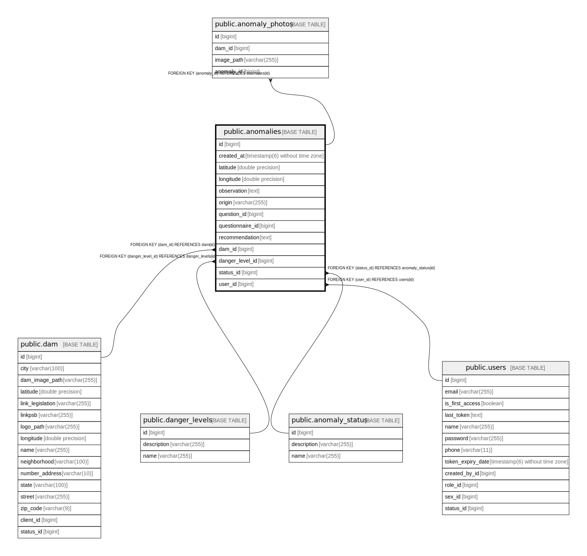

# public.anomalies

## Description

## Columns

| Name | Type | Default | Nullable | Children | Parents | Comment |
| ---- | ---- | ------- | -------- | -------- | ------- | ------- |
| id | bigint |  | false | [public.anomaly_photos](public.anomaly_photos.md) |  |  |
| created_at | timestamp(6) without time zone |  | false |  |  |  |
| latitude | double precision |  | false |  |  |  |
| longitude | double precision |  | false |  |  |  |
| observation | text |  | true |  |  |  |
| origin | varchar(255) |  | false |  |  |  |
| question_id | bigint |  | true |  |  |  |
| questionnaire_id | bigint |  | true |  |  |  |
| recommendation | text |  | true |  |  |  |
| dam_id | bigint |  | false |  | [public.dam](public.dam.md) |  |
| danger_level_id | bigint |  | false |  | [public.danger_levels](public.danger_levels.md) |  |
| status_id | bigint |  | false |  | [public.anomaly_status](public.anomaly_status.md) |  |
| user_id | bigint |  | false |  | [public.users](public.users.md) |  |

## Constraints

| Name | Type | Definition |
| ---- | ---- | ---------- |
| anomalies_origin_check | CHECK | CHECK (((origin)::text = ANY ((ARRAY['CHECKLIST'::character varying, 'WEB'::character varying, 'OTHER'::character varying])::text[]))) |
| anomalies_pkey | PRIMARY KEY | PRIMARY KEY (id) |
| fke554m1il2p7t2whhsqj6nelsv | FOREIGN KEY | FOREIGN KEY (status_id) REFERENCES anomaly_status(id) |
| fkieyax3pfwm94tfy8sh47dok4x | FOREIGN KEY | FOREIGN KEY (dam_id) REFERENCES dam(id) |
| fkgcpc164oygiguoa08967r55ow | FOREIGN KEY | FOREIGN KEY (danger_level_id) REFERENCES danger_levels(id) |
| fkhig0kyy20prba25f7akn0hrly | FOREIGN KEY | FOREIGN KEY (user_id) REFERENCES users(id) |

## Indexes

| Name | Definition |
| ---- | ---------- |
| anomalies_pkey | CREATE UNIQUE INDEX anomalies_pkey ON public.anomalies USING btree (id) |
| idx_anomaly_dam_id | CREATE INDEX idx_anomaly_dam_id ON public.anomalies USING btree (dam_id) |
| idx_anomaly_user_id | CREATE INDEX idx_anomaly_user_id ON public.anomalies USING btree (user_id) |
| idx_anomaly_status_id | CREATE INDEX idx_anomaly_status_id ON public.anomalies USING btree (status_id) |
| idx_anomaly_danger_level_id | CREATE INDEX idx_anomaly_danger_level_id ON public.anomalies USING btree (danger_level_id) |
| idx_anomaly_created_at | CREATE INDEX idx_anomaly_created_at ON public.anomalies USING btree (created_at) |
| idx_anomaly_created_desc | CREATE INDEX idx_anomaly_created_desc ON public.anomalies USING btree (created_at DESC) |
| idx_anomaly_coordinates | CREATE INDEX idx_anomaly_coordinates ON public.anomalies USING btree (latitude, longitude) |
| idx_anomaly_dam_coordinates | CREATE INDEX idx_anomaly_dam_coordinates ON public.anomalies USING btree (dam_id, latitude, longitude) |
| idx_anomaly_dam_status | CREATE INDEX idx_anomaly_dam_status ON public.anomalies USING btree (dam_id, status_id) |
| idx_anomaly_dam_created | CREATE INDEX idx_anomaly_dam_created ON public.anomalies USING btree (dam_id, created_at DESC) |
| idx_anomaly_user_created | CREATE INDEX idx_anomaly_user_created ON public.anomalies USING btree (user_id, created_at DESC) |
| idx_anomaly_status_created | CREATE INDEX idx_anomaly_status_created ON public.anomalies USING btree (status_id, created_at DESC) |
| idx_anomaly_danger_created | CREATE INDEX idx_anomaly_danger_created ON public.anomalies USING btree (danger_level_id, created_at DESC) |
| idx_anomaly_origin | CREATE INDEX idx_anomaly_origin ON public.anomalies USING btree (origin) |
| idx_anomaly_questionnaire_id | CREATE INDEX idx_anomaly_questionnaire_id ON public.anomalies USING btree (questionnaire_id) |
| idx_anomaly_question_id | CREATE INDEX idx_anomaly_question_id ON public.anomalies USING btree (question_id) |
| idx_anomaly_origin_dam | CREATE INDEX idx_anomaly_origin_dam ON public.anomalies USING btree (origin, dam_id) |
| idx_anomaly_dam_danger_status | CREATE INDEX idx_anomaly_dam_danger_status ON public.anomalies USING btree (dam_id, danger_level_id, status_id) |
| idx_anomaly_complete_filter | CREATE INDEX idx_anomaly_complete_filter ON public.anomalies USING btree (dam_id, status_id, danger_level_id, created_at DESC) |

## Relations

---

> Generated by [tbls](https://github.com/k1LoW/tbls)
