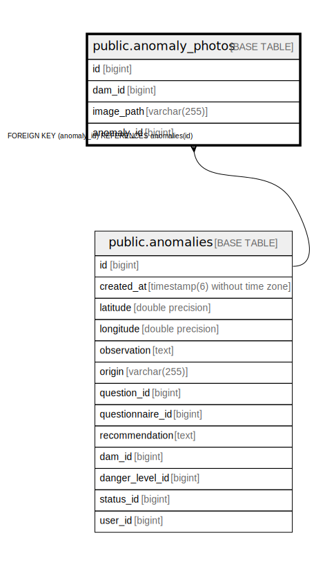

# public.anomaly_photos

## Description

## Columns

| Name | Type | Default | Nullable | Children | Parents | Comment |
| ---- | ---- | ------- | -------- | -------- | ------- | ------- |
| id | bigint |  | false |  |  |  |
| dam_id | bigint |  | true |  |  |  |
| image_path | varchar(255) |  | false |  |  |  |
| anomaly_id | bigint |  | false |  | [public.anomalies](public.anomalies.md) |  |

## Constraints

| Name | Type | Definition |
| ---- | ---- | ---------- |
| fk1t30oqndwrg68os1teh3yyalx | FOREIGN KEY | FOREIGN KEY (anomaly_id) REFERENCES anomalies(id) |
| anomaly_photos_pkey | PRIMARY KEY | PRIMARY KEY (id) |

## Indexes

| Name | Definition |
| ---- | ---------- |
| anomaly_photos_pkey | CREATE UNIQUE INDEX anomaly_photos_pkey ON public.anomaly_photos USING btree (id) |
| idx_anomaly_photo_anomaly_id | CREATE INDEX idx_anomaly_photo_anomaly_id ON public.anomaly_photos USING btree (anomaly_id) |
| idx_anomaly_photo_dam_id | CREATE INDEX idx_anomaly_photo_dam_id ON public.anomaly_photos USING btree (dam_id) |
| idx_anomaly_photo_anomaly_dam | CREATE INDEX idx_anomaly_photo_anomaly_dam ON public.anomaly_photos USING btree (anomaly_id, dam_id) |

## Relations

---

> Generated by [tbls](https://github.com/k1LoW/tbls)
