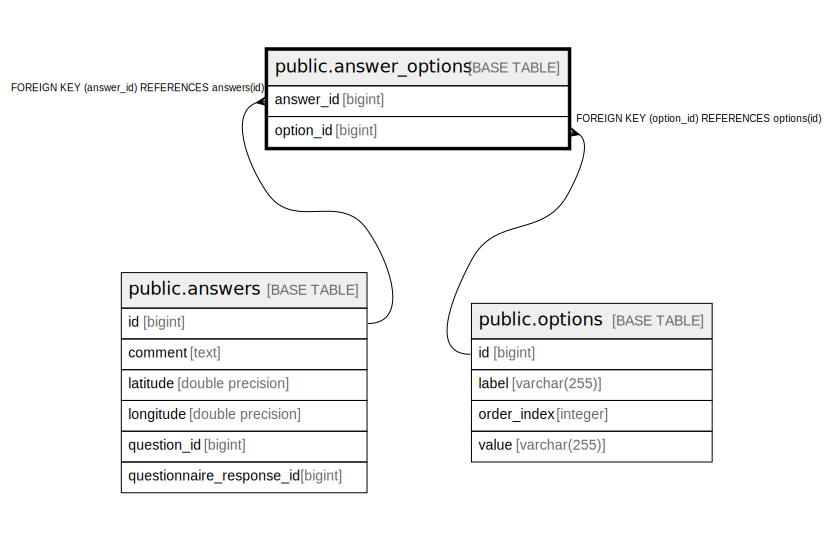

# public.answer_options

## Description

## Columns

| Name | Type | Default | Nullable | Children | Parents | Comment |
| ---- | ---- | ------- | -------- | -------- | ------- | ------- |
| answer_id | bigint |  | false |  | [public.answers](public.answers.md) |  |
| option_id | bigint |  | false |  | [public.options](public.options.md) |  |

## Constraints

| Name | Type | Definition |
| ---- | ---- | ---------- |
| answer_options_pkey | PRIMARY KEY | PRIMARY KEY (answer_id, option_id) |
| fk9hu9eir3fpbcbq83yxmqo0roh | FOREIGN KEY | FOREIGN KEY (answer_id) REFERENCES answers(id) |
| fkpaub45j3djvy5md5yph6qhv0o | FOREIGN KEY | FOREIGN KEY (option_id) REFERENCES options(id) |

## Indexes

| Name | Definition |
| ---- | ---------- |
| answer_options_pkey | CREATE UNIQUE INDEX answer_options_pkey ON public.answer_options USING btree (answer_id, option_id) |

## Relations

---

> Generated by [tbls](https://github.com/k1LoW/tbls)
