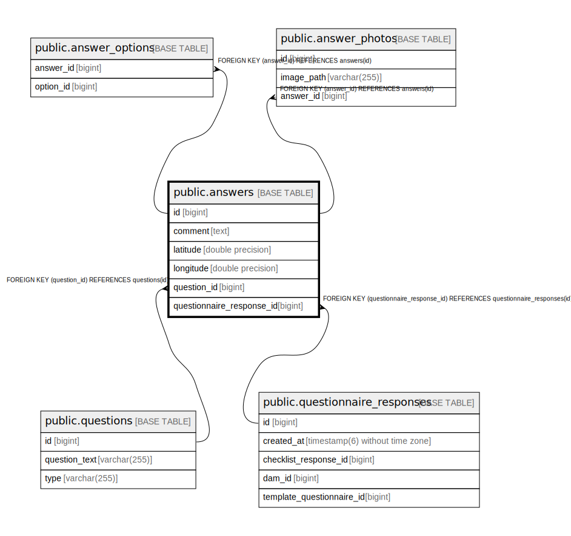

# public.answers

## Description

## Columns

| Name | Type | Default | Nullable | Children | Parents | Comment |
| ---- | ---- | ------- | -------- | -------- | ------- | ------- |
| id | bigint |  | false | [public.answer_options](public.answer_options.md) [public.answer_photos](public.answer_photos.md) |  |  |
| comment | text |  | true |  |  |  |
| latitude | double precision |  | true |  |  |  |
| longitude | double precision |  | true |  |  |  |
| question_id | bigint |  | false |  | [public.questions](public.questions.md) |  |
| questionnaire_response_id | bigint |  | false |  | [public.questionnaire_responses](public.questionnaire_responses.md) |  |

## Constraints

| Name | Type | Definition |
| ---- | ---- | ---------- |
| answers_pkey | PRIMARY KEY | PRIMARY KEY (id) |
| fk9efww7kc8ubw3bq257gkkdu2s | FOREIGN KEY | FOREIGN KEY (questionnaire_response_id) REFERENCES questionnaire_responses(id) |
| fk3erw1a3t0r78st8ty27x6v3g1 | FOREIGN KEY | FOREIGN KEY (question_id) REFERENCES questions(id) |

## Indexes

| Name | Definition |
| ---- | ---------- |
| answers_pkey | CREATE UNIQUE INDEX answers_pkey ON public.answers USING btree (id) |
| idx_answer_question | CREATE INDEX idx_answer_question ON public.answers USING btree (question_id) |
| idx_answer_questionnaire | CREATE INDEX idx_answer_questionnaire ON public.answers USING btree (questionnaire_response_id) |
| idx_answer_coords | CREATE INDEX idx_answer_coords ON public.answers USING btree (latitude, longitude) |

## Relations

---

> Generated by [tbls](https://github.com/k1LoW/tbls)
