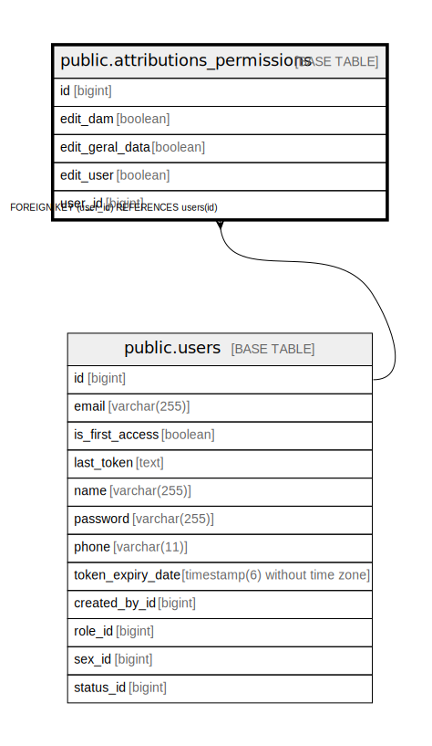

# public.attributions_permissions

## Description

## Columns

| Name | Type | Default | Nullable | Children | Parents | Comment |
| ---- | ---- | ------- | -------- | -------- | ------- | ------- |
| id | bigint |  | false |  |  |  |
| edit_dam | boolean |  | false |  |  |  |
| edit_geral_data | boolean |  | false |  |  |  |
| edit_user | boolean |  | false |  |  |  |
| user_id | bigint |  | false |  | [public.users](public.users.md) |  |

## Constraints

| Name | Type | Definition |
| ---- | ---- | ---------- |
| attributions_permissions_pkey | PRIMARY KEY | PRIMARY KEY (id) |
| fka1q3jt8gie13q8g6x5vl8v6i1 | FOREIGN KEY | FOREIGN KEY (user_id) REFERENCES users(id) |
| uk9mnnppoxlxm4fdutrst7m7dqi | UNIQUE | UNIQUE (user_id) |

## Indexes

| Name | Definition |
| ---- | ---------- |
| attributions_permissions_pkey | CREATE UNIQUE INDEX attributions_permissions_pkey ON public.attributions_permissions USING btree (id) |
| uk9mnnppoxlxm4fdutrst7m7dqi | CREATE UNIQUE INDEX uk9mnnppoxlxm4fdutrst7m7dqi ON public.attributions_permissions USING btree (user_id) |

## Relations

---

> Generated by [tbls](https://github.com/k1LoW/tbls)
