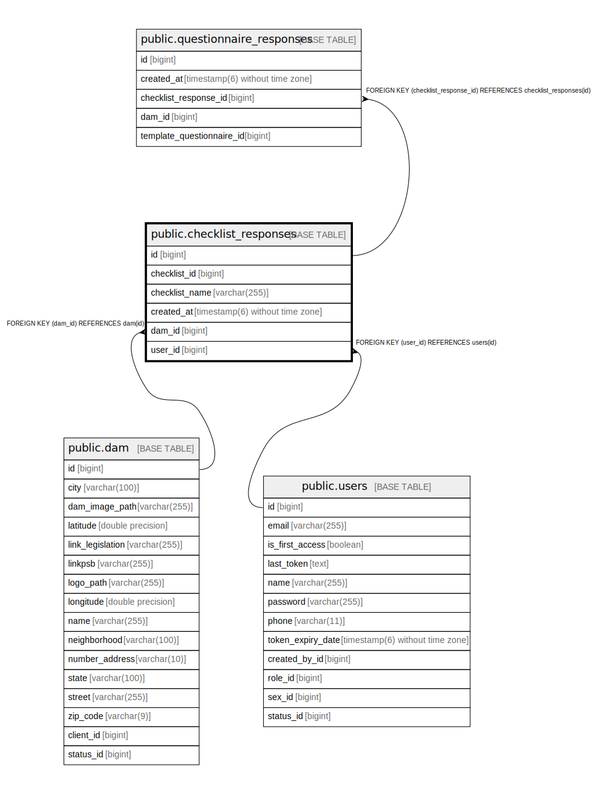

# public.checklist_responses

## Description

## Columns

| Name | Type | Default | Nullable | Children | Parents | Comment |
| ---- | ---- | ------- | -------- | -------- | ------- | ------- |
| id | bigint |  | false | [public.questionnaire_responses](public.questionnaire_responses.md) |  |  |
| checklist_id | bigint |  | false |  |  |  |
| checklist_name | varchar(255) |  | false |  |  |  |
| created_at | timestamp(6) without time zone |  | true |  |  |  |
| dam_id | bigint |  | false |  | [public.dam](public.dam.md) |  |
| user_id | bigint |  | false |  | [public.users](public.users.md) |  |

## Constraints

| Name | Type | Definition |
| ---- | ---- | ---------- |
| checklist_responses_pkey | PRIMARY KEY | PRIMARY KEY (id) |
| fkoef60bxqq0drq2774f3830l1y | FOREIGN KEY | FOREIGN KEY (dam_id) REFERENCES dam(id) |
| fkrljl7a4kngcrwf0hb3bctmhe8 | FOREIGN KEY | FOREIGN KEY (user_id) REFERENCES users(id) |

## Indexes

| Name | Definition |
| ---- | ---------- |
| checklist_responses_pkey | CREATE UNIQUE INDEX checklist_responses_pkey ON public.checklist_responses USING btree (id) |
| idx_checklist_response_dam_id | CREATE INDEX idx_checklist_response_dam_id ON public.checklist_responses USING btree (dam_id) |
| idx_checklist_response_user_id | CREATE INDEX idx_checklist_response_user_id ON public.checklist_responses USING btree (user_id) |
| idx_checklist_response_checklist_id | CREATE INDEX idx_checklist_response_checklist_id ON public.checklist_responses USING btree (checklist_id) |
| idx_checklist_response_created_at | CREATE INDEX idx_checklist_response_created_at ON public.checklist_responses USING btree (created_at) |
| idx_checklist_response_dam_created_desc | CREATE INDEX idx_checklist_response_dam_created_desc ON public.checklist_responses USING btree (dam_id, created_at) |
| idx_checklist_response_dam_checklist_created | CREATE INDEX idx_checklist_response_dam_checklist_created ON public.checklist_responses USING btree (dam_id, checklist_id, created_at) |
| idx_checklist_response_dam_period | CREATE INDEX idx_checklist_response_dam_period ON public.checklist_responses USING btree (dam_id, created_at) |
| idx_checklist_response_user_created | CREATE INDEX idx_checklist_response_user_created ON public.checklist_responses USING btree (user_id, created_at) |

## Relations

---

> Generated by [tbls](https://github.com/k1LoW/tbls)
