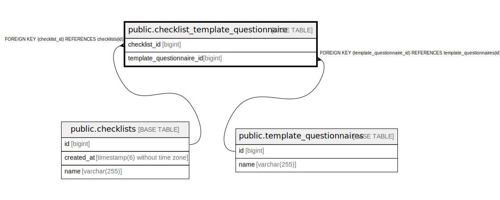

# public.checklist_template_questionnaire

## Description

## Columns

| Name | Type | Default | Nullable | Children | Parents | Comment |
| ---- | ---- | ------- | -------- | -------- | ------- | ------- |
| checklist_id | bigint |  | false |  | [public.checklists](public.checklists.md) |  |
| template_questionnaire_id | bigint |  | false |  | [public.template_questionnaires](public.template_questionnaires.md) |  |

## Constraints

| Name | Type | Definition |
| ---- | ---- | ---------- |
| checklist_template_questionnaire_pkey | PRIMARY KEY | PRIMARY KEY (checklist_id, template_questionnaire_id) |
| fkh834fdiv212fsnxdgkbpsoqo1 | FOREIGN KEY | FOREIGN KEY (checklist_id) REFERENCES checklists(id) |
| fk3ea1ejhkfasyc2fu5rnl3dylx | FOREIGN KEY | FOREIGN KEY (template_questionnaire_id) REFERENCES template_questionnaires(id) |

## Indexes

| Name | Definition |
| ---- | ---------- |
| checklist_template_questionnaire_pkey | CREATE UNIQUE INDEX checklist_template_questionnaire_pkey ON public.checklist_template_questionnaire USING btree (checklist_id, template_questionnaire_id) |

## Relations

---

> Generated by [tbls](https://github.com/k1LoW/tbls)
