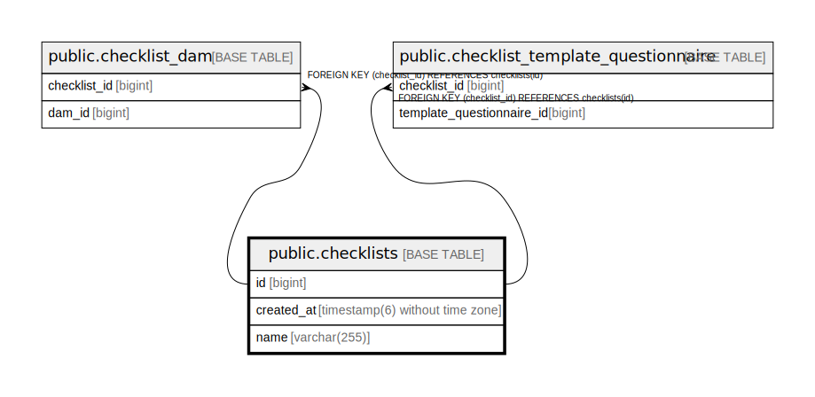

# public.checklists

## Description

## Columns

| Name | Type | Default | Nullable | Children | Parents | Comment |
| ---- | ---- | ------- | -------- | -------- | ------- | ------- |
| id | bigint |  | false | [public.checklist_dam](public.checklist_dam.md) [public.checklist_template_questionnaire](public.checklist_template_questionnaire.md) |  |  |
| created_at | timestamp(6) without time zone |  | true |  |  |  |
| name | varchar(255) |  | false |  |  |  |

## Constraints

| Name | Type | Definition |
| ---- | ---- | ---------- |
| checklists_pkey | PRIMARY KEY | PRIMARY KEY (id) |

## Indexes

| Name | Definition |
| ---- | ---------- |
| checklists_pkey | CREATE UNIQUE INDEX checklists_pkey ON public.checklists USING btree (id) |
| idx_checklist_name | CREATE INDEX idx_checklist_name ON public.checklists USING btree (name) |
| idx_checklist_created_at | CREATE INDEX idx_checklist_created_at ON public.checklists USING btree (created_at) |

## Relations

---

> Generated by [tbls](https://github.com/k1LoW/tbls)
