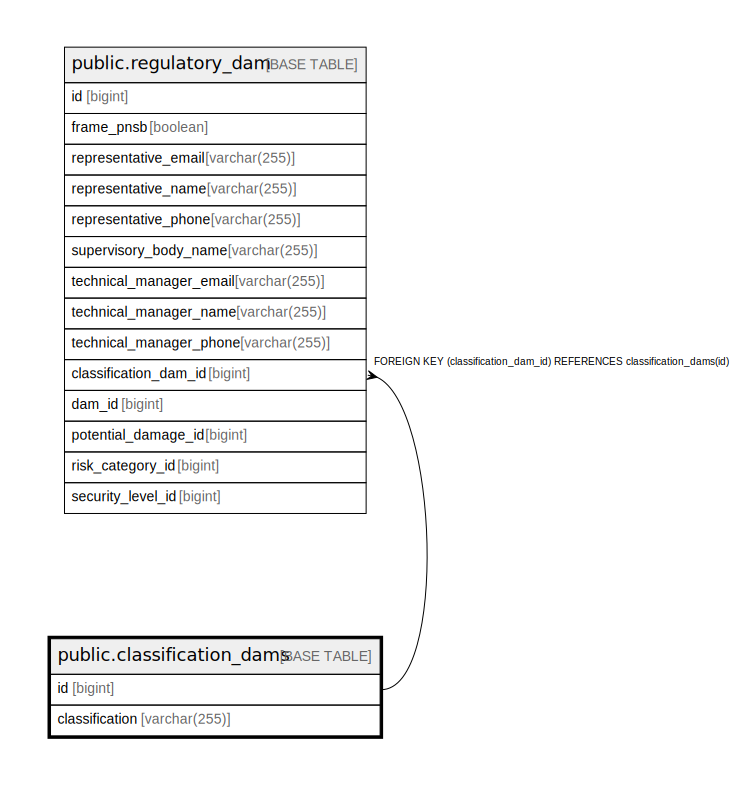

# public.classification_dams

## Description

## Columns

| Name | Type | Default | Nullable | Children | Parents | Comment |
| ---- | ---- | ------- | -------- | -------- | ------- | ------- |
| id | bigint |  | false | [public.regulatory_dam](public.regulatory_dam.md) |  |  |
| classification | varchar(255) |  | false |  |  |  |

## Constraints

| Name | Type | Definition |
| ---- | ---- | ---------- |
| classification_dams_pkey | PRIMARY KEY | PRIMARY KEY (id) |
| idx_classification_value | UNIQUE | UNIQUE (classification) |

## Indexes

| Name | Definition |
| ---- | ---------- |
| classification_dams_pkey | CREATE UNIQUE INDEX classification_dams_pkey ON public.classification_dams USING btree (id) |
| idx_classification_value | CREATE UNIQUE INDEX idx_classification_value ON public.classification_dams USING btree (classification) |

## Relations

---

> Generated by [tbls](https://github.com/k1LoW/tbls)
