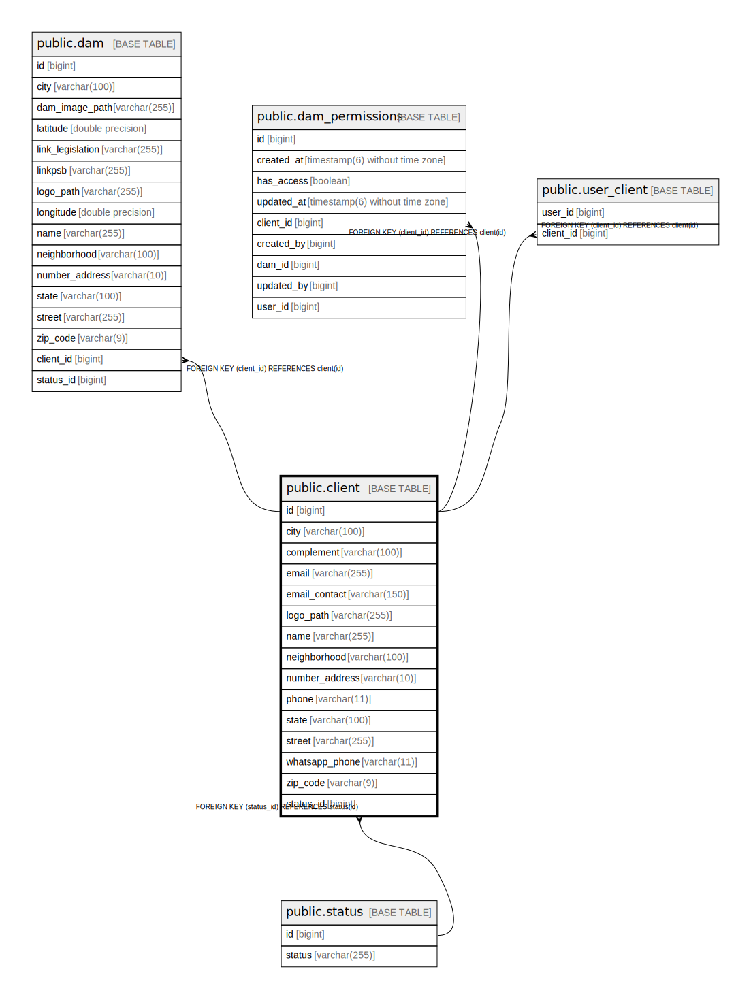

# public.client

## Description

## Columns

| Name | Type | Default | Nullable | Children | Parents | Comment |
| ---- | ---- | ------- | -------- | -------- | ------- | ------- |
| id | bigint |  | false | [public.dam](public.dam.md) [public.dam_permissions](public.dam_permissions.md) [public.user_client](public.user_client.md) |  |  |
| city | varchar(100) |  | false |  |  |  |
| complement | varchar(100) |  | true |  |  |  |
| email | varchar(255) |  | false |  |  |  |
| email_contact | varchar(150) |  | true |  |  |  |
| logo_path | varchar(255) |  | true |  |  |  |
| name | varchar(255) |  | false |  |  |  |
| neighborhood | varchar(100) |  | false |  |  |  |
| number_address | varchar(10) |  | true |  |  |  |
| phone | varchar(11) |  | false |  |  |  |
| state | varchar(100) |  | false |  |  |  |
| street | varchar(255) |  | false |  |  |  |
| whatsapp_phone | varchar(11) |  | true |  |  |  |
| zip_code | varchar(9) |  | false |  |  |  |
| status_id | bigint |  | true |  | [public.status](public.status.md) |  |

## Constraints

| Name | Type | Definition |
| ---- | ---- | ---------- |
| client_pkey | PRIMARY KEY | PRIMARY KEY (id) |
| fkpc4nxaf4m9semynspoxq8cmu6 | FOREIGN KEY | FOREIGN KEY (status_id) REFERENCES status(id) |
| idx_client_name | UNIQUE | UNIQUE (name) |
| idx_client_email | UNIQUE | UNIQUE (email) |

## Indexes

| Name | Definition |
| ---- | ---------- |
| client_pkey | CREATE UNIQUE INDEX client_pkey ON public.client USING btree (id) |
| idx_client_status | CREATE INDEX idx_client_status ON public.client USING btree (status_id) |
| idx_client_phone | CREATE INDEX idx_client_phone ON public.client USING btree (phone) |
| idx_client_whatsapp | CREATE INDEX idx_client_whatsapp ON public.client USING btree (whatsapp_phone) |
| idx_client_email_contact | CREATE INDEX idx_client_email_contact ON public.client USING btree (email_contact) |
| idx_client_city | CREATE INDEX idx_client_city ON public.client USING btree (city) |
| idx_client_state | CREATE INDEX idx_client_state ON public.client USING btree (state) |
| idx_client_city_state | CREATE INDEX idx_client_city_state ON public.client USING btree (city, state) |
| idx_client_zip_code | CREATE INDEX idx_client_zip_code ON public.client USING btree (zip_code) |
| idx_client_status_name | CREATE INDEX idx_client_status_name ON public.client USING btree (status_id, name) |
| idx_client_status_city | CREATE INDEX idx_client_status_city ON public.client USING btree (status_id, city) |
| idx_client_state_status | CREATE INDEX idx_client_state_status ON public.client USING btree (state, status_id) |
| idx_client_name | CREATE UNIQUE INDEX idx_client_name ON public.client USING btree (name) |
| idx_client_email | CREATE UNIQUE INDEX idx_client_email ON public.client USING btree (email) |

## Relations

---

> Generated by [tbls](https://github.com/k1LoW/tbls)
