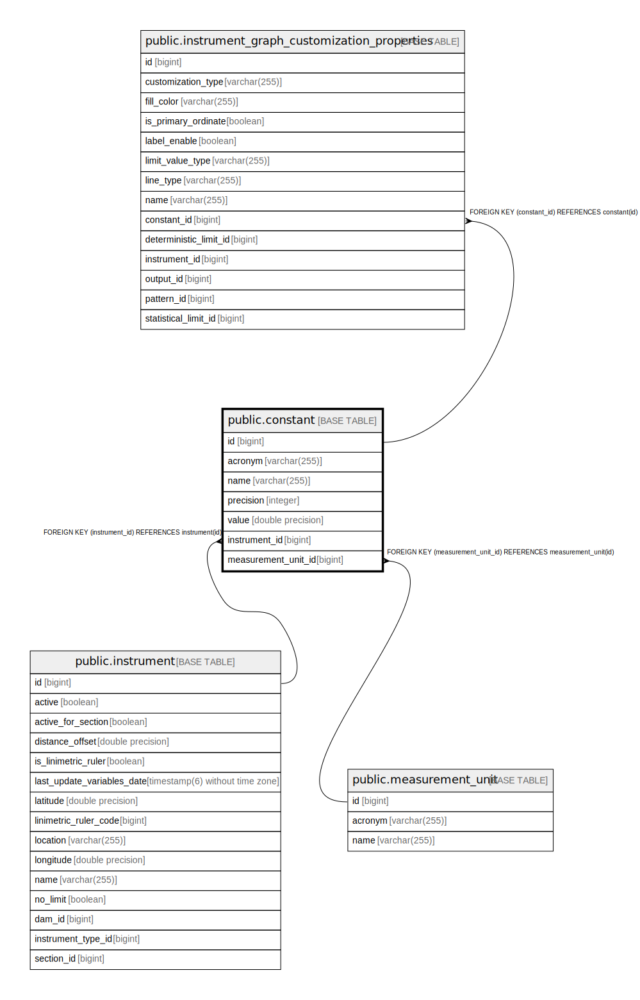

# public.constant

## Description

## Columns

| Name | Type | Default | Nullable | Children | Parents | Comment |
| ---- | ---- | ------- | -------- | -------- | ------- | ------- |
| id | bigint |  | false | [public.instrument_graph_customization_properties](public.instrument_graph_customization_properties.md) |  |  |
| acronym | varchar(255) |  | false |  |  |  |
| name | varchar(255) |  | false |  |  |  |
| precision | integer |  | false |  |  |  |
| value | double precision |  | false |  |  |  |
| instrument_id | bigint |  | false |  | [public.instrument](public.instrument.md) |  |
| measurement_unit_id | bigint |  | false |  | [public.measurement_unit](public.measurement_unit.md) |  |

## Constraints

| Name | Type | Definition |
| ---- | ---- | ---------- |
| constant_pkey | PRIMARY KEY | PRIMARY KEY (id) |
| fk99yik34r84cmesqdvu2q9qetk | FOREIGN KEY | FOREIGN KEY (instrument_id) REFERENCES instrument(id) |
| fktqq0e890ncxphsabkucty5n5p | FOREIGN KEY | FOREIGN KEY (measurement_unit_id) REFERENCES measurement_unit(id) |

## Indexes

| Name | Definition |
| ---- | ---------- |
| constant_pkey | CREATE UNIQUE INDEX constant_pkey ON public.constant USING btree (id) |
| idx_constant_instrument_id | CREATE INDEX idx_constant_instrument_id ON public.constant USING btree (instrument_id) |
| idx_constant_acronym | CREATE INDEX idx_constant_acronym ON public.constant USING btree (acronym) |
| idx_constant_instrument_acronym | CREATE INDEX idx_constant_instrument_acronym ON public.constant USING btree (instrument_id, acronym) |

## Relations

---

> Generated by [tbls](https://github.com/k1LoW/tbls)
