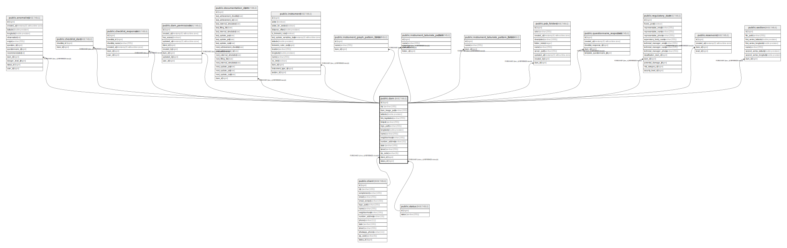

# public.dam

## Description

## Columns

| Name | Type | Default | Nullable | Children | Parents | Comment |
| ---- | ---- | ------- | -------- | -------- | ------- | ------- |
| id | bigint |  | false | [public.anomalies](public.anomalies.md) [public.checklist_dam](public.checklist_dam.md) [public.checklist_responses](public.checklist_responses.md) [public.dam_permissions](public.dam_permissions.md) [public.documentation_dam](public.documentation_dam.md) [public.instrument](public.instrument.md) [public.instrument_graph_pattern_folder](public.instrument_graph_pattern_folder.md) [public.instrument_tabulate_pattern](public.instrument_tabulate_pattern.md) [public.instrument_tabulate_pattern_folder](public.instrument_tabulate_pattern_folder.md) [public.psb_folders](public.psb_folders.md) [public.questionnaire_responses](public.questionnaire_responses.md) [public.regulatory_dam](public.regulatory_dam.md) [public.reservoirs](public.reservoirs.md) [public.section](public.section.md) |  |  |
| city | varchar(100) |  | false |  |  |  |
| dam_image_path | varchar(255) |  | true |  |  |  |
| latitude | double precision |  | false |  |  |  |
| link_legislation | varchar(255) |  | true |  |  |  |
| linkpsb | varchar(255) |  | true |  |  |  |
| logo_path | varchar(255) |  | true |  |  |  |
| longitude | double precision |  | false |  |  |  |
| name | varchar(255) |  | false |  |  |  |
| neighborhood | varchar(100) |  | true |  |  |  |
| number_address | varchar(10) |  | true |  |  |  |
| state | varchar(100) |  | false |  |  |  |
| street | varchar(255) |  | false |  |  |  |
| zip_code | varchar(9) |  | false |  |  |  |
| client_id | bigint |  | true |  | [public.client](public.client.md) |  |
| status_id | bigint |  | true |  | [public.status](public.status.md) |  |

## Constraints

| Name | Type | Definition |
| ---- | ---- | ---------- |
| fkidd4mv5rt7qs9draouxva9hvy | FOREIGN KEY | FOREIGN KEY (client_id) REFERENCES client(id) |
| dam_pkey | PRIMARY KEY | PRIMARY KEY (id) |
| fk1msr5e0iyphyifdwrp39ff34o | FOREIGN KEY | FOREIGN KEY (status_id) REFERENCES status(id) |

## Indexes

| Name | Definition |
| ---- | ---------- |
| dam_pkey | CREATE UNIQUE INDEX dam_pkey ON public.dam USING btree (id) |
| idx_dam_client_id | CREATE INDEX idx_dam_client_id ON public.dam USING btree (client_id) |
| idx_dam_status_id | CREATE INDEX idx_dam_status_id ON public.dam USING btree (status_id) |
| idx_dam_name | CREATE INDEX idx_dam_name ON public.dam USING btree (name) |
| idx_dam_coords | CREATE INDEX idx_dam_coords ON public.dam USING btree (latitude, longitude) |
| idx_dam_city_state | CREATE INDEX idx_dam_city_state ON public.dam USING btree (city, state) |
| idx_dam_zip | CREATE INDEX idx_dam_zip ON public.dam USING btree (zip_code) |
| idx_dam_latitude | CREATE INDEX idx_dam_latitude ON public.dam USING btree (latitude) |
| idx_dam_longitude | CREATE INDEX idx_dam_longitude ON public.dam USING btree (longitude) |
| idx_dam_city | CREATE INDEX idx_dam_city ON public.dam USING btree (city) |
| idx_dam_state | CREATE INDEX idx_dam_state ON public.dam USING btree (state) |
| idx_dam_client_status | CREATE INDEX idx_dam_client_status ON public.dam USING btree (client_id, status_id) |
| idx_dam_client_name | CREATE INDEX idx_dam_client_name ON public.dam USING btree (client_id, name) |
| idx_dam_status_city | CREATE INDEX idx_dam_status_city ON public.dam USING btree (status_id, city) |
| idx_dam_client_coords | CREATE INDEX idx_dam_client_coords ON public.dam USING btree (client_id, latitude, longitude) |
| idx_dam_client_geo_status | CREATE INDEX idx_dam_client_geo_status ON public.dam USING btree (client_id, status_id, latitude, longitude) |

## Relations

---

> Generated by [tbls](https://github.com/k1LoW/tbls)
