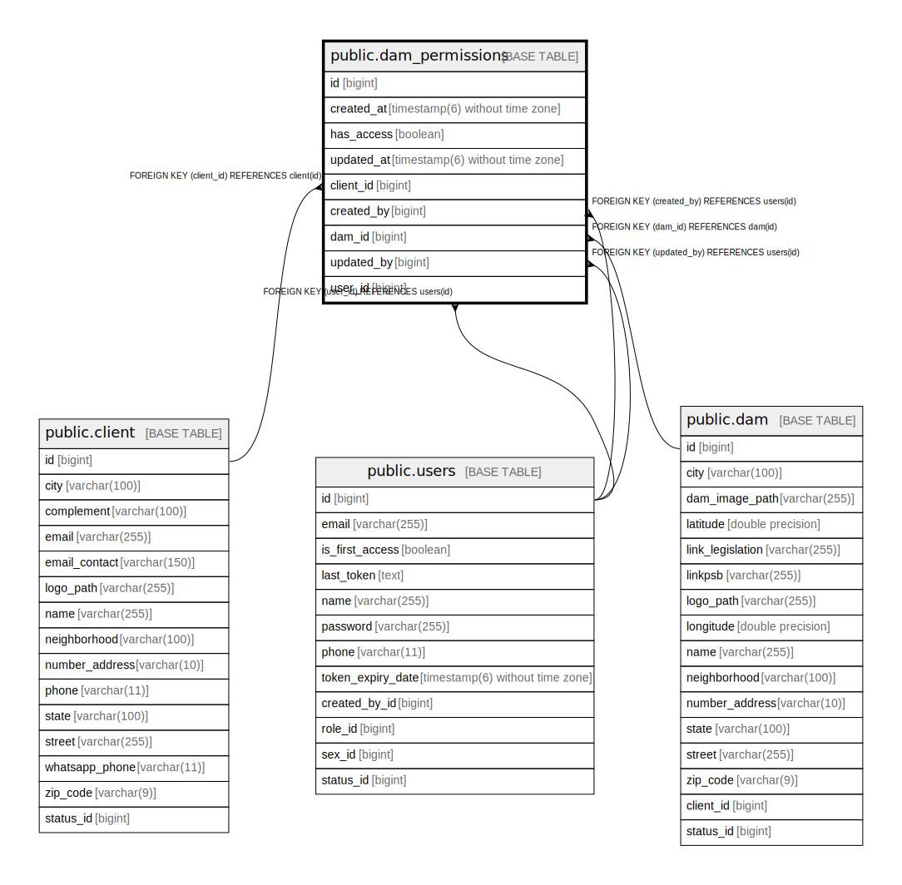

# public.dam_permissions

## Description

## Columns

| Name | Type | Default | Nullable | Children | Parents | Comment |
| ---- | ---- | ------- | -------- | -------- | ------- | ------- |
| id | bigint |  | false |  |  |  |
| created_at | timestamp(6) without time zone |  | true |  |  |  |
| has_access | boolean |  | false |  |  |  |
| updated_at | timestamp(6) without time zone |  | true |  |  |  |
| client_id | bigint |  | false |  | [public.client](public.client.md) |  |
| created_by | bigint |  | true |  | [public.users](public.users.md) |  |
| dam_id | bigint |  | false |  | [public.dam](public.dam.md) |  |
| updated_by | bigint |  | true |  | [public.users](public.users.md) |  |
| user_id | bigint |  | false |  | [public.users](public.users.md) |  |

## Constraints

| Name | Type | Definition |
| ---- | ---- | ---------- |
| fkhyg3mf5ugawo240w1872q8g4w | FOREIGN KEY | FOREIGN KEY (client_id) REFERENCES client(id) |
| fkksjft6poa1th6qtkhwielk8d | FOREIGN KEY | FOREIGN KEY (dam_id) REFERENCES dam(id) |
| dam_permissions_pkey | PRIMARY KEY | PRIMARY KEY (id) |
| fk6hhpo5kbs452dyo5scmjitu5c | FOREIGN KEY | FOREIGN KEY (created_by) REFERENCES users(id) |
| fkdss7rlsfpu1nygiwqu5gr0our | FOREIGN KEY | FOREIGN KEY (updated_by) REFERENCES users(id) |
| fkmonsrspiqcprcfm64r19p4tvh | FOREIGN KEY | FOREIGN KEY (user_id) REFERENCES users(id) |
| uk9k4u6c1rgg3fwiuvmgp3g46wx | UNIQUE | UNIQUE (user_id, dam_id, client_id) |

## Indexes

| Name | Definition |
| ---- | ---------- |
| dam_permissions_pkey | CREATE UNIQUE INDEX dam_permissions_pkey ON public.dam_permissions USING btree (id) |
| idx_dam_perm_user_id | CREATE INDEX idx_dam_perm_user_id ON public.dam_permissions USING btree (user_id) |
| idx_dam_perm_dam_id | CREATE INDEX idx_dam_perm_dam_id ON public.dam_permissions USING btree (dam_id) |
| idx_dam_perm_client_id | CREATE INDEX idx_dam_perm_client_id ON public.dam_permissions USING btree (client_id) |
| idx_dam_perm_access | CREATE INDEX idx_dam_perm_access ON public.dam_permissions USING btree (has_access) |
| idx_dam_perm_created_at | CREATE INDEX idx_dam_perm_created_at ON public.dam_permissions USING btree (created_at) |
| idx_dam_perm_created_by | CREATE INDEX idx_dam_perm_created_by ON public.dam_permissions USING btree (created_by) |
| idx_dam_perm_updated_by | CREATE INDEX idx_dam_perm_updated_by ON public.dam_permissions USING btree (updated_by) |
| idx_dam_perm_user_access | CREATE INDEX idx_dam_perm_user_access ON public.dam_permissions USING btree (user_id, has_access) |
| idx_dam_perm_client_access | CREATE INDEX idx_dam_perm_client_access ON public.dam_permissions USING btree (client_id, has_access) |
| idx_dam_perm_dam_access | CREATE INDEX idx_dam_perm_dam_access ON public.dam_permissions USING btree (dam_id, has_access) |
| idx_dam_perm_user_client | CREATE INDEX idx_dam_perm_user_client ON public.dam_permissions USING btree (user_id, client_id) |
| idx_dam_perm_user_dam | CREATE INDEX idx_dam_perm_user_dam ON public.dam_permissions USING btree (user_id, dam_id) |
| uk9k4u6c1rgg3fwiuvmgp3g46wx | CREATE UNIQUE INDEX uk9k4u6c1rgg3fwiuvmgp3g46wx ON public.dam_permissions USING btree (user_id, dam_id, client_id) |

## Relations

---

> Generated by [tbls](https://github.com/k1LoW/tbls)
