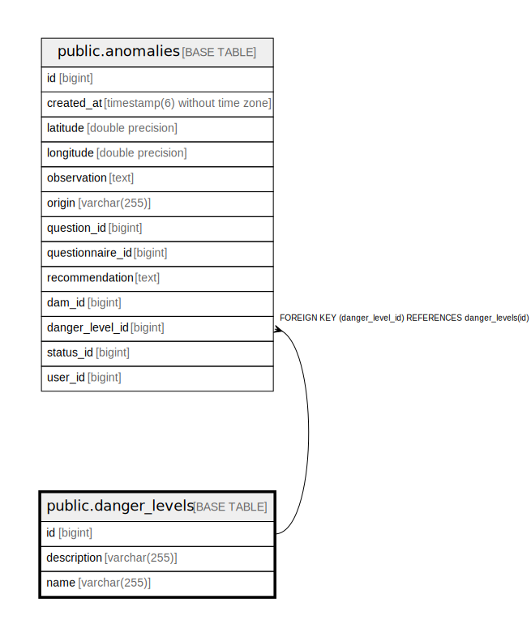

# public.danger_levels

## Description

## Columns

| Name | Type | Default | Nullable | Children | Parents | Comment |
| ---- | ---- | ------- | -------- | -------- | ------- | ------- |
| id | bigint |  | false | [public.anomalies](public.anomalies.md) |  |  |
| description | varchar(255) |  | true |  |  |  |
| name | varchar(255) |  | false |  |  |  |

## Constraints

| Name | Type | Definition |
| ---- | ---- | ---------- |
| danger_levels_pkey | PRIMARY KEY | PRIMARY KEY (id) |
| ukb7cvdwhtv2v8hiejssydwjytu | UNIQUE | UNIQUE (name) |

## Indexes

| Name | Definition |
| ---- | ---------- |
| danger_levels_pkey | CREATE UNIQUE INDEX danger_levels_pkey ON public.danger_levels USING btree (id) |
| ukb7cvdwhtv2v8hiejssydwjytu | CREATE UNIQUE INDEX ukb7cvdwhtv2v8hiejssydwjytu ON public.danger_levels USING btree (name) |

## Relations

---

> Generated by [tbls](https://github.com/k1LoW/tbls)
