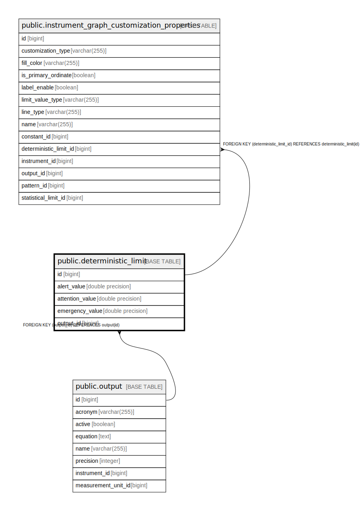

# public.deterministic_limit

## Description

## Columns

| Name | Type | Default | Nullable | Children | Parents | Comment |
| ---- | ---- | ------- | -------- | -------- | ------- | ------- |
| id | bigint |  | false | [public.instrument_graph_customization_properties](public.instrument_graph_customization_properties.md) |  |  |
| alert_value | double precision |  | true |  |  |  |
| attention_value | double precision |  | true |  |  |  |
| emergency_value | double precision |  | true |  |  |  |
| output_id | bigint |  | false |  | [public.output](public.output.md) |  |

## Constraints

| Name | Type | Definition |
| ---- | ---- | ---------- |
| deterministic_limit_pkey | PRIMARY KEY | PRIMARY KEY (id) |
| fk219qt88q8hbcffvk14k6l7elm | FOREIGN KEY | FOREIGN KEY (output_id) REFERENCES output(id) |
| uk4fotk9wwwy8t9cund516ym0n8 | UNIQUE | UNIQUE (output_id) |

## Indexes

| Name | Definition |
| ---- | ---------- |
| deterministic_limit_pkey | CREATE UNIQUE INDEX deterministic_limit_pkey ON public.deterministic_limit USING btree (id) |
| uk4fotk9wwwy8t9cund516ym0n8 | CREATE UNIQUE INDEX uk4fotk9wwwy8t9cund516ym0n8 ON public.deterministic_limit USING btree (output_id) |

## Relations

---

> Generated by [tbls](https://github.com/k1LoW/tbls)
