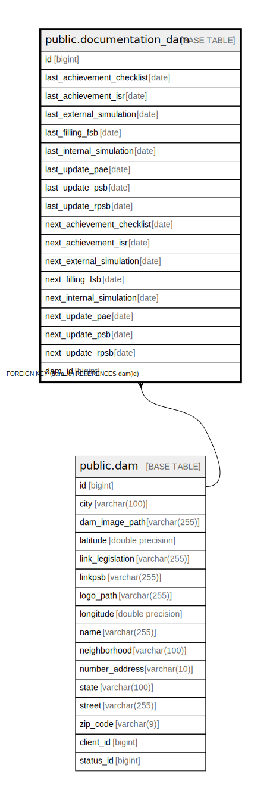

# public.documentation_dam

## Description

## Columns

| Name | Type | Default | Nullable | Children | Parents | Comment |
| ---- | ---- | ------- | -------- | -------- | ------- | ------- |
| id | bigint |  | false |  |  |  |
| last_achievement_checklist | date |  | true |  |  |  |
| last_achievement_isr | date |  | true |  |  |  |
| last_external_simulation | date |  | true |  |  |  |
| last_filling_fsb | date |  | true |  |  |  |
| last_internal_simulation | date |  | true |  |  |  |
| last_update_pae | date |  | true |  |  |  |
| last_update_psb | date |  | true |  |  |  |
| last_update_rpsb | date |  | true |  |  |  |
| next_achievement_checklist | date |  | true |  |  |  |
| next_achievement_isr | date |  | true |  |  |  |
| next_external_simulation | date |  | true |  |  |  |
| next_filling_fsb | date |  | true |  |  |  |
| next_internal_simulation | date |  | true |  |  |  |
| next_update_pae | date |  | true |  |  |  |
| next_update_psb | date |  | true |  |  |  |
| next_update_rpsb | date |  | true |  |  |  |
| dam_id | bigint |  | false |  | [public.dam](public.dam.md) |  |

## Constraints

| Name | Type | Definition |
| ---- | ---- | ---------- |
| fkgpcxiem741mcp2qygg37cld86 | FOREIGN KEY | FOREIGN KEY (dam_id) REFERENCES dam(id) |
| documentation_dam_pkey | PRIMARY KEY | PRIMARY KEY (id) |
| idx_doc_dam_dam_id | UNIQUE | UNIQUE (dam_id) |

## Indexes

| Name | Definition |
| ---- | ---------- |
| documentation_dam_pkey | CREATE UNIQUE INDEX documentation_dam_pkey ON public.documentation_dam USING btree (id) |
| idx_doc_dam_next_pae | CREATE INDEX idx_doc_dam_next_pae ON public.documentation_dam USING btree (next_update_pae) |
| idx_doc_dam_next_psb | CREATE INDEX idx_doc_dam_next_psb ON public.documentation_dam USING btree (next_update_psb) |
| idx_doc_dam_next_checklist | CREATE INDEX idx_doc_dam_next_checklist ON public.documentation_dam USING btree (next_achievement_checklist) |
| idx_doc_dam_dam_id | CREATE UNIQUE INDEX idx_doc_dam_dam_id ON public.documentation_dam USING btree (dam_id) |

## Relations

---

> Generated by [tbls](https://github.com/k1LoW/tbls)
