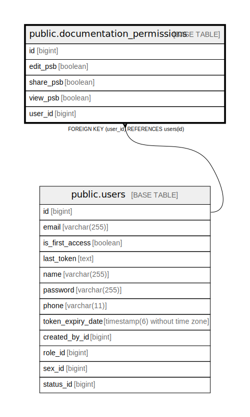

# public.documentation_permissions

## Description

## Columns

| Name | Type | Default | Nullable | Children | Parents | Comment |
| ---- | ---- | ------- | -------- | -------- | ------- | ------- |
| id | bigint |  | false |  |  |  |
| edit_psb | boolean |  | false |  |  |  |
| share_psb | boolean |  | false |  |  |  |
| view_psb | boolean |  | false |  |  |  |
| user_id | bigint |  | false |  | [public.users](public.users.md) |  |

## Constraints

| Name | Type | Definition |
| ---- | ---- | ---------- |
| documentation_permissions_pkey | PRIMARY KEY | PRIMARY KEY (id) |
| fkgwi3t8vcf4c2l8rcfbcebyy8e | FOREIGN KEY | FOREIGN KEY (user_id) REFERENCES users(id) |
| uk5etsi0t66bcbcogt56a7f4kyd | UNIQUE | UNIQUE (user_id) |

## Indexes

| Name | Definition |
| ---- | ---------- |
| documentation_permissions_pkey | CREATE UNIQUE INDEX documentation_permissions_pkey ON public.documentation_permissions USING btree (id) |
| uk5etsi0t66bcbcogt56a7f4kyd | CREATE UNIQUE INDEX uk5etsi0t66bcbcogt56a7f4kyd ON public.documentation_permissions USING btree (user_id) |

## Relations

---

> Generated by [tbls](https://github.com/k1LoW/tbls)
