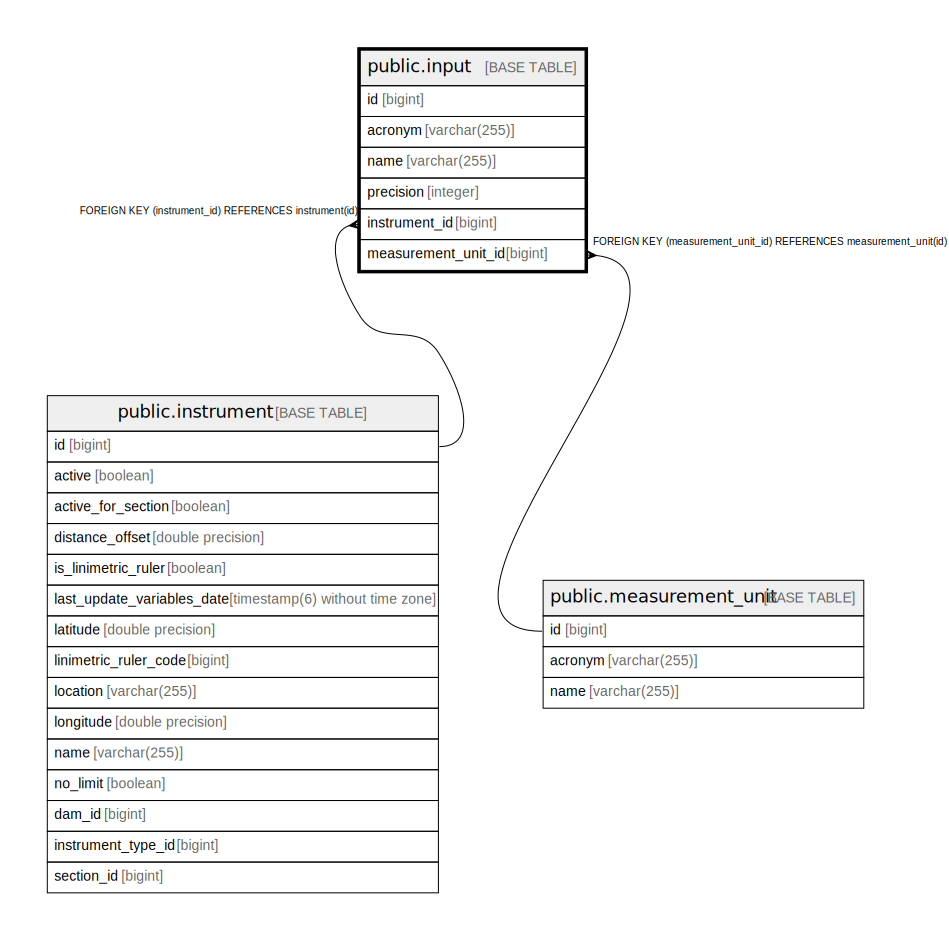

# public.input

## Description

## Columns

| Name | Type | Default | Nullable | Children | Parents | Comment |
| ---- | ---- | ------- | -------- | -------- | ------- | ------- |
| id | bigint |  | false |  |  |  |
| acronym | varchar(255) |  | false |  |  |  |
| name | varchar(255) |  | false |  |  |  |
| precision | integer |  | false |  |  |  |
| instrument_id | bigint |  | false |  | [public.instrument](public.instrument.md) |  |
| measurement_unit_id | bigint |  | false |  | [public.measurement_unit](public.measurement_unit.md) |  |

## Constraints

| Name | Type | Definition |
| ---- | ---- | ---------- |
| input_pkey | PRIMARY KEY | PRIMARY KEY (id) |
| fki1tcwk1kufv61nmmdobvmg32a | FOREIGN KEY | FOREIGN KEY (instrument_id) REFERENCES instrument(id) |
| fko3d2nchjf132m4l1inu43qn66 | FOREIGN KEY | FOREIGN KEY (measurement_unit_id) REFERENCES measurement_unit(id) |

## Indexes

| Name | Definition |
| ---- | ---------- |
| input_pkey | CREATE UNIQUE INDEX input_pkey ON public.input USING btree (id) |
| idx_input_instrument_id | CREATE INDEX idx_input_instrument_id ON public.input USING btree (instrument_id) |
| idx_input_acronym | CREATE INDEX idx_input_acronym ON public.input USING btree (acronym) |
| idx_input_instrument_acronym | CREATE INDEX idx_input_instrument_acronym ON public.input USING btree (instrument_id, acronym) |

## Relations

---

> Generated by [tbls](https://github.com/k1LoW/tbls)
