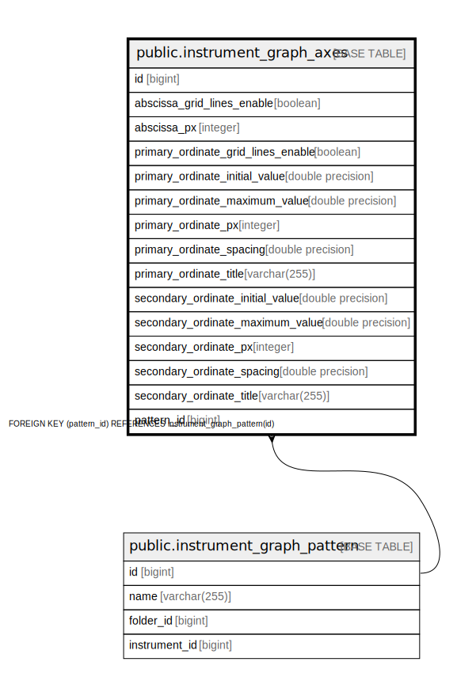

# public.instrument_graph_axes

## Description

## Columns

| Name | Type | Default | Nullable | Children | Parents | Comment |
| ---- | ---- | ------- | -------- | -------- | ------- | ------- |
| id | bigint |  | false |  |  |  |
| abscissa_grid_lines_enable | boolean |  | false |  |  |  |
| abscissa_px | integer |  | false |  |  |  |
| primary_ordinate_grid_lines_enable | boolean |  | false |  |  |  |
| primary_ordinate_initial_value | double precision |  | true |  |  |  |
| primary_ordinate_maximum_value | double precision |  | true |  |  |  |
| primary_ordinate_px | integer |  | false |  |  |  |
| primary_ordinate_spacing | double precision |  | true |  |  |  |
| primary_ordinate_title | varchar(255) |  | true |  |  |  |
| secondary_ordinate_initial_value | double precision |  | true |  |  |  |
| secondary_ordinate_maximum_value | double precision |  | true |  |  |  |
| secondary_ordinate_px | integer |  | false |  |  |  |
| secondary_ordinate_spacing | double precision |  | true |  |  |  |
| secondary_ordinate_title | varchar(255) |  | true |  |  |  |
| pattern_id | bigint |  | false |  | [public.instrument_graph_pattern](public.instrument_graph_pattern.md) |  |

## Constraints

| Name | Type | Definition |
| ---- | ---- | ---------- |
| instrument_graph_axes_pkey | PRIMARY KEY | PRIMARY KEY (id) |
| fkd93iv145rlitv9si9blo8ld0u | FOREIGN KEY | FOREIGN KEY (pattern_id) REFERENCES instrument_graph_pattern(id) |
| ukajv1d6p5oa7j1xewf0t0t9e3a | UNIQUE | UNIQUE (pattern_id) |

## Indexes

| Name | Definition |
| ---- | ---------- |
| instrument_graph_axes_pkey | CREATE UNIQUE INDEX instrument_graph_axes_pkey ON public.instrument_graph_axes USING btree (id) |
| idx_graph_axes_pattern | CREATE INDEX idx_graph_axes_pattern ON public.instrument_graph_axes USING btree (pattern_id) |
| ukajv1d6p5oa7j1xewf0t0t9e3a | CREATE UNIQUE INDEX ukajv1d6p5oa7j1xewf0t0t9e3a ON public.instrument_graph_axes USING btree (pattern_id) |

## Relations

---

> Generated by [tbls](https://github.com/k1LoW/tbls)
