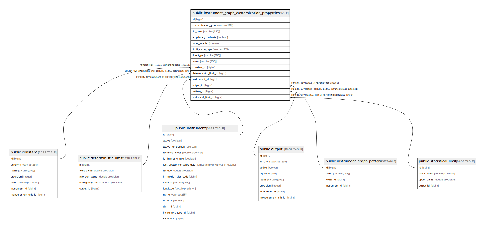

# public.instrument_graph_customization_properties

## Description

## Columns

| Name | Type | Default | Nullable | Children | Parents | Comment |
| ---- | ---- | ------- | -------- | -------- | ------- | ------- |
| id | bigint |  | false |  |  |  |
| customization_type | varchar(255) |  | false |  |  |  |
| fill_color | varchar(255) |  | true |  |  |  |
| is_primary_ordinate | boolean |  | false |  |  |  |
| label_enable | boolean |  | false |  |  |  |
| limit_value_type | varchar(255) |  | true |  |  |  |
| line_type | varchar(255) |  | true |  |  |  |
| name | varchar(255) |  | true |  |  |  |
| constant_id | bigint |  | true |  | [public.constant](public.constant.md) |  |
| deterministic_limit_id | bigint |  | true |  | [public.deterministic_limit](public.deterministic_limit.md) |  |
| instrument_id | bigint |  | true |  | [public.instrument](public.instrument.md) |  |
| output_id | bigint |  | true |  | [public.output](public.output.md) |  |
| pattern_id | bigint |  | false |  | [public.instrument_graph_pattern](public.instrument_graph_pattern.md) |  |
| statistical_limit_id | bigint |  | true |  | [public.statistical_limit](public.statistical_limit.md) |  |

## Constraints

| Name | Type | Definition |
| ---- | ---- | ---------- |
| instrument_graph_customization_propert_customization_type_check | CHECK | CHECK (((customization_type)::text = ANY ((ARRAY['INSTRUMENT'::character varying, 'OUTPUT'::character varying, 'STATISTICAL_LIMIT'::character varying, 'DETERMINISTIC_LIMIT'::character varying, 'LINIMETRIC_RULER'::character varying, 'CONSTANT'::character varying])::text[]))) |
| instrument_graph_customization_propertie_limit_value_type_check | CHECK | CHECK (((limit_value_type)::text = ANY ((ARRAY['STATISTICAL_LOWER'::character varying, 'STATISTICAL_UPPER'::character varying, 'DETERMINISTIC_ATTENTION'::character varying, 'DETERMINISTIC_ALERT'::character varying, 'DETERMINISTIC_EMERGENCY'::character varying])::text[]))) |
| instrument_graph_customization_properties_line_type_check | CHECK | CHECK (((line_type)::text = ANY ((ARRAY['SOLID'::character varying, 'DASHED'::character varying, 'DOTTED'::character varying, 'DASH_DOT'::character varying, 'DASH_DOT_DOT'::character varying])::text[]))) |
| fk6luowbaps30yigflr6qmdmfs5 | FOREIGN KEY | FOREIGN KEY (constant_id) REFERENCES constant(id) |
| fk8p8i6qdeq6d81g4b0pv6srgqr | FOREIGN KEY | FOREIGN KEY (deterministic_limit_id) REFERENCES deterministic_limit(id) |
| fkq5xp8l0jc14pqesmq10p9s3rc | FOREIGN KEY | FOREIGN KEY (instrument_id) REFERENCES instrument(id) |
| instrument_graph_customization_properties_pkey | PRIMARY KEY | PRIMARY KEY (id) |
| fknysastmuw36781ea4e9ct5mis | FOREIGN KEY | FOREIGN KEY (pattern_id) REFERENCES instrument_graph_pattern(id) |
| fkloth1r4e67815sd1m1j51a2ex | FOREIGN KEY | FOREIGN KEY (output_id) REFERENCES output(id) |
| fkp3w2m7adajlpl3pms96fqhrph | FOREIGN KEY | FOREIGN KEY (statistical_limit_id) REFERENCES statistical_limit(id) |

## Indexes

| Name | Definition |
| ---- | ---------- |
| instrument_graph_customization_properties_pkey | CREATE UNIQUE INDEX instrument_graph_customization_properties_pkey ON public.instrument_graph_customization_properties USING btree (id) |
| idx_graph_custom_props_type | CREATE INDEX idx_graph_custom_props_type ON public.instrument_graph_customization_properties USING btree (customization_type) |
| idx_graph_custom_props_output | CREATE INDEX idx_graph_custom_props_output ON public.instrument_graph_customization_properties USING btree (output_id) |
| idx_graph_custom_props_stat_limit | CREATE INDEX idx_graph_custom_props_stat_limit ON public.instrument_graph_customization_properties USING btree (statistical_limit_id) |
| idx_graph_custom_props_det_limit | CREATE INDEX idx_graph_custom_props_det_limit ON public.instrument_graph_customization_properties USING btree (deterministic_limit_id) |
| idx_graph_custom_props_name | CREATE INDEX idx_graph_custom_props_name ON public.instrument_graph_customization_properties USING btree (name) |
| idx_graph_custom_props_limit_value_type | CREATE INDEX idx_graph_custom_props_limit_value_type ON public.instrument_graph_customization_properties USING btree (limit_value_type) |
| idx_graph_custom_props_constant | CREATE INDEX idx_graph_custom_props_constant ON public.instrument_graph_customization_properties USING btree (constant_id) |

## Relations

---

> Generated by [tbls](https://github.com/k1LoW/tbls)
