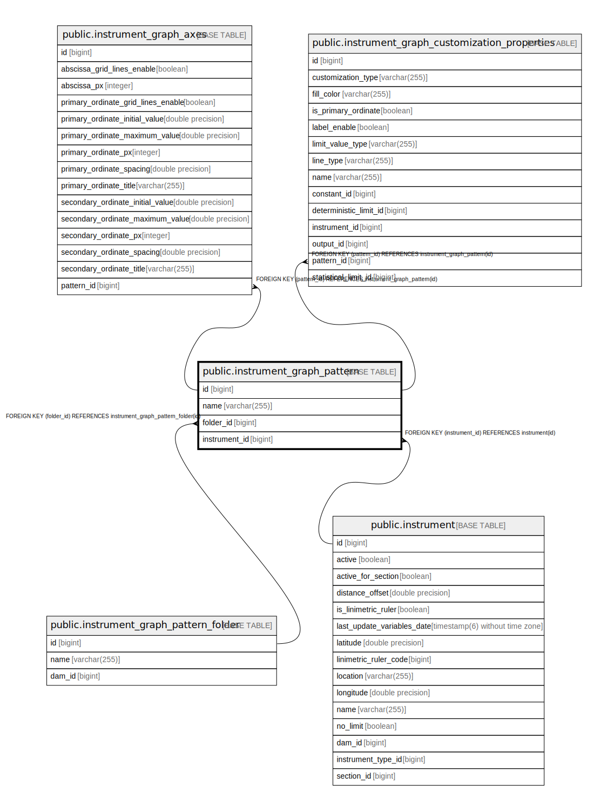

# public.instrument_graph_pattern

## Description

## Columns

| Name | Type | Default | Nullable | Children | Parents | Comment |
| ---- | ---- | ------- | -------- | -------- | ------- | ------- |
| id | bigint |  | false | [public.instrument_graph_axes](public.instrument_graph_axes.md) [public.instrument_graph_customization_properties](public.instrument_graph_customization_properties.md) |  |  |
| name | varchar(255) |  | false |  |  |  |
| folder_id | bigint |  | true |  | [public.instrument_graph_pattern_folder](public.instrument_graph_pattern_folder.md) |  |
| instrument_id | bigint |  | false |  | [public.instrument](public.instrument.md) |  |

## Constraints

| Name | Type | Definition |
| ---- | ---- | ---------- |
| fkeswjn3m57don33y5otqflpg19 | FOREIGN KEY | FOREIGN KEY (instrument_id) REFERENCES instrument(id) |
| instrument_graph_pattern_pkey | PRIMARY KEY | PRIMARY KEY (id) |
| fk3dxbyv4kc911wh483o063c4wy | FOREIGN KEY | FOREIGN KEY (folder_id) REFERENCES instrument_graph_pattern_folder(id) |

## Indexes

| Name | Definition |
| ---- | ---------- |
| instrument_graph_pattern_pkey | CREATE UNIQUE INDEX instrument_graph_pattern_pkey ON public.instrument_graph_pattern USING btree (id) |
| idx_graph_pattern_instrument | CREATE INDEX idx_graph_pattern_instrument ON public.instrument_graph_pattern USING btree (instrument_id) |
| idx_graph_pattern_name | CREATE INDEX idx_graph_pattern_name ON public.instrument_graph_pattern USING btree (name) |
| idx_graph_pattern_folder | CREATE INDEX idx_graph_pattern_folder ON public.instrument_graph_pattern USING btree (folder_id) |
| idx_graph_pattern_instrument_name | CREATE INDEX idx_graph_pattern_instrument_name ON public.instrument_graph_pattern USING btree (instrument_id, name) |
| idx_graph_pattern_folder_name | CREATE INDEX idx_graph_pattern_folder_name ON public.instrument_graph_pattern USING btree (folder_id, name) |

## Relations

---

> Generated by [tbls](https://github.com/k1LoW/tbls)
