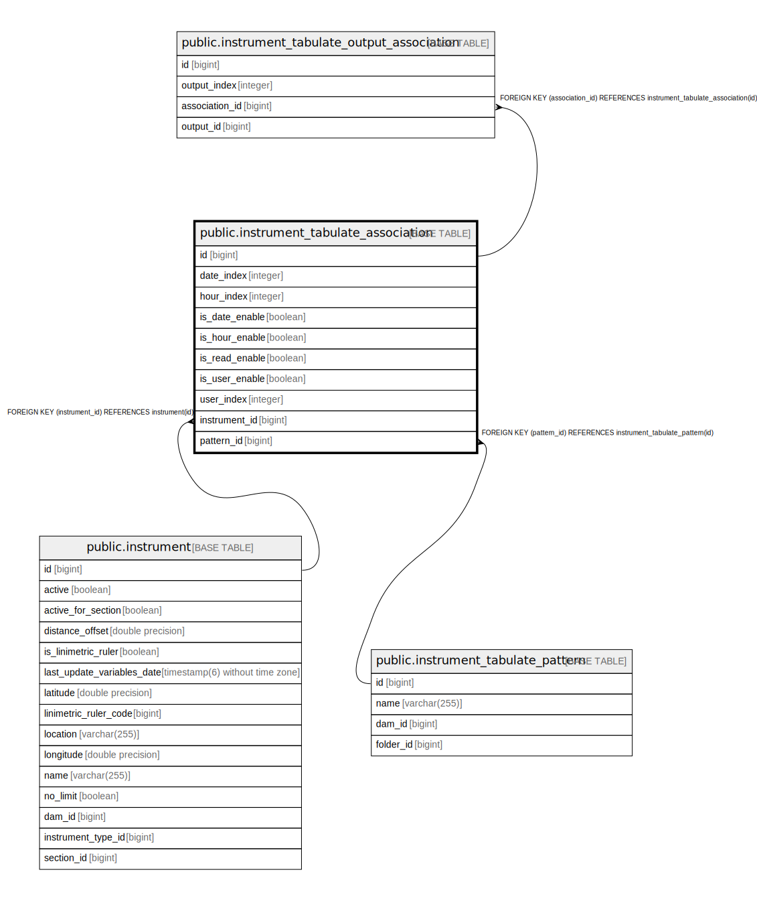

# public.instrument_tabulate_association

## Description

## Columns

| Name | Type | Default | Nullable | Children | Parents | Comment |
| ---- | ---- | ------- | -------- | -------- | ------- | ------- |
| id | bigint |  | false | [public.instrument_tabulate_output_association](public.instrument_tabulate_output_association.md) |  |  |
| date_index | integer |  | true |  |  |  |
| hour_index | integer |  | true |  |  |  |
| is_date_enable | boolean |  | true |  |  |  |
| is_hour_enable | boolean |  | true |  |  |  |
| is_read_enable | boolean |  | true |  |  |  |
| is_user_enable | boolean |  | true |  |  |  |
| user_index | integer |  | true |  |  |  |
| instrument_id | bigint |  | false |  | [public.instrument](public.instrument.md) |  |
| pattern_id | bigint |  | false |  | [public.instrument_tabulate_pattern](public.instrument_tabulate_pattern.md) |  |

## Constraints

| Name | Type | Definition |
| ---- | ---- | ---------- |
| fkpt755rkg8eb6ffm1cipn7rnnh | FOREIGN KEY | FOREIGN KEY (instrument_id) REFERENCES instrument(id) |
| instrument_tabulate_association_pkey | PRIMARY KEY | PRIMARY KEY (id) |
| fk3p5aajn6h4c1bk7jj0n63p4by | FOREIGN KEY | FOREIGN KEY (pattern_id) REFERENCES instrument_tabulate_pattern(id) |

## Indexes

| Name | Definition |
| ---- | ---------- |
| instrument_tabulate_association_pkey | CREATE UNIQUE INDEX instrument_tabulate_association_pkey ON public.instrument_tabulate_association USING btree (id) |
| idx_tabulate_assoc_pattern | CREATE INDEX idx_tabulate_assoc_pattern ON public.instrument_tabulate_association USING btree (pattern_id) |
| idx_tabulate_assoc_instrument | CREATE INDEX idx_tabulate_assoc_instrument ON public.instrument_tabulate_association USING btree (instrument_id) |
| idx_tabulate_assoc_pattern_instrument | CREATE INDEX idx_tabulate_assoc_pattern_instrument ON public.instrument_tabulate_association USING btree (pattern_id, instrument_id) |
| idx_tabulate_assoc_date_enable | CREATE INDEX idx_tabulate_assoc_date_enable ON public.instrument_tabulate_association USING btree (is_date_enable) |
| idx_tabulate_assoc_indexes | CREATE INDEX idx_tabulate_assoc_indexes ON public.instrument_tabulate_association USING btree (date_index, hour_index, user_index) |

## Relations

---

> Generated by [tbls](https://github.com/k1LoW/tbls)
