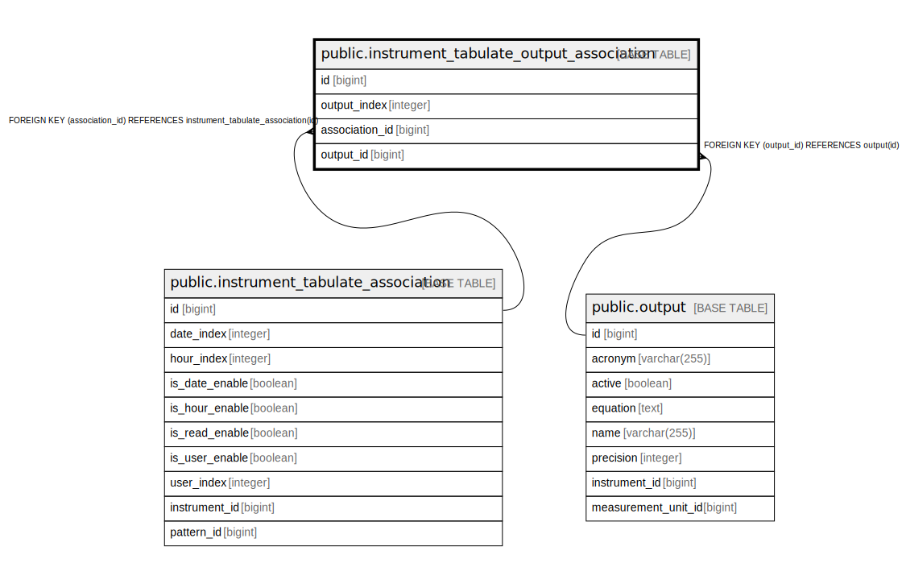

# public.instrument_tabulate_output_association

## Description

## Columns

| Name | Type | Default | Nullable | Children | Parents | Comment |
| ---- | ---- | ------- | -------- | -------- | ------- | ------- |
| id | bigint |  | false |  |  |  |
| output_index | integer |  | false |  |  |  |
| association_id | bigint |  | false |  | [public.instrument_tabulate_association](public.instrument_tabulate_association.md) |  |
| output_id | bigint |  | false |  | [public.output](public.output.md) |  |

## Constraints

| Name | Type | Definition |
| ---- | ---- | ---------- |
| fkk4jpb4qq20vgjvd5qrrsv610p | FOREIGN KEY | FOREIGN KEY (association_id) REFERENCES instrument_tabulate_association(id) |
| instrument_tabulate_output_association_pkey | PRIMARY KEY | PRIMARY KEY (id) |
| fknhwyt106cl4oiwoot8cqf0hfc | FOREIGN KEY | FOREIGN KEY (output_id) REFERENCES output(id) |

## Indexes

| Name | Definition |
| ---- | ---------- |
| instrument_tabulate_output_association_pkey | CREATE UNIQUE INDEX instrument_tabulate_output_association_pkey ON public.instrument_tabulate_output_association USING btree (id) |
| idx_tabulate_output_assoc_association | CREATE INDEX idx_tabulate_output_assoc_association ON public.instrument_tabulate_output_association USING btree (association_id) |
| idx_tabulate_output_assoc_output | CREATE INDEX idx_tabulate_output_assoc_output ON public.instrument_tabulate_output_association USING btree (output_id) |
| idx_tabulate_output_assoc_index | CREATE INDEX idx_tabulate_output_assoc_index ON public.instrument_tabulate_output_association USING btree (output_index) |
| idx_tabulate_output_assoc_assoc_output | CREATE INDEX idx_tabulate_output_assoc_assoc_output ON public.instrument_tabulate_output_association USING btree (association_id, output_id) |
| idx_tabulate_output_assoc_assoc_index | CREATE INDEX idx_tabulate_output_assoc_assoc_index ON public.instrument_tabulate_output_association USING btree (association_id, output_index) |

## Relations

---

> Generated by [tbls](https://github.com/k1LoW/tbls)
