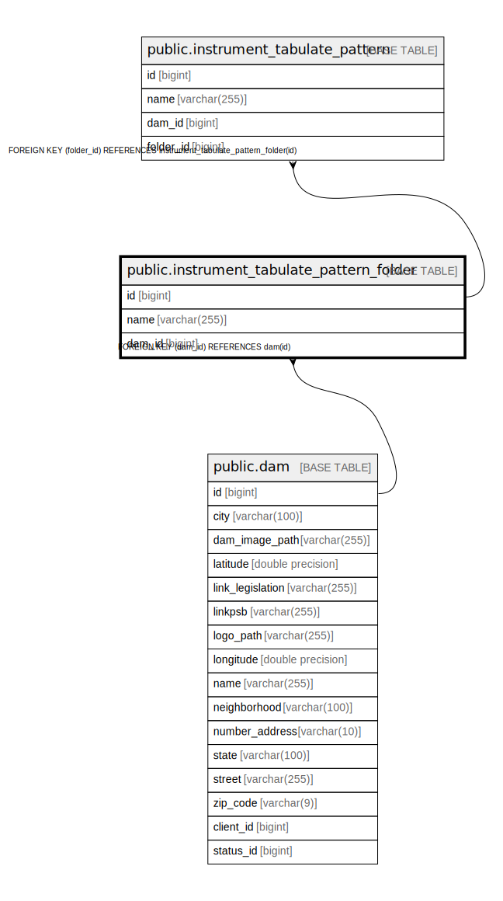

# public.instrument_tabulate_pattern_folder

## Description

## Columns

| Name | Type | Default | Nullable | Children | Parents | Comment |
| ---- | ---- | ------- | -------- | -------- | ------- | ------- |
| id | bigint |  | false | [public.instrument_tabulate_pattern](public.instrument_tabulate_pattern.md) |  |  |
| name | varchar(255) |  | false |  |  |  |
| dam_id | bigint |  | false |  | [public.dam](public.dam.md) |  |

## Constraints

| Name | Type | Definition |
| ---- | ---- | ---------- |
| fkilevxedkf4bsx7h4lh5p58g6i | FOREIGN KEY | FOREIGN KEY (dam_id) REFERENCES dam(id) |
| instrument_tabulate_pattern_folder_pkey | PRIMARY KEY | PRIMARY KEY (id) |

## Indexes

| Name | Definition |
| ---- | ---------- |
| instrument_tabulate_pattern_folder_pkey | CREATE UNIQUE INDEX instrument_tabulate_pattern_folder_pkey ON public.instrument_tabulate_pattern_folder USING btree (id) |
| idx_tabulate_folder_name | CREATE INDEX idx_tabulate_folder_name ON public.instrument_tabulate_pattern_folder USING btree (name) |
| idx_tabulate_folder_dam | CREATE INDEX idx_tabulate_folder_dam ON public.instrument_tabulate_pattern_folder USING btree (dam_id) |
| idx_tabulate_folder_dam_name | CREATE INDEX idx_tabulate_folder_dam_name ON public.instrument_tabulate_pattern_folder USING btree (dam_id, name) |

## Relations

---

> Generated by [tbls](https://github.com/k1LoW/tbls)
