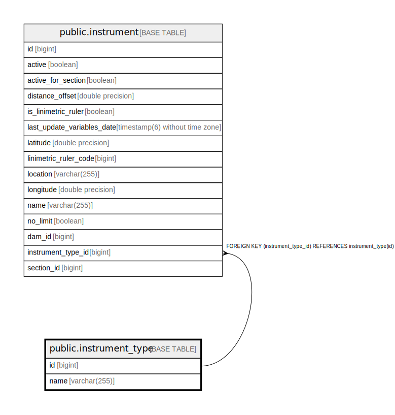

# public.instrument_type

## Description

## Columns

| Name | Type | Default | Nullable | Children | Parents | Comment |
| ---- | ---- | ------- | -------- | -------- | ------- | ------- |
| id | bigint |  | false | [public.instrument](public.instrument.md) |  |  |
| name | varchar(255) |  | false |  |  |  |

## Constraints

| Name | Type | Definition |
| ---- | ---- | ---------- |
| instrument_type_pkey | PRIMARY KEY | PRIMARY KEY (id) |
| uk_instrument_type_name | UNIQUE | UNIQUE (name) |

## Indexes

| Name | Definition |
| ---- | ---------- |
| instrument_type_pkey | CREATE UNIQUE INDEX instrument_type_pkey ON public.instrument_type USING btree (id) |
| idx_instrument_type_name_search | CREATE INDEX idx_instrument_type_name_search ON public.instrument_type USING btree (name) |
| uk_instrument_type_name | CREATE UNIQUE INDEX uk_instrument_type_name ON public.instrument_type USING btree (name) |

## Relations

---

> Generated by [tbls](https://github.com/k1LoW/tbls)
