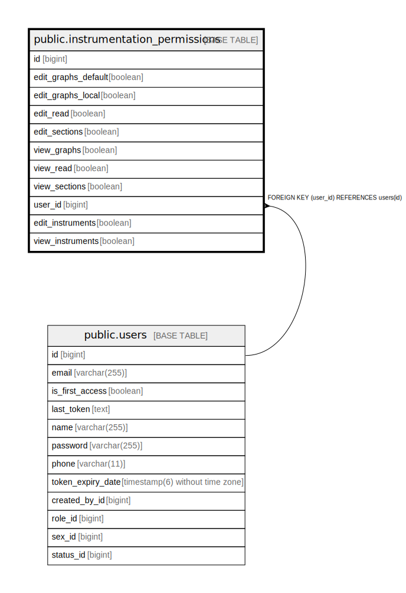

# public.instrumentation_permissions

## Description

## Columns

| Name | Type | Default | Nullable | Children | Parents | Comment |
| ---- | ---- | ------- | -------- | -------- | ------- | ------- |
| id | bigint |  | false |  |  |  |
| edit_graphs_default | boolean |  | false |  |  |  |
| edit_graphs_local | boolean |  | false |  |  |  |
| edit_read | boolean |  | false |  |  |  |
| edit_sections | boolean |  | false |  |  |  |
| view_graphs | boolean |  | false |  |  |  |
| view_read | boolean |  | false |  |  |  |
| view_sections | boolean |  | false |  |  |  |
| user_id | bigint |  | false |  | [public.users](public.users.md) |  |
| edit_instruments | boolean | false | true |  |  |  |
| view_instruments | boolean | false | true |  |  |  |

## Constraints

| Name | Type | Definition |
| ---- | ---- | ---------- |
| instrumentation_permissions_pkey | PRIMARY KEY | PRIMARY KEY (id) |
| fkt7k1ipsfbnq6360k13bha1lso | FOREIGN KEY | FOREIGN KEY (user_id) REFERENCES users(id) |
| ukal6ptehcvsbc72dd0uoxmjovv | UNIQUE | UNIQUE (user_id) |

## Indexes

| Name | Definition |
| ---- | ---------- |
| instrumentation_permissions_pkey | CREATE UNIQUE INDEX instrumentation_permissions_pkey ON public.instrumentation_permissions USING btree (id) |
| ukal6ptehcvsbc72dd0uoxmjovv | CREATE UNIQUE INDEX ukal6ptehcvsbc72dd0uoxmjovv ON public.instrumentation_permissions USING btree (user_id) |

## Relations

---

> Generated by [tbls](https://github.com/k1LoW/tbls)
