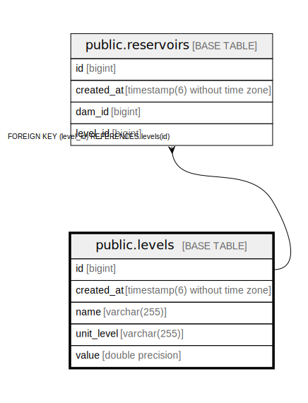

# public.levels

## Description

## Columns

| Name | Type | Default | Nullable | Children | Parents | Comment |
| ---- | ---- | ------- | -------- | -------- | ------- | ------- |
| id | bigint |  | false | [public.reservoirs](public.reservoirs.md) |  |  |
| created_at | timestamp(6) without time zone |  | true |  |  |  |
| name | varchar(255) |  | false |  |  |  |
| unit_level | varchar(255) |  | false |  |  |  |
| value | double precision |  | false |  |  |  |

## Constraints

| Name | Type | Definition |
| ---- | ---- | ---------- |
| levels_pkey | PRIMARY KEY | PRIMARY KEY (id) |
| idx_level_name | UNIQUE | UNIQUE (name) |

## Indexes

| Name | Definition |
| ---- | ---------- |
| levels_pkey | CREATE UNIQUE INDEX levels_pkey ON public.levels USING btree (id) |
| idx_level_value | CREATE INDEX idx_level_value ON public.levels USING btree (value) |
| idx_level_name | CREATE UNIQUE INDEX idx_level_name ON public.levels USING btree (name) |

## Relations

---

> Generated by [tbls](https://github.com/k1LoW/tbls)
