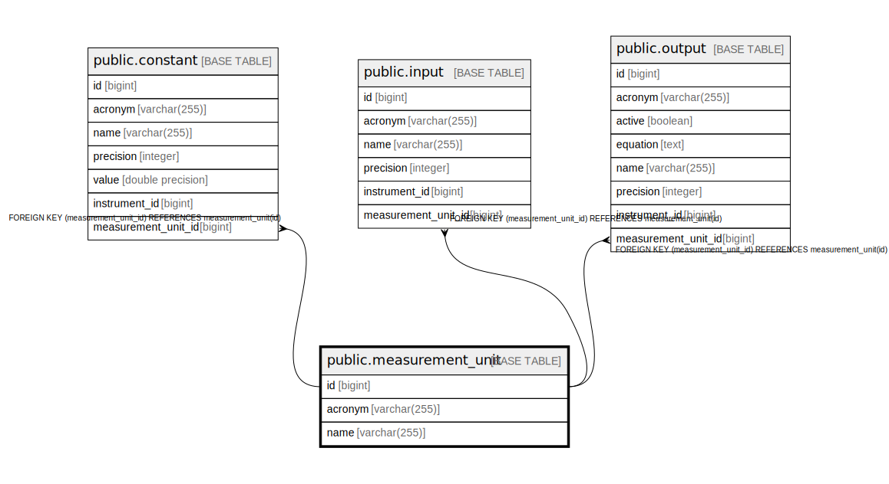

# public.measurement_unit

## Description

## Columns

| Name | Type | Default | Nullable | Children | Parents | Comment |
| ---- | ---- | ------- | -------- | -------- | ------- | ------- |
| id | bigint |  | false | [public.constant](public.constant.md) [public.input](public.input.md) [public.output](public.output.md) |  |  |
| acronym | varchar(255) |  | false |  |  |  |
| name | varchar(255) |  | false |  |  |  |

## Constraints

| Name | Type | Definition |
| ---- | ---- | ---------- |
| measurement_unit_pkey | PRIMARY KEY | PRIMARY KEY (id) |
| uknj5745skr6xqut88m6fbxi1ea | UNIQUE | UNIQUE (acronym) |
| uk1vvd0tjmao71dgo2ancmocayu | UNIQUE | UNIQUE (name) |

## Indexes

| Name | Definition |
| ---- | ---------- |
| measurement_unit_pkey | CREATE UNIQUE INDEX measurement_unit_pkey ON public.measurement_unit USING btree (id) |
| uknj5745skr6xqut88m6fbxi1ea | CREATE UNIQUE INDEX uknj5745skr6xqut88m6fbxi1ea ON public.measurement_unit USING btree (acronym) |
| uk1vvd0tjmao71dgo2ancmocayu | CREATE UNIQUE INDEX uk1vvd0tjmao71dgo2ancmocayu ON public.measurement_unit USING btree (name) |

## Relations

---

> Generated by [tbls](https://github.com/k1LoW/tbls)
