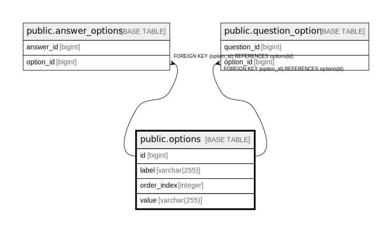

# public.options

## Description

## Columns

| Name | Type | Default | Nullable | Children | Parents | Comment |
| ---- | ---- | ------- | -------- | -------- | ------- | ------- |
| id | bigint |  | false | [public.answer_options](public.answer_options.md) [public.question_option](public.question_option.md) |  |  |
| label | varchar(255) |  | false |  |  |  |
| order_index | integer |  | true |  |  |  |
| value | varchar(255) |  | false |  |  |  |

## Constraints

| Name | Type | Definition |
| ---- | ---- | ---------- |
| options_pkey | PRIMARY KEY | PRIMARY KEY (id) |
| idx_option_label | UNIQUE | UNIQUE (label) |

## Indexes

| Name | Definition |
| ---- | ---------- |
| options_pkey | CREATE UNIQUE INDEX options_pkey ON public.options USING btree (id) |
| idx_option_value | CREATE INDEX idx_option_value ON public.options USING btree (value) |
| idx_option_order | CREATE INDEX idx_option_order ON public.options USING btree (order_index) |
| idx_option_label | CREATE UNIQUE INDEX idx_option_label ON public.options USING btree (label) |

## Relations

---

> Generated by [tbls](https://github.com/k1LoW/tbls)
