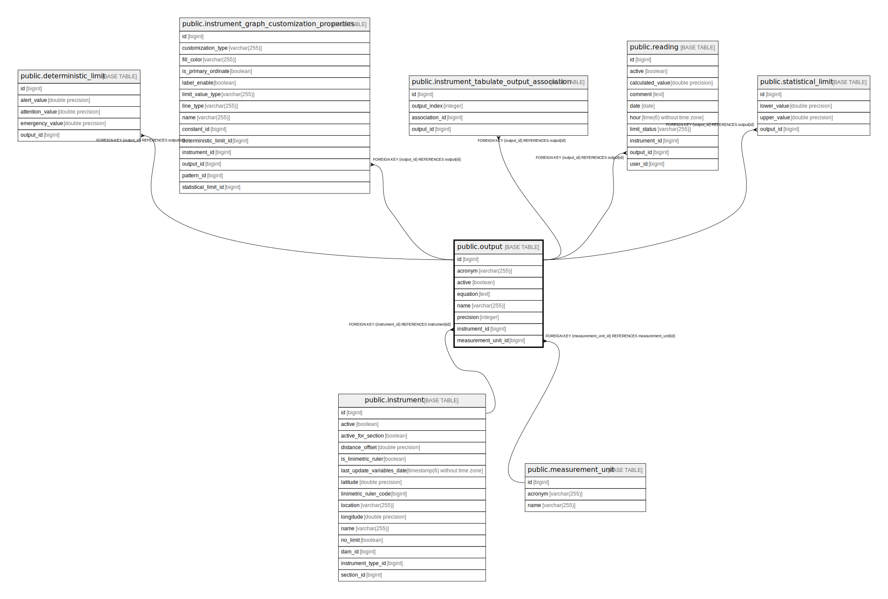

# public.output

## Description

## Columns

| Name | Type | Default | Nullable | Children | Parents | Comment |
| ---- | ---- | ------- | -------- | -------- | ------- | ------- |
| id | bigint |  | false | [public.deterministic_limit](public.deterministic_limit.md) [public.instrument_graph_customization_properties](public.instrument_graph_customization_properties.md) [public.instrument_tabulate_output_association](public.instrument_tabulate_output_association.md) [public.reading](public.reading.md) [public.statistical_limit](public.statistical_limit.md) |  |  |
| acronym | varchar(255) |  | false |  |  |  |
| active | boolean |  | false |  |  |  |
| equation | text |  | false |  |  |  |
| name | varchar(255) |  | false |  |  |  |
| precision | integer |  | false |  |  |  |
| instrument_id | bigint |  | false |  | [public.instrument](public.instrument.md) |  |
| measurement_unit_id | bigint |  | false |  | [public.measurement_unit](public.measurement_unit.md) |  |

## Constraints

| Name | Type | Definition |
| ---- | ---- | ---------- |
| fksfarayn6inor5wgkgnmvvc6bu | FOREIGN KEY | FOREIGN KEY (instrument_id) REFERENCES instrument(id) |
| fkki57pt6qbainvh3fusvqyn7ol | FOREIGN KEY | FOREIGN KEY (measurement_unit_id) REFERENCES measurement_unit(id) |
| output_pkey | PRIMARY KEY | PRIMARY KEY (id) |

## Indexes

| Name | Definition |
| ---- | ---------- |
| output_pkey | CREATE UNIQUE INDEX output_pkey ON public.output USING btree (id) |
| idx_output_instrument_active | CREATE INDEX idx_output_instrument_active ON public.output USING btree (instrument_id, active) |
| idx_output_acronym | CREATE INDEX idx_output_acronym ON public.output USING btree (acronym) |
| idx_output_instrument_acronym | CREATE INDEX idx_output_instrument_acronym ON public.output USING btree (instrument_id, acronym) |
| idx_output_active | CREATE INDEX idx_output_active ON public.output USING btree (active) |
| idx_output_measurement_unit | CREATE INDEX idx_output_measurement_unit ON public.output USING btree (measurement_unit_id, instrument_id) |

## Relations

---

> Generated by [tbls](https://github.com/k1LoW/tbls)
