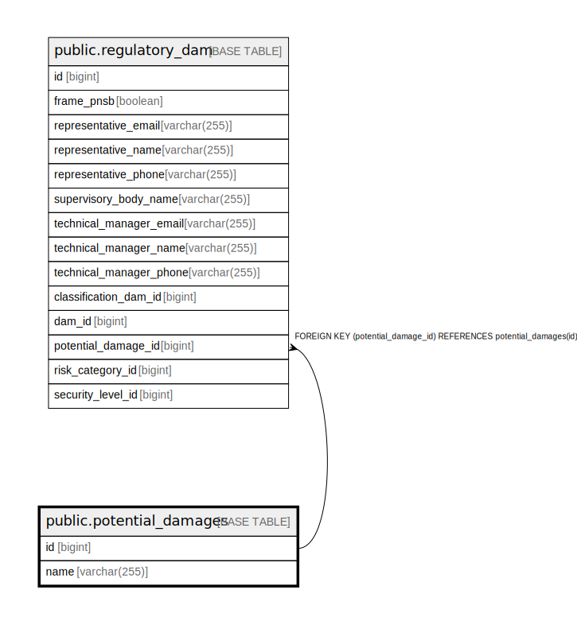

# public.potential_damages

## Description

## Columns

| Name | Type | Default | Nullable | Children | Parents | Comment |
| ---- | ---- | ------- | -------- | -------- | ------- | ------- |
| id | bigint |  | false | [public.regulatory_dam](public.regulatory_dam.md) |  |  |
| name | varchar(255) |  | false |  |  |  |

## Constraints

| Name | Type | Definition |
| ---- | ---- | ---------- |
| potential_damages_pkey | PRIMARY KEY | PRIMARY KEY (id) |
| idx_potential_damage_name | UNIQUE | UNIQUE (name) |

## Indexes

| Name | Definition |
| ---- | ---------- |
| potential_damages_pkey | CREATE UNIQUE INDEX potential_damages_pkey ON public.potential_damages USING btree (id) |
| idx_potential_damage_name | CREATE UNIQUE INDEX idx_potential_damage_name ON public.potential_damages USING btree (name) |

## Relations

---

> Generated by [tbls](https://github.com/k1LoW/tbls)
