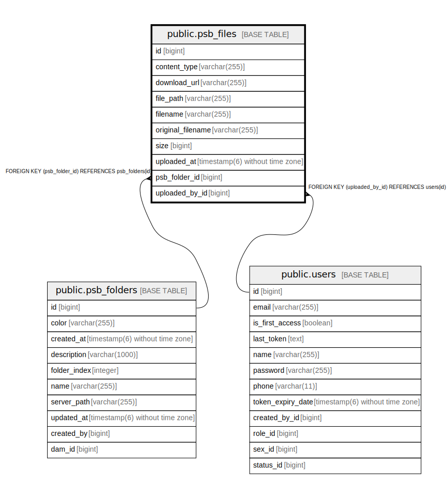

# public.psb_files

## Description

## Columns

| Name | Type | Default | Nullable | Children | Parents | Comment |
| ---- | ---- | ------- | -------- | -------- | ------- | ------- |
| id | bigint |  | false |  |  |  |
| content_type | varchar(255) |  | true |  |  |  |
| download_url | varchar(255) |  | true |  |  |  |
| file_path | varchar(255) |  | false |  |  |  |
| filename | varchar(255) |  | false |  |  |  |
| original_filename | varchar(255) |  | true |  |  |  |
| size | bigint |  | true |  |  |  |
| uploaded_at | timestamp(6) without time zone |  | true |  |  |  |
| psb_folder_id | bigint |  | false |  | [public.psb_folders](public.psb_folders.md) |  |
| uploaded_by_id | bigint |  | true |  | [public.users](public.users.md) |  |

## Constraints

| Name | Type | Definition |
| ---- | ---- | ---------- |
| psb_files_pkey | PRIMARY KEY | PRIMARY KEY (id) |
| fk9x526xeynpci58b3pgpq7qf0q | FOREIGN KEY | FOREIGN KEY (psb_folder_id) REFERENCES psb_folders(id) |
| fkk3a59tdkho4k3ojdsm6meed7g | FOREIGN KEY | FOREIGN KEY (uploaded_by_id) REFERENCES users(id) |

## Indexes

| Name | Definition |
| ---- | ---------- |
| psb_files_pkey | CREATE UNIQUE INDEX psb_files_pkey ON public.psb_files USING btree (id) |
| idx_psb_file_folder_id | CREATE INDEX idx_psb_file_folder_id ON public.psb_files USING btree (psb_folder_id) |
| idx_psb_file_uploaded_by_id | CREATE INDEX idx_psb_file_uploaded_by_id ON public.psb_files USING btree (uploaded_by_id) |
| idx_psb_file_filename | CREATE INDEX idx_psb_file_filename ON public.psb_files USING btree (filename) |
| idx_psb_file_folder_uploaded | CREATE INDEX idx_psb_file_folder_uploaded ON public.psb_files USING btree (psb_folder_id, uploaded_at) |

## Relations

---

> Generated by [tbls](https://github.com/k1LoW/tbls)
