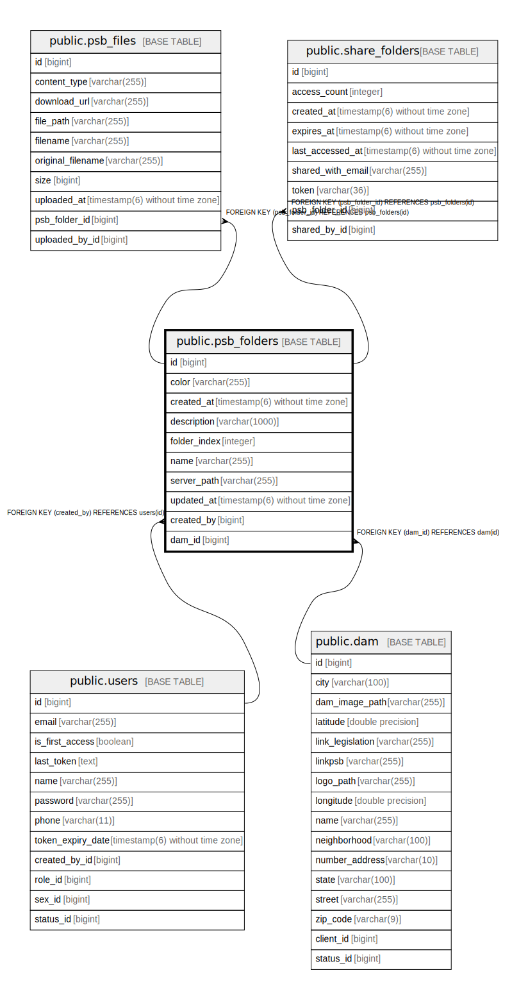

# public.psb_folders

## Description

## Columns

| Name | Type | Default | Nullable | Children | Parents | Comment |
| ---- | ---- | ------- | -------- | -------- | ------- | ------- |
| id | bigint |  | false | [public.psb_files](public.psb_files.md) [public.share_folders](public.share_folders.md) |  |  |
| color | varchar(255) |  | true |  |  |  |
| created_at | timestamp(6) without time zone |  | true |  |  |  |
| description | varchar(1000) |  | true |  |  |  |
| folder_index | integer |  | false |  |  |  |
| name | varchar(255) |  | false |  |  |  |
| server_path | varchar(255) |  | false |  |  |  |
| updated_at | timestamp(6) without time zone |  | true |  |  |  |
| created_by | bigint |  | true |  | [public.users](public.users.md) |  |
| dam_id | bigint |  | false |  | [public.dam](public.dam.md) |  |

## Constraints

| Name | Type | Definition |
| ---- | ---- | ---------- |
| psb_folders_color_check | CHECK | CHECK (((color)::text = ANY ((ARRAY['RED'::character varying, 'BLUE'::character varying])::text[]))) |
| fkgjub42w8kaecvnt6i73yweshp | FOREIGN KEY | FOREIGN KEY (dam_id) REFERENCES dam(id) |
| psb_folders_pkey | PRIMARY KEY | PRIMARY KEY (id) |
| fkmuh52yd8j6y0wa4hn73hu4fw8 | FOREIGN KEY | FOREIGN KEY (created_by) REFERENCES users(id) |

## Indexes

| Name | Definition |
| ---- | ---------- |
| psb_folders_pkey | CREATE UNIQUE INDEX psb_folders_pkey ON public.psb_folders USING btree (id) |
| idx_psb_folder_dam_id | CREATE INDEX idx_psb_folder_dam_id ON public.psb_folders USING btree (dam_id) |
| idx_psb_folder_created_by | CREATE INDEX idx_psb_folder_created_by ON public.psb_folders USING btree (created_by) |
| idx_psb_folder_dam_idx | CREATE INDEX idx_psb_folder_dam_idx ON public.psb_folders USING btree (dam_id, folder_index) |
| idx_psb_folder_dam_name | CREATE INDEX idx_psb_folder_dam_name ON public.psb_folders USING btree (dam_id, name) |
| idx_psb_folder_updated_at | CREATE INDEX idx_psb_folder_updated_at ON public.psb_folders USING btree (updated_at) |

## Relations

---

> Generated by [tbls](https://github.com/k1LoW/tbls)
