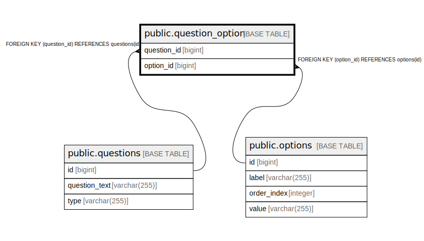

# public.question_option

## Description

## Columns

| Name | Type | Default | Nullable | Children | Parents | Comment |
| ---- | ---- | ------- | -------- | -------- | ------- | ------- |
| question_id | bigint |  | false |  | [public.questions](public.questions.md) |  |
| option_id | bigint |  | false |  | [public.options](public.options.md) |  |

## Constraints

| Name | Type | Definition |
| ---- | ---- | ---------- |
| fk9urqaptr64qt7ov7xwy48r4tj | FOREIGN KEY | FOREIGN KEY (option_id) REFERENCES options(id) |
| question_option_pkey | PRIMARY KEY | PRIMARY KEY (question_id, option_id) |
| fktrf5invxsty5o99qqlrkgjwkh | FOREIGN KEY | FOREIGN KEY (question_id) REFERENCES questions(id) |

## Indexes

| Name | Definition |
| ---- | ---------- |
| question_option_pkey | CREATE UNIQUE INDEX question_option_pkey ON public.question_option USING btree (question_id, option_id) |

## Relations

---

> Generated by [tbls](https://github.com/k1LoW/tbls)
