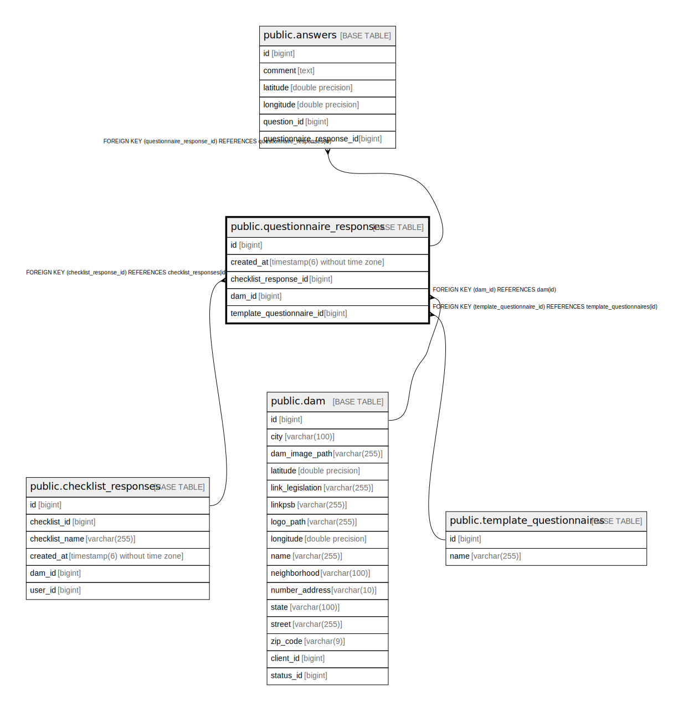

# public.questionnaire_responses

## Description

## Columns

| Name | Type | Default | Nullable | Children | Parents | Comment |
| ---- | ---- | ------- | -------- | -------- | ------- | ------- |
| id | bigint |  | false | [public.answers](public.answers.md) |  |  |
| created_at | timestamp(6) without time zone |  | false |  |  |  |
| checklist_response_id | bigint |  | false |  | [public.checklist_responses](public.checklist_responses.md) |  |
| dam_id | bigint |  | false |  | [public.dam](public.dam.md) |  |
| template_questionnaire_id | bigint |  | false |  | [public.template_questionnaires](public.template_questionnaires.md) |  |

## Constraints

| Name | Type | Definition |
| ---- | ---- | ---------- |
| fkkteogsw77qxowioobje7q4m0g | FOREIGN KEY | FOREIGN KEY (checklist_response_id) REFERENCES checklist_responses(id) |
| fknxtwj02i34cuu16ncrp8a1lki | FOREIGN KEY | FOREIGN KEY (dam_id) REFERENCES dam(id) |
| questionnaire_responses_pkey | PRIMARY KEY | PRIMARY KEY (id) |
| fkrv3dbxrvv5a2iy1qd6br70yfw | FOREIGN KEY | FOREIGN KEY (template_questionnaire_id) REFERENCES template_questionnaires(id) |

## Indexes

| Name | Definition |
| ---- | ---------- |
| questionnaire_responses_pkey | CREATE UNIQUE INDEX questionnaire_responses_pkey ON public.questionnaire_responses USING btree (id) |
| idx_questionnaire_response_checklist_id | CREATE INDEX idx_questionnaire_response_checklist_id ON public.questionnaire_responses USING btree (checklist_response_id) |
| idx_questionnaire_response_dam_id | CREATE INDEX idx_questionnaire_response_dam_id ON public.questionnaire_responses USING btree (dam_id) |
| idx_questionnaire_response_dam_created | CREATE INDEX idx_questionnaire_response_dam_created ON public.questionnaire_responses USING btree (dam_id, created_at) |
| idx_questionnaire_response_template_id | CREATE INDEX idx_questionnaire_response_template_id ON public.questionnaire_responses USING btree (template_questionnaire_id) |

## Relations

---

> Generated by [tbls](https://github.com/k1LoW/tbls)
