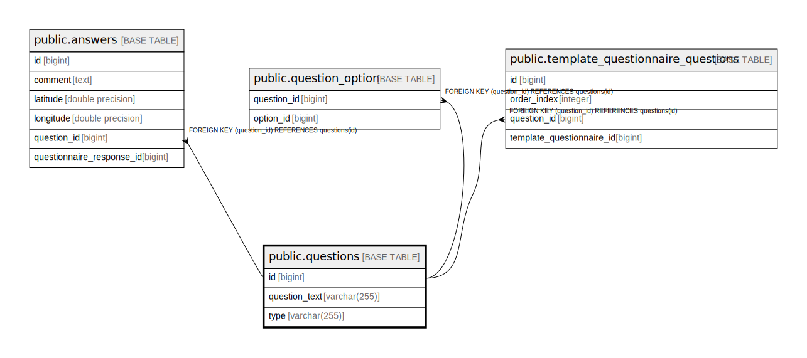

# public.questions

## Description

## Columns

| Name | Type | Default | Nullable | Children | Parents | Comment |
| ---- | ---- | ------- | -------- | -------- | ------- | ------- |
| id | bigint |  | false | [public.answers](public.answers.md) [public.question_option](public.question_option.md) [public.template_questionnaire_questions](public.template_questionnaire_questions.md) |  |  |
| question_text | varchar(255) |  | false |  |  |  |
| type | varchar(255) |  | false |  |  |  |

## Constraints

| Name | Type | Definition |
| ---- | ---- | ---------- |
| questions_type_check | CHECK | CHECK (((type)::text = ANY ((ARRAY['CHECKBOX'::character varying, 'TEXT'::character varying])::text[]))) |
| questions_pkey | PRIMARY KEY | PRIMARY KEY (id) |

## Indexes

| Name | Definition |
| ---- | ---------- |
| questions_pkey | CREATE UNIQUE INDEX questions_pkey ON public.questions USING btree (id) |
| idx_question_type | CREATE INDEX idx_question_type ON public.questions USING btree (type) |

## Relations

---

> Generated by [tbls](https://github.com/k1LoW/tbls)
