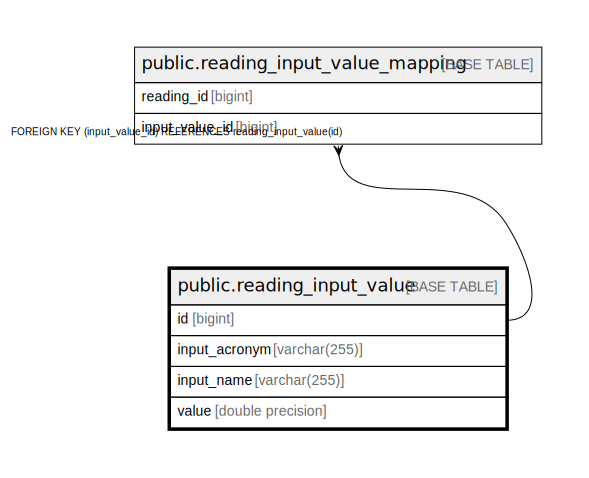

# public.reading_input_value

## Description

## Columns

| Name | Type | Default | Nullable | Children | Parents | Comment |
| ---- | ---- | ------- | -------- | -------- | ------- | ------- |
| id | bigint |  | false | [public.reading_input_value_mapping](public.reading_input_value_mapping.md) |  |  |
| input_acronym | varchar(255) |  | false |  |  |  |
| input_name | varchar(255) |  | false |  |  |  |
| value | double precision |  | false |  |  |  |

## Constraints

| Name | Type | Definition |
| ---- | ---- | ---------- |
| reading_input_value_pkey | PRIMARY KEY | PRIMARY KEY (id) |

## Indexes

| Name | Definition |
| ---- | ---------- |
| reading_input_value_pkey | CREATE UNIQUE INDEX reading_input_value_pkey ON public.reading_input_value USING btree (id) |
| idx_reading_input_value_acronym | CREATE INDEX idx_reading_input_value_acronym ON public.reading_input_value USING btree (input_acronym) |

## Relations

---

> Generated by [tbls](https://github.com/k1LoW/tbls)
