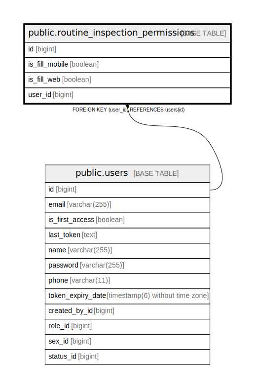

# public.routine_inspection_permissions

## Description

## Columns

| Name | Type | Default | Nullable | Children | Parents | Comment |
| ---- | ---- | ------- | -------- | -------- | ------- | ------- |
| id | bigint |  | false |  |  |  |
| is_fill_mobile | boolean |  | false |  |  |  |
| is_fill_web | boolean |  | false |  |  |  |
| user_id | bigint |  | false |  | [public.users](public.users.md) |  |

## Constraints

| Name | Type | Definition |
| ---- | ---- | ---------- |
| routine_inspection_permissions_pkey | PRIMARY KEY | PRIMARY KEY (id) |
| fk5bns02b7bm8t3xpb20kej8x5w | FOREIGN KEY | FOREIGN KEY (user_id) REFERENCES users(id) |
| uk70w49hgo03per97lr2sjsofjn | UNIQUE | UNIQUE (user_id) |

## Indexes

| Name | Definition |
| ---- | ---------- |
| routine_inspection_permissions_pkey | CREATE UNIQUE INDEX routine_inspection_permissions_pkey ON public.routine_inspection_permissions USING btree (id) |
| uk70w49hgo03per97lr2sjsofjn | CREATE UNIQUE INDEX uk70w49hgo03per97lr2sjsofjn ON public.routine_inspection_permissions USING btree (user_id) |

## Relations

---

> Generated by [tbls](https://github.com/k1LoW/tbls)
