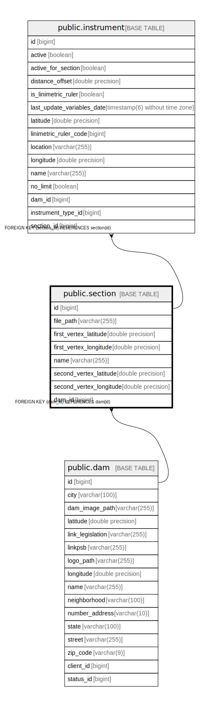

# public.section

## Description

## Columns

| Name | Type | Default | Nullable | Children | Parents | Comment |
| ---- | ---- | ------- | -------- | -------- | ------- | ------- |
| id | bigint |  | false | [public.instrument](public.instrument.md) |  |  |
| file_path | varchar(255) |  | true |  |  |  |
| first_vertex_latitude | double precision |  | false |  |  |  |
| first_vertex_longitude | double precision |  | false |  |  |  |
| name | varchar(255) |  | false |  |  |  |
| second_vertex_latitude | double precision |  | false |  |  |  |
| second_vertex_longitude | double precision |  | false |  |  |  |
| dam_id | bigint |  | true |  | [public.dam](public.dam.md) |  |

## Constraints

| Name | Type | Definition |
| ---- | ---- | ---------- |
| fk1ingyhfvqmwr31efjc81mwkew | FOREIGN KEY | FOREIGN KEY (dam_id) REFERENCES dam(id) |
| section_pkey | PRIMARY KEY | PRIMARY KEY (id) |

## Indexes

| Name | Definition |
| ---- | ---------- |
| section_pkey | CREATE UNIQUE INDEX section_pkey ON public.section USING btree (id) |
| idx_section_dam_id | CREATE INDEX idx_section_dam_id ON public.section USING btree (dam_id) |
| idx_section_dam_name | CREATE INDEX idx_section_dam_name ON public.section USING btree (dam_id, name) |
| idx_section_coords | CREATE INDEX idx_section_coords ON public.section USING btree (first_vertex_latitude, first_vertex_longitude) |

## Relations

---

> Generated by [tbls](https://github.com/k1LoW/tbls)
