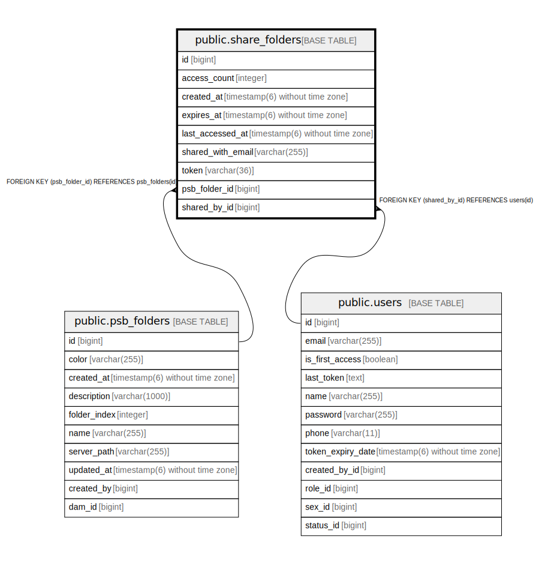

# public.share_folders

## Description

## Columns

| Name | Type | Default | Nullable | Children | Parents | Comment |
| ---- | ---- | ------- | -------- | -------- | ------- | ------- |
| id | bigint |  | false |  |  |  |
| access_count | integer |  | false |  |  |  |
| created_at | timestamp(6) without time zone |  | false |  |  |  |
| expires_at | timestamp(6) without time zone |  | true |  |  |  |
| last_accessed_at | timestamp(6) without time zone |  | true |  |  |  |
| shared_with_email | varchar(255) |  | false |  |  |  |
| token | varchar(36) |  | false |  |  |  |
| psb_folder_id | bigint |  | false |  | [public.psb_folders](public.psb_folders.md) |  |
| shared_by_id | bigint |  | false |  | [public.users](public.users.md) |  |

## Constraints

| Name | Type | Definition |
| ---- | ---- | ---------- |
| fkhnahi43nx4tuxy862r71bux9c | FOREIGN KEY | FOREIGN KEY (psb_folder_id) REFERENCES psb_folders(id) |
| share_folders_pkey | PRIMARY KEY | PRIMARY KEY (id) |
| fkjf8510iof0ofchus6igk46k65 | FOREIGN KEY | FOREIGN KEY (shared_by_id) REFERENCES users(id) |
| idx_share_folder_token | UNIQUE | UNIQUE (token) |

## Indexes

| Name | Definition |
| ---- | ---------- |
| share_folders_pkey | CREATE UNIQUE INDEX share_folders_pkey ON public.share_folders USING btree (id) |
| idx_share_folder_psb_folder | CREATE INDEX idx_share_folder_psb_folder ON public.share_folders USING btree (psb_folder_id) |
| idx_share_folder_token | CREATE UNIQUE INDEX idx_share_folder_token ON public.share_folders USING btree (token) |

## Relations

---

> Generated by [tbls](https://github.com/k1LoW/tbls)
