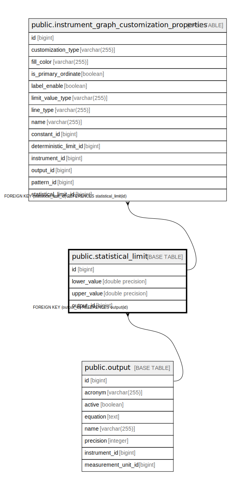

# public.statistical_limit

## Description

## Columns

| Name | Type | Default | Nullable | Children | Parents | Comment |
| ---- | ---- | ------- | -------- | -------- | ------- | ------- |
| id | bigint |  | false | [public.instrument_graph_customization_properties](public.instrument_graph_customization_properties.md) |  |  |
| lower_value | double precision |  | true |  |  |  |
| upper_value | double precision |  | true |  |  |  |
| output_id | bigint |  | false |  | [public.output](public.output.md) |  |

## Constraints

| Name | Type | Definition |
| ---- | ---- | ---------- |
| fkpym3faf4o2kuwk1myfwcjj7li | FOREIGN KEY | FOREIGN KEY (output_id) REFERENCES output(id) |
| statistical_limit_pkey | PRIMARY KEY | PRIMARY KEY (id) |
| uk5em27xham6w9a56d1ie0a3mij | UNIQUE | UNIQUE (output_id) |

## Indexes

| Name | Definition |
| ---- | ---------- |
| statistical_limit_pkey | CREATE UNIQUE INDEX statistical_limit_pkey ON public.statistical_limit USING btree (id) |
| uk5em27xham6w9a56d1ie0a3mij | CREATE UNIQUE INDEX uk5em27xham6w9a56d1ie0a3mij ON public.statistical_limit USING btree (output_id) |

## Relations

---

> Generated by [tbls](https://github.com/k1LoW/tbls)
