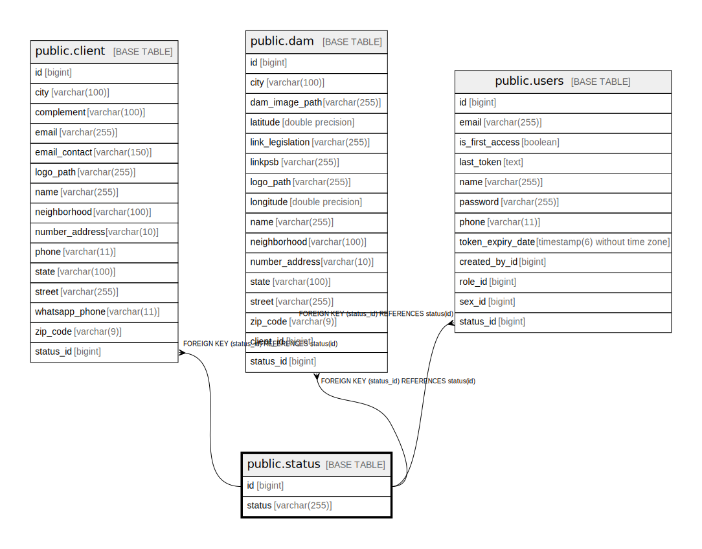

# public.status

## Description

## Columns

| Name | Type | Default | Nullable | Children | Parents | Comment |
| ---- | ---- | ------- | -------- | -------- | ------- | ------- |
| id | bigint |  | false | [public.client](public.client.md) [public.dam](public.dam.md) [public.users](public.users.md) |  |  |
| status | varchar(255) |  | false |  |  |  |

## Constraints

| Name | Type | Definition |
| ---- | ---- | ---------- |
| status_status_check | CHECK | CHECK (((status)::text = ANY ((ARRAY['ACTIVE'::character varying, 'DISABLED'::character varying])::text[]))) |
| status_pkey | PRIMARY KEY | PRIMARY KEY (id) |
| idx_status_enum | UNIQUE | UNIQUE (status) |

## Indexes

| Name | Definition |
| ---- | ---------- |
| status_pkey | CREATE UNIQUE INDEX status_pkey ON public.status USING btree (id) |
| idx_status_enum | CREATE UNIQUE INDEX idx_status_enum ON public.status USING btree (status) |

## Relations

---

> Generated by [tbls](https://github.com/k1LoW/tbls)
