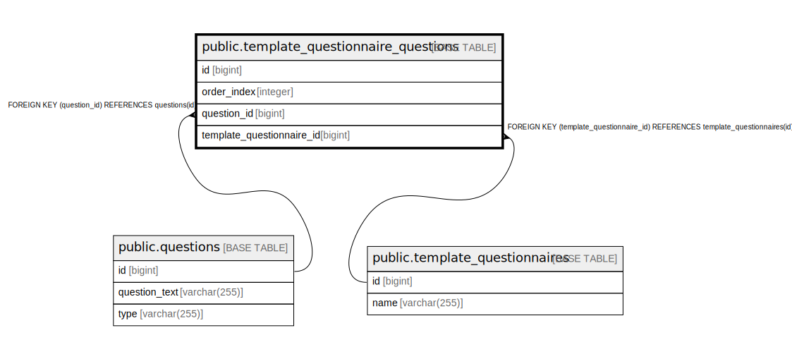

# public.template_questionnaire_questions

## Description

## Columns

| Name | Type | Default | Nullable | Children | Parents | Comment |
| ---- | ---- | ------- | -------- | -------- | ------- | ------- |
| id | bigint |  | false |  |  |  |
| order_index | integer |  | false |  |  |  |
| question_id | bigint |  | false |  | [public.questions](public.questions.md) |  |
| template_questionnaire_id | bigint |  | false |  | [public.template_questionnaires](public.template_questionnaires.md) |  |

## Constraints

| Name | Type | Definition |
| ---- | ---- | ---------- |
| fkihluxspmetksbca0k73d6t1p8 | FOREIGN KEY | FOREIGN KEY (question_id) REFERENCES questions(id) |
| template_questionnaire_questions_pkey | PRIMARY KEY | PRIMARY KEY (id) |
| fkcin7o3soc5tchrp20k1745uv8 | FOREIGN KEY | FOREIGN KEY (template_questionnaire_id) REFERENCES template_questionnaires(id) |

## Indexes

| Name | Definition |
| ---- | ---------- |
| template_questionnaire_questions_pkey | CREATE UNIQUE INDEX template_questionnaire_questions_pkey ON public.template_questionnaire_questions USING btree (id) |
| idx_tqq_template_id | CREATE INDEX idx_tqq_template_id ON public.template_questionnaire_questions USING btree (template_questionnaire_id) |
| idx_tqq_question_id | CREATE INDEX idx_tqq_question_id ON public.template_questionnaire_questions USING btree (question_id) |
| idx_tqq_order | CREATE INDEX idx_tqq_order ON public.template_questionnaire_questions USING btree (template_questionnaire_id, order_index) |

## Relations

---

> Generated by [tbls](https://github.com/k1LoW/tbls)
