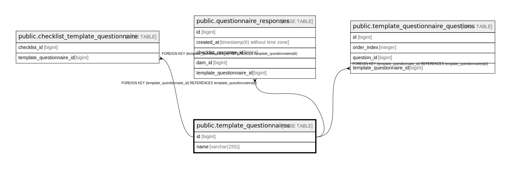

# public.template_questionnaires

## Description

## Columns

| Name | Type | Default | Nullable | Children | Parents | Comment |
| ---- | ---- | ------- | -------- | -------- | ------- | ------- |
| id | bigint |  | false | [public.checklist_template_questionnaire](public.checklist_template_questionnaire.md) [public.questionnaire_responses](public.questionnaire_responses.md) [public.template_questionnaire_questions](public.template_questionnaire_questions.md) |  |  |
| name | varchar(255) |  | false |  |  |  |

## Constraints

| Name | Type | Definition |
| ---- | ---- | ---------- |
| template_questionnaires_pkey | PRIMARY KEY | PRIMARY KEY (id) |

## Indexes

| Name | Definition |
| ---- | ---------- |
| template_questionnaires_pkey | CREATE UNIQUE INDEX template_questionnaires_pkey ON public.template_questionnaires USING btree (id) |
| idx_template_questionnaire_name | CREATE INDEX idx_template_questionnaire_name ON public.template_questionnaires USING btree (name) |

## Relations

---

> Generated by [tbls](https://github.com/k1LoW/tbls)
