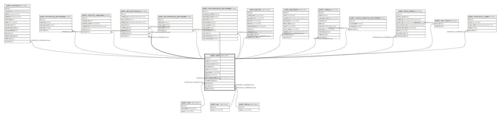

# public.users

## Description

## Columns

| Name | Type | Default | Nullable | Children | Parents | Comment |
| ---- | ---- | ------- | -------- | -------- | ------- | ------- |
| id | bigint |  | false | [public.anomalies](public.anomalies.md) [public.attributions_permissions](public.attributions_permissions.md) [public.checklist_responses](public.checklist_responses.md) [public.dam_permissions](public.dam_permissions.md) [public.documentation_permissions](public.documentation_permissions.md) [public.instrumentation_permissions](public.instrumentation_permissions.md) [public.psb_files](public.psb_files.md) [public.psb_folders](public.psb_folders.md) [public.reading](public.reading.md) [public.routine_inspection_permissions](public.routine_inspection_permissions.md) [public.share_folders](public.share_folders.md) [public.user_client](public.user_client.md) [public.users](public.users.md) [public.verification_codes](public.verification_codes.md) |  |  |
| email | varchar(255) |  | false |  |  |  |
| is_first_access | boolean |  | true |  |  |  |
| last_token | text |  | true |  |  |  |
| name | varchar(255) |  | false |  |  |  |
| password | varchar(255) |  | false |  |  |  |
| phone | varchar(11) |  | true |  |  |  |
| token_expiry_date | timestamp(6) without time zone |  | true |  |  |  |
| created_by_id | bigint |  | true |  | [public.users](public.users.md) |  |
| role_id | bigint |  | false |  | [public.roles](public.roles.md) |  |
| sex_id | bigint |  | false |  | [public.sex](public.sex.md) |  |
| status_id | bigint |  | false |  | [public.status](public.status.md) |  |

## Constraints

| Name | Type | Definition |
| ---- | ---- | ---------- |
| fkp56c1712k691lhsyewcssf40f | FOREIGN KEY | FOREIGN KEY (role_id) REFERENCES roles(id) |
| fkcp5pxtowep2x7vs5rhgxi1n4x | FOREIGN KEY | FOREIGN KEY (sex_id) REFERENCES sex(id) |
| fk3m08uc0bd36m6tgp3g65m20dl | FOREIGN KEY | FOREIGN KEY (status_id) REFERENCES status(id) |
| fk8nakkftyppd62ke6tv7oo5a92 | FOREIGN KEY | FOREIGN KEY (created_by_id) REFERENCES users(id) |
| users_pkey | PRIMARY KEY | PRIMARY KEY (id) |
| idx_user_email | UNIQUE | UNIQUE (email) |

## Indexes

| Name | Definition |
| ---- | ---------- |
| users_pkey | CREATE UNIQUE INDEX users_pkey ON public.users USING btree (id) |
| idx_user_phone | CREATE INDEX idx_user_phone ON public.users USING btree (phone) |
| idx_user_email_status | CREATE INDEX idx_user_email_status ON public.users USING btree (email, status_id) |
| idx_user_role_status | CREATE INDEX idx_user_role_status ON public.users USING btree (role_id, status_id) |
| idx_user_created_by | CREATE INDEX idx_user_created_by ON public.users USING btree (created_by_id) |
| idx_user_status | CREATE INDEX idx_user_status ON public.users USING btree (status_id) |
| idx_user_role | CREATE INDEX idx_user_role ON public.users USING btree (role_id) |
| idx_user_sex | CREATE INDEX idx_user_sex ON public.users USING btree (sex_id) |
| idx_user_first_access | CREATE INDEX idx_user_first_access ON public.users USING btree (is_first_access) |
| idx_user_token_expiry | CREATE INDEX idx_user_token_expiry ON public.users USING btree (token_expiry_date) |
| idx_user_id_name | CREATE INDEX idx_user_id_name ON public.users USING btree (id, name) |
| idx_user_status_role | CREATE INDEX idx_user_status_role ON public.users USING btree (status_id, role_id) |
| idx_user_created_by_status | CREATE INDEX idx_user_created_by_status ON public.users USING btree (created_by_id, status_id) |
| idx_user_first_access_status | CREATE INDEX idx_user_first_access_status ON public.users USING btree (is_first_access, status_id) |
| idx_user_name_id | CREATE INDEX idx_user_name_id ON public.users USING btree (name, id) |
| idx_user_name_status | CREATE INDEX idx_user_name_status ON public.users USING btree (name, status_id) |
| idx_user_email | CREATE UNIQUE INDEX idx_user_email ON public.users USING btree (email) |

## Relations

---

> Generated by [tbls](https://github.com/k1LoW/tbls)
