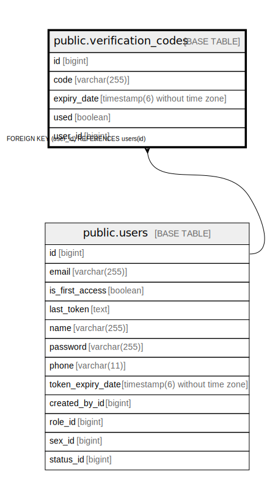

# public.verification_codes

## Description

## Columns

| Name | Type | Default | Nullable | Children | Parents | Comment |
| ---- | ---- | ------- | -------- | -------- | ------- | ------- |
| id | bigint |  | false |  |  |  |
| code | varchar(255) |  | false |  |  |  |
| expiry_date | timestamp(6) without time zone |  | false |  |  |  |
| used | boolean |  | false |  |  |  |
| user_id | bigint |  | false |  | [public.users](public.users.md) |  |

## Constraints

| Name | Type | Definition |
| ---- | ---- | ---------- |
| fka4qo6nts1xd94owirq5evcpda | FOREIGN KEY | FOREIGN KEY (user_id) REFERENCES users(id) |
| verification_codes_pkey | PRIMARY KEY | PRIMARY KEY (id) |

## Indexes

| Name | Definition |
| ---- | ---------- |
| verification_codes_pkey | CREATE UNIQUE INDEX verification_codes_pkey ON public.verification_codes USING btree (id) |

## Relations

---

> Generated by [tbls](https://github.com/k1LoW/tbls)
